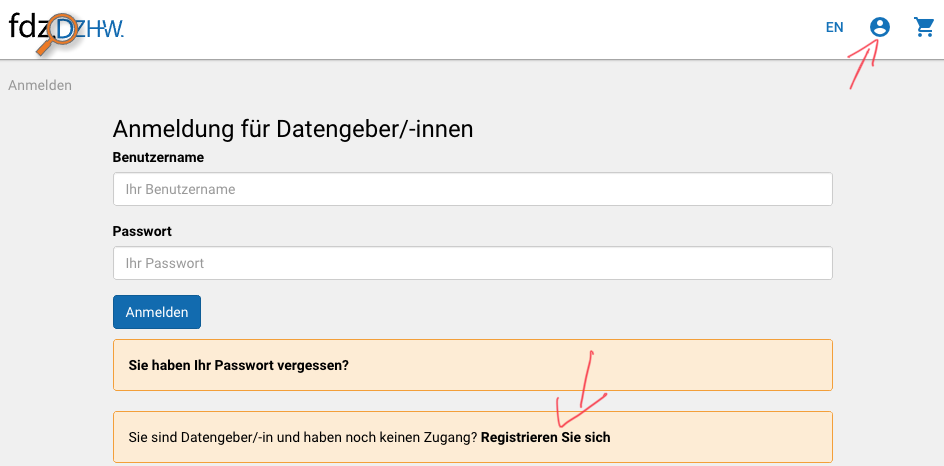
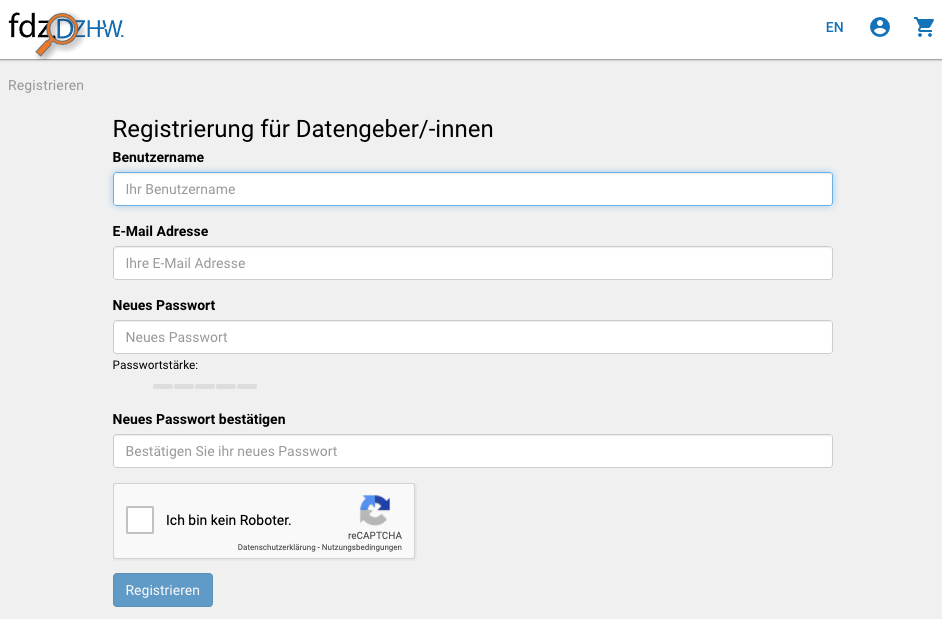
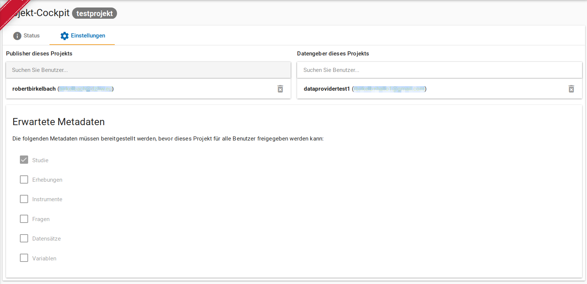
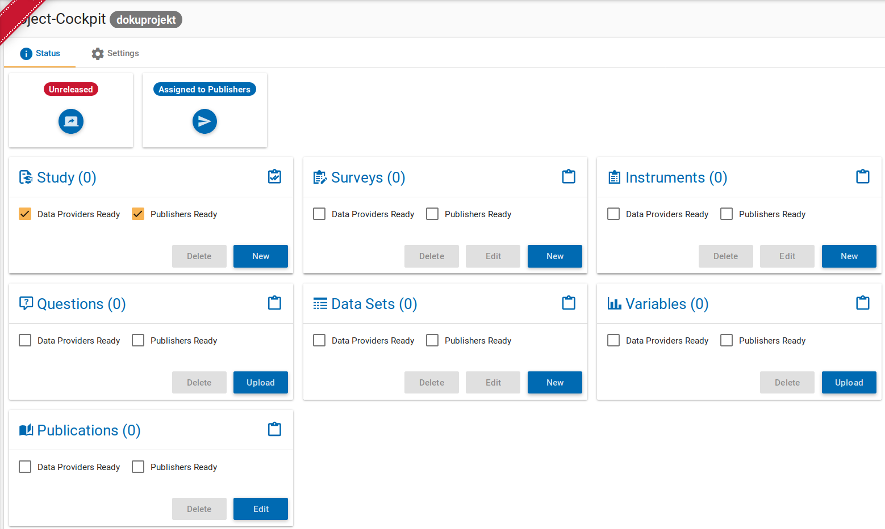
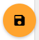
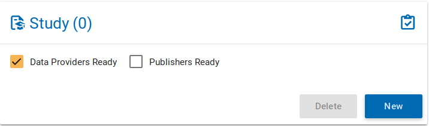
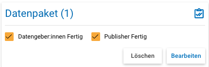
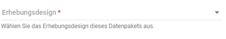
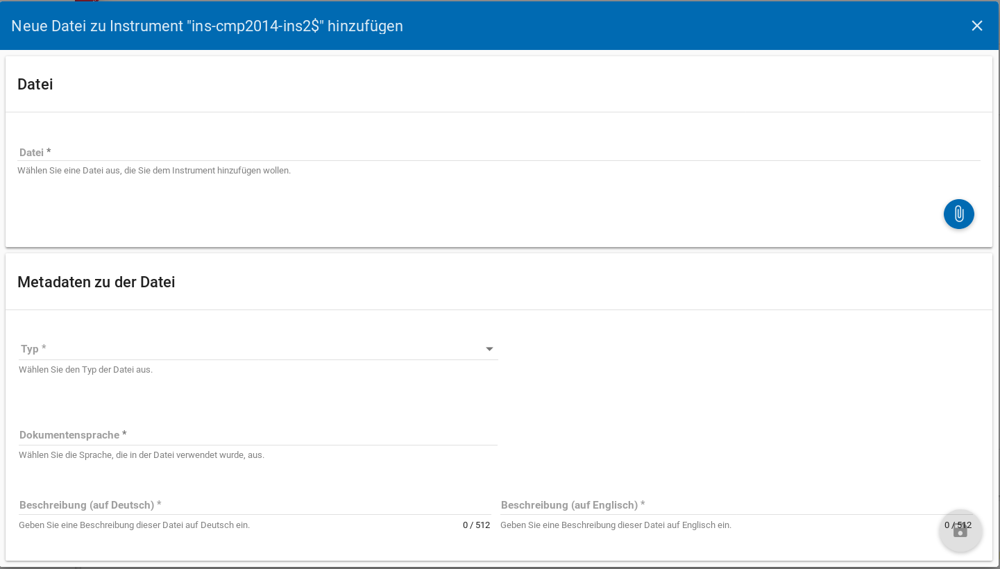
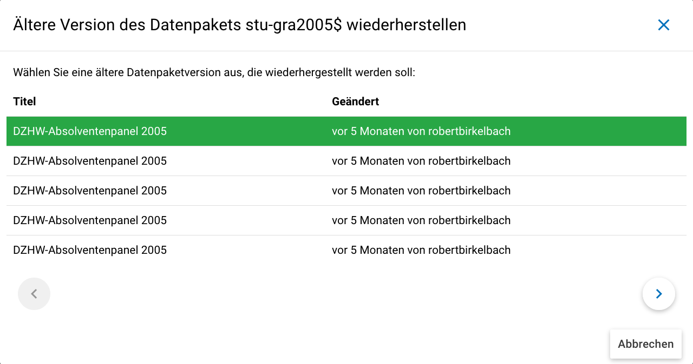

.. _Allgemeines:

Allgemeines
=================================

Was ist das Rechercheportal?
--------------------------------------------

Das FDZ-DZHW stellt Forschungsdaten quantitativer und qualitativer Erhebungen aus dem Feld der Hochschul- und Wissenschaftsforschung für die wissenschaftliche Sekundärnutzung zur Verfügung. Im Rechercheportal (https://metadata.fdz.dzhw.eu) werden Metadaten über die Forschungsdaten erfasst und bereitgestellt. Dies erhöht die Auffindbarkeit der Forschungsdaten und erleichtert es Sekundärforscher:innen, für sie passende Forschungsdaten auszuwählen sowie diese nachzunutzen.

Die Metadaten können im Rechercheportal auf (bis zu) acht unterschiedlichen Ebenen erfasst werden:

- Datenpaket
- Erhebungen
- Erhebungsinstrumente
- Fragen
- Datensätze
- Variablen
- Konzepte
- Publikationen

Dadurch, dass alle Ebenen miteinander verknüpft sind, wird eine umfassende Durchsuchbarkeit ermöglicht. 

**Wenn Sie Ihre Forschungsdaten an das FDZ-DZHW übergeben, können Sie die Metadaten für die Ebenen Datenpaket, Erhebungen und Erhebungsinstrumente selbst erfassen.** Das genaue Vorgehen wird in dieser Anleitung beschrieben. Für die anderen Ebenen ist eine individuelle Abstimmung mit dem FDZ notwendig.

Registrierung
--------------------------------------------

Sie müssen sich zunächst auf https://metadata.fdz.dzhw.eu registrieren, um die Berechtigung für das Erfassen von Metadaten zu erhalten. 

   Registrierung im Rechercheportal: Schritt 1

   Registrierung im Rechercheportal: Schritt 2

Im Anschluss erhalten Sie eine Bestätigungs-E-Mail. In dieser müssen Sie auf den Aktivierungslink klicken, welcher nach drei Tagen automatisch abläuft. Im Anschluss werden Sie von uns dem Projekt in der Rolle "Datengeber:in" hinzugefügt und werden per E-Mail darüber informiert.

Projekt-Cockpit
--------------------------------------------

Die Eingabe der Metadaten wird über das "Projekt-Cockpit" verwaltet.
In der Navigationsleiste links, welche ggfs. aufgeklappt werden muss, finden Sie den Zugang zum Projekt-Cockpit über den Projekt-Cockpit-Button (vgl. :numref:`projectcockpit`).

.. figure:: ./_static/cockpit-button.png
   :name: projectcockpit

   Projekt-Cockpit-Button.

Innerhalb des Projekt-Cockpits sehen Sie unter dem Reiter "Einstellungen" (vgl. :numref:`project_cockpit_settings`), 
welche Publisher (FDZ-Mitarbeiter:innen) und Datengeber:innen dem Projekt zugewiesen sind und welche Metadaten erwartet werden.
Die erwarteten Metadaten werden im Vorfeld zwischen Ihnen und den Publishern abgestimmt.

   Projekt-Cockpit Einstellungen.

**Es werden lediglich die erwarteten Metadatenebenen im Reiter "Status" angezeigt (vgl. :numref:`projectcockpit_status_empty`).** Zudem wird hier angezeigt, ob das Projekt freigegeben ist, also die eingegebenen Metadaten für alle öffentlichen Nutzer:innen des Rechercheportals sichtbar sind, und ob das Projekt gerade bei den Publishern oder bei den Datengeber:innen zur Bearbeitung liegt.

   Projekt-Cockpit-Status mit allen Metadatenebenen (nicht jedes Projekt muss alle Metadatenebenen bedienen)

Anfangs liegt das Projekt immer zur Bearbeitung bei den Publishern und Sie als Datengeber:innen werden per E-Mail benachrichtigt, wenn es Ihnen zugewiesen wird.
**Für die Ebenen Datenpaket, Erhebungen und Erhebungsinstrumente können Sie die Metadaten dann über Eingabemasken selbst erfassen. Zur jeweiligen Eingabemaske gelangen Sie über den Neu-Button.** Genauere Informationen zu den Eingabemasken finden Sie :ref:`hier <Eingabemasken>`. Sie können Ihre Eingaben über den orangenen Speichern-Button (Disketten-Symbol) unten rechts speichern (siehe :numref:`speichernbutton`).

   
   Speichern-Button

**Falls Sie die Informationen nicht in einem Vorgang eingeben können oder möchten, ist es immer möglich, dass Sie Ihre bisherigen Eingaben abspeichern und zu einem späteren Zeitpunkt weiter bearbeiten.** Über den Bearbeiten-Button im Projekt-Cockpit gelangen Sie auf der Datenpaket-Ebene direkt zur Eingabemaske mit dem aktuellen Stand Ihrer Eingaben. Bei den anderen Ebenen werden Sie zunächst zu einer Übersicht mit allen Erhebungen bzw. Instrumenten weitergeleitet. Pro Erhebung bzw. Instrument finden Sie jeweils unten rechts einen Bearbeiten-Button, über den Sie zur Eingabemaske gelangen. Zudem können Sie mit dem Löschen-Button bereits angelegte Erhebungen bzw. Instrumente auch komplett löschen.

**Wenn Sie mit der Eingabe der Metadaten einer Ebene fertig sind**, setzen Sie bitte im Projekt-Cockpit-Status das entsprechende Häkchen (siehe :numref:`projectcockpit_dataprovider_ready`).

   
   Häkchen gesetzt durch Datengeber:innen auf Datenpaket-Ebene

**Wenn Sie alle von Ihnen zu bearbeitenden Ebenen als "fertig" markiert haben**, können Sie das Projekt wieder den Publishern zuweisen.
Dafür klicken Sie den "Papierflieger"-Button (siehe :numref:`papierflieger`).

   
   Papierflieger-Button

Nachdem der Papierflieger-Button geklickt wurde, erscheint der "Nachricht an Publisher"-Dialog. Sie können dem Publisher hier noch einmal den genauen Stand sowie mglw. Fragen und Hinweise schreiben.

Die Publisher nehmen ein Review der eingetragenen Metadaten vor. Falls die Publisher denken, dass noch etwas vergessen wurde oder anders eingegeben werden sollte, weisen sie Ihnen das Projekt zurück zu und Sie werden per E-Mail darüber benachrichtigt. Zudem werden noch weitere Metadaten durch die Publisher ergänzt. Erklären die Publisher die Eingabe der Metadaten auf einer Ebene als "fertig", setzen sie ebenfalls ein entsprechendes Häkchen (siehe :numref:`dp_ready`).

   
   Häkchen gesetzt durch Datengeber:innen und Publisher auf Datenpaket-Ebene

Sind alle erwarteten Ebenen mit zwei Häkchen markiert, können die Publisher das Projekt für alle öffentlichen Nutzer:innen des Rechercheportals freigeben.

.. _Eingabemasken:

Eingabemasken
--------------------------------------------

Jede Eingabemaske umfasst verschiedene Felder, welche mit den einzutragenden Informationen beschriftet sind. Die folgenden Aspekte sind dabei zu beachten. Details zur Eingabe der konkreten Metadaten über die Eingabemasken finden sich in dieser Anleitung in den Abschnitten zu den einzelnen Ebenen (:ref:`Datenpaket <DataPackage>`, :ref:`Erhebungen <Surveys>`, :ref:`Erhebungsinstrumente <Instruments>`).

Pflichtfelder
^^^^^^^^^^^^^^^^^^^^^^^^^^
Einige Felder sind verpflichtend auszufüllen und deshalb mit einem Sternchen versehen. Sie werden beim Speichern der Eingaben automatisch darauf hingewiesen, wenn noch Felder offen sind, die nicht leer bleiben dürfen.

Maximale Zeichenanzahl
^^^^^^^^^^^^^^^^^^^^^^^^^^
Einige Felder, die Sie frei ausfüllen können, verfügen über einen Zeichenzähler, der Sie darüber informiert, wie viele Zeichen dort insgesamt eintragen dürfen und wie viele Zeichen Sie bereits eingetragen haben. 

Verwendung von Markdown
^^^^^^^^^^^^^^^^^^^^^^^^^^
Eingabefelder, die mit einem M↓-Symbol gekennzeichnet sind, *können* bei Bedarf mit `Markdown <https://www.markdownguide.org/basic-syntax/>`_ formatiert werden.

Drop-Down-Menüs
^^^^^^^^^^^^^^^^^^^^^^^^^^
Teilweise gibt es Drop-Down-Menüs mit festgelegten Antwortmöglichkeiten, zwischen denen Sie auswählen können (siehe :numref:`dropdownmenue`).

   
   Drop-Down-Menü

Bitte beachten Sie, dass es sich nur um ein Drop-Down-Menü handelt, wenn Sie rechts den kleinen "Pfeil nach unten" sehen.
Bei anderen Feldern werden Ihnen bereits in anderen Projekten gemachte Eingaben ebenfalls (einem Drop-Down-Menü ähnelnd) als Auswahlmöglichkeit angeboten, Sie können aber auch selbst eigene Einträge vornehmen.

.. _Anhaenge:

Anhänge
^^^^^^^^^^^^^^^^^^^^^^^^^^
Über die Eingabemasken können auch zusätzliche Dateien als Anhänge hochgeladen werden. Zu den Anhängen zählen z.B. der Daten- und Methodenbericht auf der Datenpaketebene sowie Fragebögen auf Instrumentenebene.

Um Anhänge hochzuladen muss das jeweilige Element, also z.B. das Datenpaket, erst über die Eingabemaske angelegt und gespeichert werden. Anschließend können Sie über den Bearbeiten-Button wieder in den Bearbeitungs-Modus gehen und sehen dann unter dem Abschnitt "Materialien zu..." in der Eingabemaske einen Plus-Button. Wenn Sie diesen anklicken, öffnet sich ein neues Fenster (s. :numref:`instruments_anhang_dialog`), in dem die jeweilige Datei über den Büroklammer-Button hochgeladen werden kann und Metadaten zur Datei eingegeben werden. Anschließend lässt sich der Anhang mit dem Speichern-Button (Diskettensymbol unten rechts) speichern.

   Instrumente Anhang

Die Anhänge sollten i. d. R. in einem der folgenden Formate vorliegen:

- *.pdf (idealerweise PDF/A)
- *.md

Ältere Versionen wiederherstellen (Historisierung)
^^^^^^^^^^^^^^^^^^^^^^^^^^^^^^^^^^^^^^^^^^^^^^^^^^^^
Im Bearbeitungsmodus können Sie ältere Versionen Ihrer abgespeicherten Eingaben wiederherstellen, indem Sie den Historisierungs-Button (blauer Pfeil-Button über dem 
Speichern-Button unten rechts auf der Seite) verwenden (s. :numref:`versionierung`).

   Ältere Versionen eine Datenpakets wiederherstellen

Bei einem Klick auf den Historisierungs-Button öffnet sich ein Dialog, der die verschiedenen Versionen anzeigt (s. :numref:`historisierung_dp`).
Zudem sind der Name der Person, die die entsprechende Version gespeichert hat, sowie das Änderungsdatum sichtbar. Durch Klicken auf die Version wird diese wiederhergestellt, aber nicht automatisch als aktuelle Version gespeichert. Dies müsste über einen Klick auf den Speichern-Button erfolgen. Zu beachten ist, dass :ref:`Anhänge <Anhaenge>` nicht historisiert werden.

   Dialog zur Historisierung innerhalb eines Datenpakets
