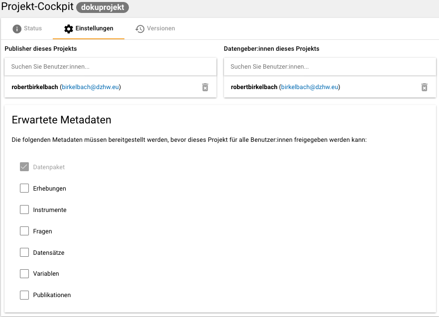

.. _Allgemeines:

Allgemeines
=================================

Was ist das Metadatenmanagementsystem (MDM)?
--------------------------------------------

Das FDZ-DZHW stellt Forschungsdaten quantitativer und qualitativer Erhebungen aus dem Feld der Hochschul- und Wissenschaftsforschung für die wissenschaftliche Sekundärnutzung zur Verfügung. Im Metadatenmanagementsystem (MDM) werden Metadaten über die Forschungsdaten erfasst und bereitgestellt. Dies erhöht die Auffindbarkeit der Forschungsdaten und erleichtert es Sekundärforscher:innen für sie passende Forschungsdaten auszuwählen sowie diese nachzunutzen. Das System ist über die Website https://metadata.fdz.dzhw.eu zu erreichen.

Die Metadaten werden im MDM auf (bis zu) acht unterschiedlichen Ebenen erfasst:

- Datenpaket
- Erhebungen
- Erhebungsinstrumente
- Fragen
- Datensätze
- Variablen
- Konzepte
- Publikationen

Dadurch, dass alle Ebenen miteinander verknüpft sind, wird eine umfassende Durchsuchbarkeit ermöglicht. 

Wenn Sie Ihre Forschungsdaten an das FDZ-DZHW übergeben, können Sie die Metadaten für die Ebenen Datenpaket, Erhebungen, Erhebungsinstrumente und Datensätze selbst erfassen. Das genaue Vorgehen wird in dieser Anleitung beschrieben.

Registrierung
--------------------------------------------

Sie müssen sich zunächst auf https://metadata.fdz.dzhw.eu registrieren, um die Berechtigung für das Erfassen von Metadaten zu erhalten. 

.. figure:: ./_static/registrierung_1_de.png
   :name: registrierung

   Registrierung im MDM: Schritt 1

.. figure:: ./_static/registrierung_2_de.png
   :name: registrierung_2

   Registrierung im MDM: Schritt 2

Im Anschluss erhalten Sie eine Bestätigungs-E-Mail. In dieser müssen Sie auf den Aktivierungslink klicken, 
welcher nach drei Tagen automatisch abläuft. Im Anschluss werden Sie von uns dem Projekt in der Rolle "Datengeber:in" 
hinzugefügt. Sie erhalten jeweils eine E-Mail, wenn Sie Ihrem Datenaufbereitungsprojekt hinzugefügt wurden und 
wenn das Projekt Ihnen zur Bearbeitung freigegeben wurde.

Projekt-Cockpit
--------------------------------------------

Das Projekt-Cockpit dient der Zusammenarbeit zwischen FDZ-Mitarbeiter:innen und Ihnen, den Datengeber:innen.
In der Navigationsleiste links, welche ggfs. aufgeklappt werden muss, finden Sie den Zugang zum Projekt-Cockpit (vgl. :numref:`projectcockpit`).
Wenn Sie ins Projekt-Cockpit gehen, sehen Sie unter dem Punkt Einstellungen (vgl. :numref:`project_cockpit_settings`), 
welche Publisher (FDZ-Mitarbeiter:innen) und Datengeber:innen dem Projekt zugewiesen sind und welche Metadaten erwartet werden. 
Es werden lediglich die erwarteten Metadatenebenen im Projekt-Cockpit-Status angezeigt.

.. figure:: ./_static/cockpit-button.png
   :name: projectcockpit

   Projekt-Cockpit Button.

   Projekt-Cockpit Einstellungen.

Das Status-Menü (siehe :numref:`projectcockpit_status_empty`) hat einerseits Funktionen zum Projektmanagement und andererseits Funktionen um Metadaten anzulegen:

.. figure:: ./_static/projectcockpit_dataprovider_status_empty.png
   :name: projectcockpit_status_empty

   Projekt-Cockpit-Status.

Es wird angezeigt, ob das Projekt freigegeben ist, also die eingegebenen Metadaten für alle öffentlichen Nutzer des Systems sichtbar sind.
Daneben wird angezeigt, ob das Projekt gerade bei den Publishern liegt oder bei den Datengeber:innen zur Bearbeitung liegt.

Zuerst liegt das Projekt zur Bearbeitung bei den Publishern und Sie als Datengeber:in werden per E-Mail benachrichtigt, wenn es Ihnen zugewiesen wird.
Um das Projekt wieder den Publishern zuzuweisen, klicken Sie den "Papierflieger"-Button (siehe :numref:`papierflieger`) über dem "Zugewiesen
an Datengeber" bzw "Assigned to Publishers" steht.

.. figure:: ./_static/projectcockpit_papierflieger.png
   :name: papierflieger

Die Voraussetzung, dass Sie das Projekt zurückgeben können ist, dass Sie die erwarteten Metadaten eingegeben und als "fertig" markiert haben (siehe :numref:`projectcockpit_dataprovider_ready`).

Wenn Sie auf den Neu-Button klicken, gelangen Sie zur Eingabemaske. Jede Eingabemaske umfasst verschiedene Felder, welche mit den einzutragenden Informationen beschriftet sind.
Einige Felder sind verpflichtend auszufüllen und deshalb mit einem Sternchen versehen. Sie werden beim Speichern der Eingaben automatisch
darauf hingewiesen, wenn noch Felder offen sind, die nicht leer bleiben dürfen. Zusätzlich ist über die Eingabemasken das Hochladen von Anhängen (vgl. :ref:`Anhänge`) möglich.
Zu den Anhängen zählen z.B. der Daten- und Methodenbericht auf der Datenpaketebene sowie Fragebögen auf Instrumentenebene. 
Diese Dokumente müssen als Dateien im PDF- oder Excel-Format vorliegen und zudem nach bestimmten Richtlinien benannt werden.
Für die Anhänge  im PDF-Format gilt es darüber hinaus zu beachten, dass dokumenteigene Metadaten wie Autor und Titel der PDF-Datei gelöscht werden. 
Eine Anleitung finden Sie hier: https://helpx.adobe.com/acrobat/using/pdf-properties-metadata.html

Eingabefelder welche mit einem M↓-Symbol gekennzeichnet sind, können mit Markdown formatiert werden. `Hier <https://www.markdownguide.org/basic-syntax/>`_ finden Sie eine Markdown-Anleitung. Es kann sein, dass die konkreten Überschriften-Ebenen nicht der angegebenen Überschriften-Ebene ensprechen. So kann es sein, dass eine H1-Überschrift auf Ebene H2 "rutscht". Das liegt daran, dass die Überschriften-Ebenen auf der gesamten Detailseite vom System konsistent gemacht werden. Die niedrigste Überschriften-Ebene ist H6.

Details zur Abgabe der konkreten Metadaten der einzelnen Ebenen wird im jeweiligen Kapitel erklärt.

Wenn Sie fertig mit der Eingabe der Metadaten einer Ebene sind, setzen Sie bitte das entsprechende Häkchen.

.. figure:: ./_static/projectcockpit_dataprovider_ready.png
   :name: projectcockpit_dataprovider_ready

Nachdem der Papierflieger-Button geklickt wurde, erscheint der "Nachricht an Publisher" Dialog (siehe :numref:`nachricht_an_publisher`).

.. figure:: ./_static/cockpit_nachricht_an_publisher.png
   :name: nachricht_an_publisher

Die Publisher nehmen ein Review der eingetragenen Metadaten vor. Falls die Publisher denken, dass noch etwas vergessen wurde oder anders eingegeben werden sollte, weisen die Publisher Ihnen das Projekt zurück zu und Sie werden per E-Mail darüber benachrichtigt. Sollten die Publisher denken, dass die Eingabe der Metadaten auf der jeweiligen Ebene fertig sind, markieren sie die Ebene auch als "fertig", was durch einen zweiten Haken signalisiert wird (siehe :numref:`dp_ready`). Sind alle erwarteten Ebenen mit zwei Häkchen markiert, können die Publisher das Projekt für alle öffentlichen Nutzer:innen des Systems freigeben.

