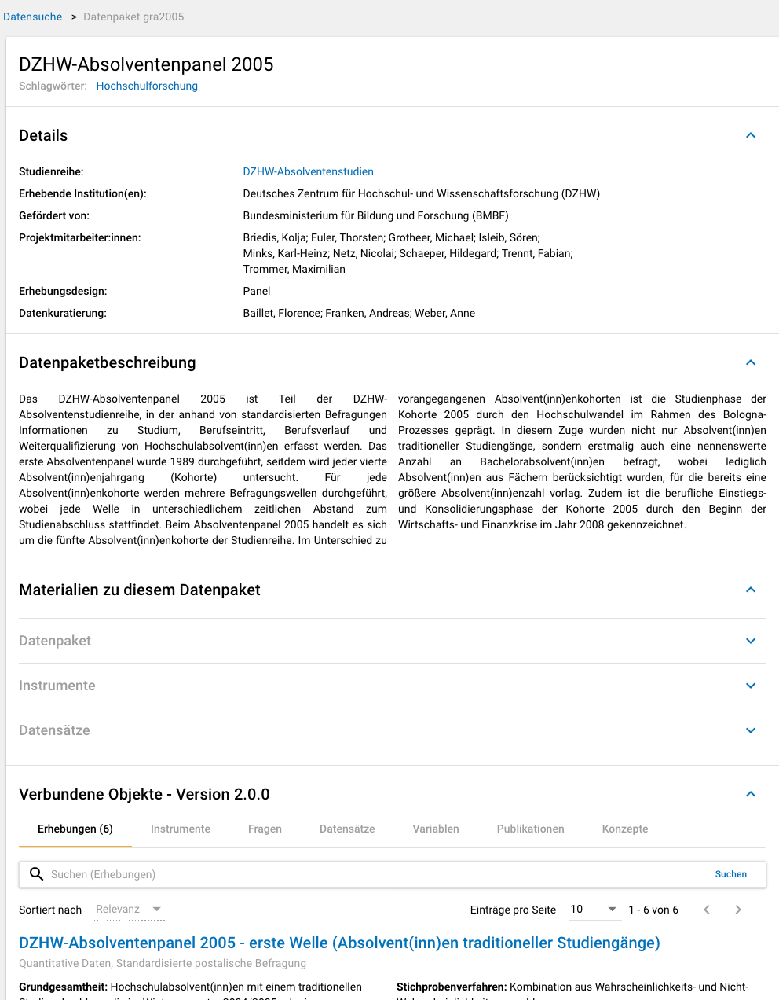
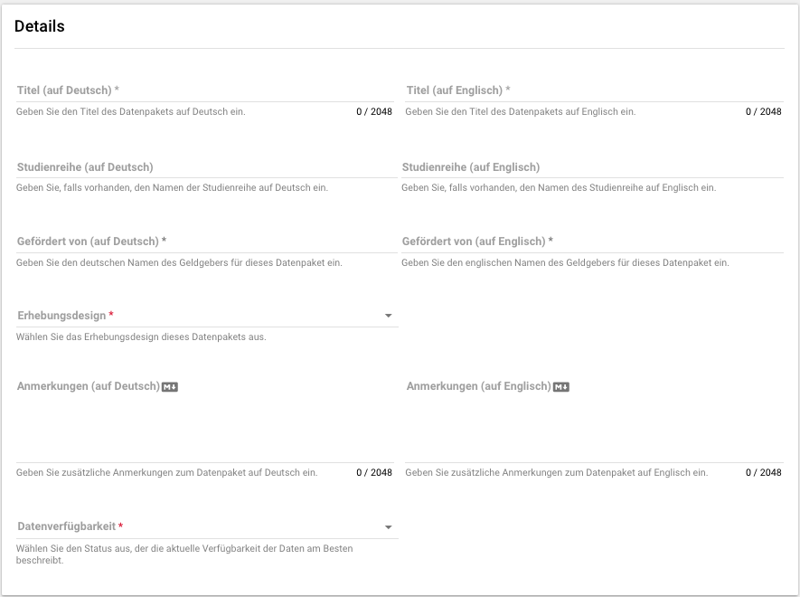
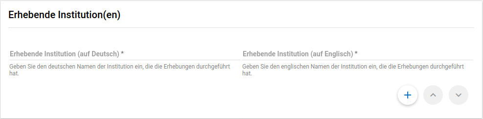
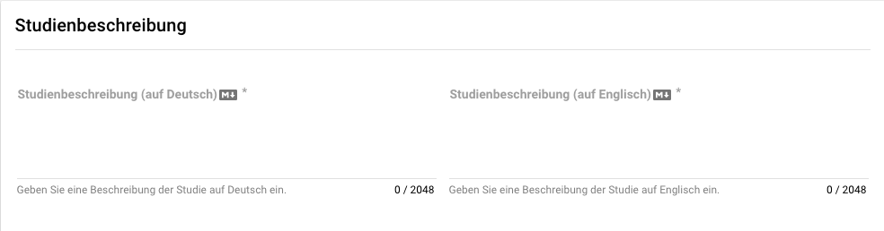
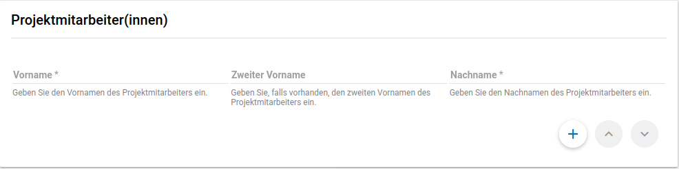
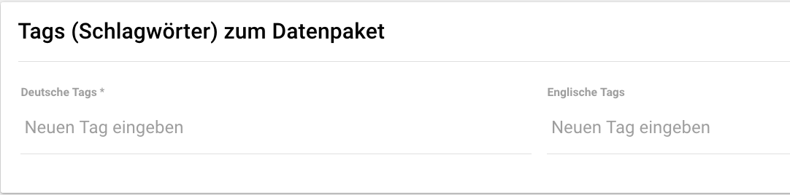
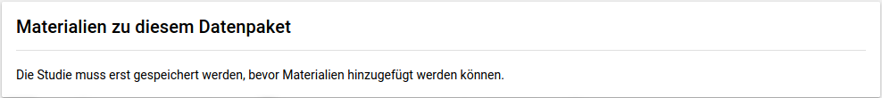
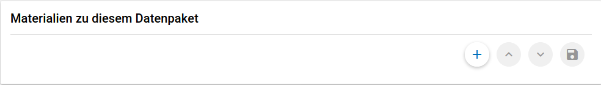
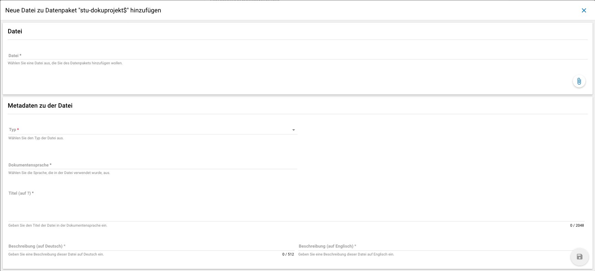

.. _DataPackage:

Datenpaket (Data Package)
---------------------------------

**Übersicht**

Anhand der Informationen, die Sie bzgl. Ihres Datenpakets im MDM erfassen, wird dort später eine Übersichtsseite erstellt (vgl. :numref:`datenpaketübersicht`).

   Datenpaketübersicht im MDM am Beispiel des Absolventenpanels 2005

**Datenpaket anlegen**

Wenn Sie im Projekt-Cockpit auf der Ebene "Datenpaket" auf den "Neu"-Button klicken, gelangen Sie zur Eingabemaske.
Nach dem Öffnen der Eingabemaske erscheint ganz oben die aus Ihrem Projektnamen automatisch generierte ID für die Datenpaketseite.
Die Eingabemaske auf Datenpaketebene besteht aus den folgenden Abschnitten:

- Details
- Erhebende Institution(en)
- Datenpaketbeschreibung
- Projektmitarbeiter:innen
- Datenkuratierung
- Tags (Schlagwörter) zum Datenpaket
- Materialien zu diesem Datenpaket

Im Folgenden wird auf die einzelnen Abschnitte genauer eingegangen. Allgemeine Informationen zu den Eingabemasken finden Sie :ref:`hier <Eingabemasken>`.

Der Abschnitt „Details“ ist der umfangreichste:

   Eingabemaske auf Datenpaketebene, Abschnitt "Details" am Beispiel der 21.
   Sozialerhebung

Im Feld Institution(en) (s.
:numref:`eingabemaske_dpbeschreibung_institution`)
geben Sie an welche Institution die Konzeption und Durchführung der Erhebung
des Datenpakets durchgeführt hat.
Es werden Institutionen vorgeschlagen, die bereits andere Datenpakete
durchgeführt haben. Sollte kein Vorschlag passen, geben Sie bitte den
Institutionsnamen auf Deutsch und Englisch ein.

Im zweiten Abschnitt der Eingabemaske müssen Sie eine Beschreibung Ihres Datenpaket
sowohl auf Deutsch als auch auf Englisch eingeben. Als
Beispiel ist im Folgenden die Beschreibung der 21. Sozialerhebung
abgebildet:

   Eingabemaske auf Datenpaketebene, Abschnitt "Datenpaketbeschreibung" am Beispiel
   der 21. Sozialerhebung

Im dritten Abschnitt der Eingabemaske geben Sie die Mitarbeiter(innen)
Ihres Projekts ein. Für die Eingabe weiterer Personen klicken Sie
einfach auf den blauen Plus-Button (s.
:numref:`dpebene_eingabemaske_mitarbeiter`).
Wenn mindestens zwei
Personen eingetragen sind, erscheinen die Pfeil-Buttons als aktiv
(Farbwechsel von grau zu blau). Dann können Sie die Reihenfolge der
Personen ändern, indem Sie die Namen nach oben oder unten verschieben.
Links neben den bereits aufgeführten Personen erscheint in jeder Zeile
ein blauer Button mit einem Mülleimer-Symbol, mit dem Sie den jeweiligen
Namen wieder löschen können. Mit dem orangefarbenen Save-Button unten
rechts können Sie Ihre Eingaben jederzeit abspeichern. Dies müssen Sie
spätestens jetzt tun, da Sie ansonsten den letzten Abschnitt der
Eingabemaske („Materialien zum Datenpaket“) nicht bearbeiten können.

   Eingabemaske auf Datenpaketebene, Abschnitt "Projektmitarbeiter(innen)"

   Eingabemaske Schlagwörter/ Tags

Im Feld Tags (Schlagwörter) zum Datenpaket sind kurze Schlagwörter anzugeben,
die dabei helfen, schnell einen Überblick über die wichtigsten Themen des Datenpakets
zu erhalten und ihr Datenpaket schnell auffindbar zu machen.
Außerdem erleichtert es forschenden ähnliche Datenpakete, die das selbe
Schlagwort verwendet haben, zu finden.

Im vierten und letzten Abschnitt der Eingabemaske können Sie Materialien
zum Datenpaket ablegen. Dazu klicken Sie auf den blauen Plus-Button (s.
:numref:`eingabemaske_dp_materialien`), woraufhin sich ein Dialog öffnet,
in dem Sie eine Datei hochladen und diese näher beschreiben können.
Die hier relevanten Materialien sind momentan der deutsch- und
englischsprachige Daten- und Methodenbericht (DMB) sowie eine
deutsch oder englischsprachige *Datenpaketübersicht/data package overview*. [1]_
Die Sprache der Materialien muss nach ISO 639-1_ angegeben werden.
Bei den Metadaten der Materialien ist darauf zu achten, dass diese korrekt
eingegeben worden sind.
Die Eingaben müssen Sie
anschließend über den orangefarbenen Save-Button abspeichern.
Mit den Pfeil-Buttons können Sie dann ggf. die Reihenfolge bereits
eingegebener Materialien verändern. Wenn Sie eine geänderte Reihenfolge
beibehalten möchten, müssen Sie erneut speichern.

.. _639-1: https://en.wikipedia.org/wiki/List_of_ISO_639-1_codes

   Materialienabschnitt ist noch ausgegraut

   Materialien können hinzugefügt werden

   Eingabemaske zu den Materialien des Datenpakets

@TODO describe attachments
