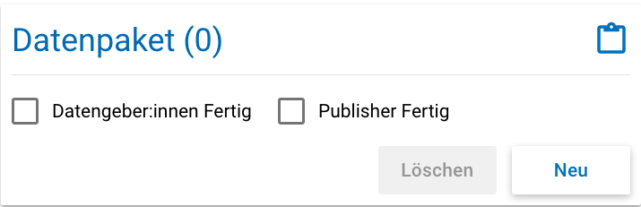
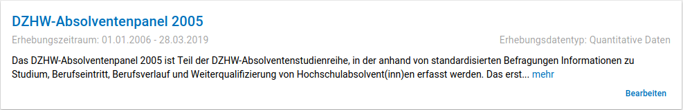

.. _DataPackage:

Datenpaket (Data Package)
---------------------------------

**Übersicht**

Anhand der Informationen, die Sie bzgl. Ihres Datenpakets im MDM erfassen,
wird dort später eine Übersichtsseite erstellt, die im Folgenden am
Beispiel des Absolventenpanels 2005 dargestellt wird:

.. figure:: ./_static/dp_details_overview.png
   :name: datenpaketübersicht

   Datenpaketübersicht im MDM am Beispiel des Absolventenpanels 2005

**Eine neues Datenpaket anlegen**

Nachdem ein neues Projekt erstellt wurde, können
Sie nun innerhalb des Projektes ein Datenpaket über das Project-Cockpit
anlegen.

**Datenpaket anlegen über das Projekt-Cockpit**

Im Projekt-Cockpit sehen Sie im Status-Bereich die Felder zu den einzelnen
Metadatenebenen. Wenn Sie unter dem Punkt Datenpaket auf den "Neu"-Button klicken,
gelangen Sie zur Eingabemaske. Machen Sie beim Punkt Eingabemaske_
weiter.

   Datenpaket per Cockpit anlegen

**Datenpaket anlegen über die Suche**

Dazu finden Sie im
Reiter „Datenpakete“ unten rechts auf der Seite einen orangefarbenen
Plus-Button (vgl. :numref:`dp_anlegen_per_suche`).

.. figure:: ./_static/dp_create_dp_via_search.png
   :name: dp_anlegen_per_suche

   Datenpaket per Suche anlegen

Mit einem Klick auf den
Plus-Button öffnet sich die Eingabemaske, in der Sie Ihre Informationen
zum Datenpaket ablegen können.

**Eingabemaske**

.. _Eingabemaske:

Die Eingabemaske auf Datenpaketebene besteht aus den vier Abschnitten
„Details“, „Datenpaketbeschreibung“, „Projektmitarbeiter(innen)“ sowie
„Materialien zum Datenpaket“. Der Abschnitt „Details“ ist der
umfangreichste und wird im Folgenden aufgrund der Veranschaulichung mit
bereits eingetragenen Informationen dargestellt (hier beispielhaft: 21.
Sozialerhebung):

.. figure:: ./_static/dp_edit_details_page.png
   :name: dpebene_eingabemaske

   Eingabemaske auf Datenpaketebene, Abschnitt "Details" am Beispiel der 21.
   Sozialerhebung

Nach dem Öffnen der Eingabemaske erscheint ganz oben die aus ihrem
Projektnamen automatisch generierte ID für die Datenpaketseite (s. rotes
Kästchen in :numref:`dpebene_eingabemaske`). Einige Felder, die Sie frei
ausfüllen können,
verfügen über einen Zeichenzähler, der Sie darüber informiert, wie viele
Zeichen Sie dort insgesamt eintragen dürfen und wie viele Zeichen Sie
bereits eingetragen haben (s. blaues Kästchen in
:numref:`dpebene_eingabemaske`). Außerdem
finden Sie teilweise Drop-Down-Menüs vor, in denen Sie aus vorgegebenen
Alternativen auswählen können (s. grünes Kästchen in
:numref:`dpebene_eingabemaske`).

Im Feld Institution(en) (s.
:numref:`eingabemaske_dpbeschreibung_institution`)
geben Sie an welche Institution die Konzeption und Durchführung der Erhebung
des Datenpakets durchgeführt hat.
Es werden Institutionen vorgeschlagen, die bereits andere Datenpakete
durchgeführt haben. Sollte kein Vorschlag passen, geben Sie bitte den
Institutionsnamen auf Deutsch und Englisch ein.

Im zweiten Abschnitt der Eingabemaske müssen Sie eine Beschreibung Ihres Datenpaket
sowohl auf Deutsch als auch auf Englisch eingeben. Als
Beispiel ist im Folgenden die Beschreibung der 21. Sozialerhebung
abgebildet:

.. figure:: ./_static/dp_edit_details_description.png
   :name: eingabemaske_dpbeschreibung

   Eingabemaske auf Datenpaketebene, Abschnitt "Datenpaketbeschreibung" am Beispiel
   der 21. Sozialerhebung

Im dritten Abschnitt der Eingabemaske geben Sie die Mitarbeiter(innen)
Ihres Projekts ein. Für die Eingabe weiterer Personen klicken Sie
einfach auf den blauen Plus-Button (s.
:numref:`dpebene_eingabemaske_mitarbeiter`).
Wenn mindestens zwei
Personen eingetragen sind, erscheinen die Pfeil-Buttons als aktiv
(Farbwechsel von grau zu blau). Dann können Sie die Reihenfolge der
Personen ändern, indem Sie die Namen nach oben oder unten verschieben.
Links neben den bereits aufgeführten Personen erscheint in jeder Zeile
ein blauer Button mit einem Mülleimer-Symbol, mit dem Sie den jeweiligen
Namen wieder löschen können. Mit dem orangefarbenen Save-Button unten
rechts können Sie Ihre Eingaben jederzeit abspeichern. Dies müssen Sie
spätestens jetzt tun, da Sie ansonsten den letzten Abschnitt der
Eingabemaske („Materialien zum Datenpaket“) nicht bearbeiten können.

   Eingabemaske auf Datenpaketebene, Abschnitt "Projektmitarbeiter(innen)"

.. figure:: ./_static/dp_edit_details_tags.png
   :name: eingabemaske_tags

   Eingabemaske Schlagwörter/ Tags

Im Feld Tags (Schlagwörter) zum Datenpaket sind kurze Schlagwörter anzugeben,
die dabei helfen, schnell einen Überblick über die wichtigsten Themen des Datenpakets
zu erhalten und ihr Datenpaket schnell auffindbar zu machen.
Außerdem erleichtert es forschenden ähnliche Datenpakete, die das selbe
Schlagwort verwendet haben, zu finden.

Im vierten und letzten Abschnitt der Eingabemaske können Sie Materialien
zum Datenpaket ablegen. Dazu klicken Sie auf den blauen Plus-Button (s.
:numref:`eingabemaske_dp_materialien`), woraufhin sich ein Dialog öffnet,
in dem Sie eine Datei hochladen und diese näher beschreiben können.
Die hier relevanten Materialien sind momentan der deutsch- und
englischsprachige Daten- und Methodenbericht (DMB) sowie eine
deutsch oder englischsprachige *Datenpaketübersicht/data package overview*. [1]_
Die Sprache der Materialien muss nach ISO 639-1_ angegeben werden.
Bei den Metadaten der Materialien ist darauf zu achten, dass diese korrekt
eingegeben worden sind.
Die Eingaben müssen Sie
anschließend über den orangefarbenen Save-Button abspeichern.
Mit den Pfeil-Buttons können Sie dann ggf. die Reihenfolge bereits
eingegebener Materialien verändern. Wenn Sie eine geänderte Reihenfolge
beibehalten möchten, müssen Sie erneut speichern.

.. _639-1: https://en.wikipedia.org/wiki/List_of_ISO_639-1_codes

.. figure:: ./_static/dp_edit_details_attachments_before_details_are_saved.png
   :name: eingabemaske_dp_materialien_deaktiviert

   Materialienabschnitt ist noch ausgegraut

.. figure:: ./_static/dp_edit_details_attachments_after_details_are_saved.png
   :name: eingabemaske_dp_materialien_koennen_angegeben werden

   Materialien können hinzugefügt werden

   Eingabemaske zu den Materialien des Datenpakets

@TODO describe attachments

**Editieren und historisieren**

Falls Sie Ihre Informationen auf Datenpaketebene nicht in einem Vorgang
eingeben und hochladen können oder möchten, ist es immer möglich, dass
Sie Ihre bisherigen Eingaben abspeichern und zu einem späteren Zeitpunkt
weiter bearbeiten. Hierfür wird Ihnen im Reiter „Datenpakete“ am rechten
Rand neben Ihrers Datenpakets ein Stift-Button angezeigt, über den Sie wieder
in die Eingabemaske gelangen (s. :numref:`bearbeitung_gespeicherte_dp`).

   Weitere Bearbeitung eines bereits abgespeicherten Datenpakets

Ebenso können Sie ältere Versionen Ihrer abgespeicherten Eingaben
wiederherstellen, indem Sie im Bearbeitungsmodus den
Historisierungs-Button (blauer Pfeil-Button über dem Save-Button unten
rechts auf der Seite) verwenden (s. :numref:`versionierung`).

.. figure:: ./_static/historization_undo.png
   :name: versionierung

   Ältere Versionen eine Datenpakets wiederherstellen

Bei einem Klick auf den Historisierungs-Button öffnet sich ein Dialog,
der die verschiedenen Versionen des Datenpakets anzeigt
(s. :numref:`historisierung_dp`).
Zudem sind der Name des Nutzers, der die entsprechende Version des Datenpakets
gespeichert hat, sowie das Änderungsdatum sichtbar. Durch Klicken auf
die Version wird diese wiederhergestellt, aber nicht automatisch als
aktuelle Version gespeichert. Dies müsste über einen Klick auf den
Save-Button erfolgen. Zu beachten ist, dass Materialien zum Datenpaket
(Dateianhänge) nicht historisiert werden, sondern lediglich deren ins MDM
eingegebene Metadaten.

.. figure:: ./_static/dp_historization.png
   :name: historisierung_dp

   Dialog zur Historisierung innerhalb eines Datenpakets
