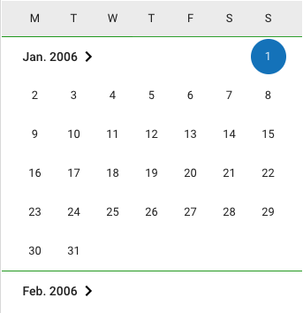

.. _Surveys:

Erhebungen (Surveys)
---------------------------------

**Übersicht**

Mit den Informationen über die Erhebung(en), auf die sich Ihr Datenpaket bezieht, wird im MDM folgende Übersichtsseite erstellt:

.. figure:: ./_static/surveys_public-view.png
   :name: erhebungsübersicht

   Erhebungsübersicht im MDM am Beispiel der ersten Welle (traditioneller Studiengänge) im Absolventenpanel 2005

**Erhebung anlegen**

Wenn Sie ein Datenpaket angelegt haben (vgl. Kapitel :ref:`Datenpaket`), können Sie im Projekt-Cockpit auf den Neu-Button klicken und gelangen zur Eingabemaske.
Bitte beachten Sie, dass Sie mehrere Erhebungen über die Eingabemaske in der richtigen Reihenfolge eingeben müssen, da die IDs beim Anlegen einer neuen Erhebung automatisch generiert werden und sich später nicht mehr verändern lassen.

Die Eingabemaske auf Datenpaketebene besteht aus den folgenden Abschnitten:

- Details
- Untersuchungsgebiete
- Weitere Informationen zum Rücklauf
- Materialien zu der Erhebung

Im Folgenden wird auf die einzelnen Abschnitte genauer eingegangen. Allgemeine Informationen zu den Eingabemasken finden Sie :ref:`hier <Eingabemasken>`.

**Eingabemaske**

Die Eingabemaske auf Erhebungsebene besteht aus den drei Abschnitten
„Details“, „Weitere Informationen zum Rücklauf“ sowie „Materialien zu
der Erhebung“. Im Folgenden wird der Abschnitt „Details“ – aufgrund der
Länge in zwei Teilen – dargestellt:

.. figure:: ./_static/surveys_edit-details-main.png
   :name: eingabemaske_erhebung_details_1

   Eingabemaske der Erhebungsebene, Abschnitt "Details" Teil 1

Beim Anlegen einer Erhebung wird automatisch die ID auf Basis des
Projektnamens generiert (s. rotes Kästchen,
:numref:`eingabemaske_erhebung_details_1`, hier als Beispiel der
21. Sozialerhebung). Neben den bereits aus der
Datenpaketebene bekannten Funktionen gibt es in dieser Eingabemaske
zusätzlich eine Kalenderfunktion (s. blaue Kästchen,
:numref:`eingabemaske_erhebung_details_1`),
welche die Feldzeit des Projekts erfasst und in :numref:`kalender_erhebung`
dargestellt ist:

   Kalenderfunktion auf der Erhebungsebene

Die Rücklaufquote wird automatisch ermittelt. Sie können den Rücklauf
auch manuell eingeben. Hierbei ist zu jedoch beachten, dass sich bereits
eingegebene Zahlen bei Brutto- und Netto-Stichprobe bei nicht automatisch
anpassen.

Um den nächsten Abschnitt in der Eingabemaske („Weitere Informationen
zum Rücklauf“ [2]_) bearbeiten zu können, müssen Sie die bisherigen
Eingaben abspeichern. Dann können Sie deutschsprachige und/oder
englischsprachige Grafiken zum Rücklauf entweder über den blauen
Plus-Button oder per Drag & Drop hochladen und dann mit dem Save-Button
speichern. Diese Grafiken dürfen im svg-Format
vorliegen. Über den Button mit dem Mülleimer-Symbol lassen sich
hochgeladene Dateien wieder löschen (s. :numref:`weitere_infos_rücklauf`).

.. figure:: ./_static/ruecklaufhochladen_de.png
   :name: weitere_infos_rücklauf

   Eingabemaske der Erhebungsebene, Abschnitt „Weitere Informationen zum Rücklauf“

Im letzten Abschnitt der Eingabemaske können – wie auch beim Datenpaket –
Materialien hinzugefügt werden
(s. :numref:`eingabemaske_erhebung_materialien`).
Die Funktionsweise ist identisch zu der auf Datenpaketebene. [3]_

.. figure:: ./_static/eingabemaske_erhebung_materialien.png
   :name: eingabemaske_erhebung_materialien

   Eingabemaske der Erhebungsebene, Abschnitt „Materialien zu der Erhebung“
