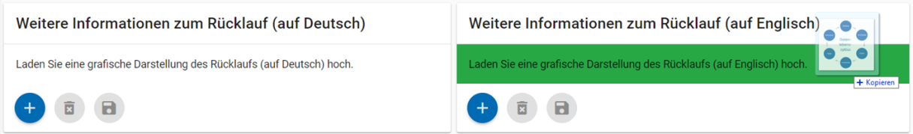
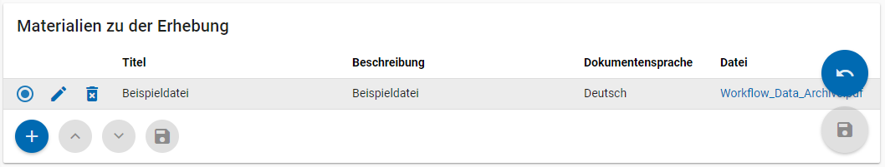
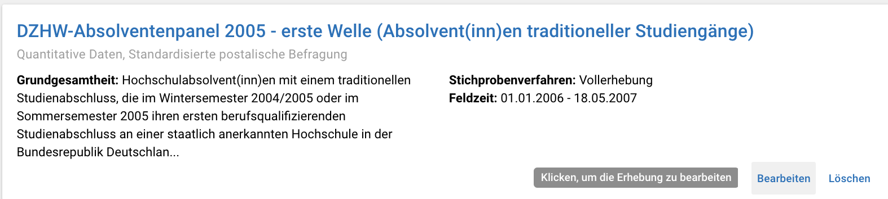
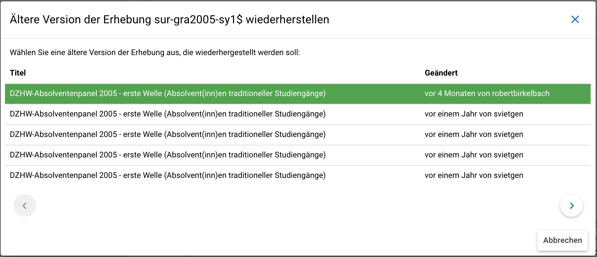

.. _Erhebungen:

Erhebungen (surveys)
---------------------------------

**Übersicht**

Mit den Informationen über die Erhebung(en), die Sie innerhalb Ihres
Datenpakets durchgeführt haben, wird im MDM folgende Übersichtsseite
erstellt:

.. figure:: ./_static/surveys_public-view.png
   :name: erhebungsübersicht

   Erhebungsübersicht im MDM am Beispiel der ersten Welle (traditioneller Studiengänge) im Absolventenpanel 2005

**Eine neue Erhebung anlegen**

Wenn Sie ein Datenpaket angelegt haben (vgl. Kapitel :ref:`Datenpaket`), können
Sie über den Reiter „Erhebungen“ eine neue Erhebung innerhalb Ihres Datenpakets
erstellen. Hierzu finden Sie unten rechts auf der Seite – ebenso wie bei Datenpaketen – einen orangefarbenen Plus-Button. Wenn
Sie mit dem Mauszeiger darüberfahren, erscheinen die beiden weißen
Buttons, von denen Sie den Plus-Button anklicken, um die Eingabemaske zu
öffnen. Bitte beachten Sie, dass Sie mehrere Erhebungen über die
Eingabemaske in der richtigen Reihenfolge eingeben müssen, da die IDs
beim Anlegen einer neuen Erhebung automatisch generiert werden und sich
später nicht mehr verändern lassen.

**Eingabemaske**

Die Eingabemaske auf Erhebungsebene besteht aus den drei Abschnitten
„Details“, „Weitere Informationen zum Rücklauf“ sowie „Materialien zu
der Erhebung“. Im Folgenden wird der Abschnitt „Details“ – aufgrund der
Länge in zwei Teilen – dargestellt:

.. figure:: ./_static/surveys_edit-details-main.png
   :name: eingabemaske_erhebung_details_1

   Eingabemaske der Erhebungsebene, Abschnitt "Details" Teil 1

Beim Anlegen einer Erhebung wird automatisch die ID auf Basis des
Projektnamens generiert (s. rotes Kästchen,
:numref:`eingabemaske_erhebung_details_1`, hier als Beispiel der
21. Sozialerhebung). Neben den bereits aus der
Datenpaketebene bekannten Funktionen gibt es in dieser Eingabemaske
zusätzlich eine Kalenderfunktion (s. blaue Kästchen,
:numref:`eingabemaske_erhebung_details_1`),
welche die Feldzeit des Projekts erfasst und in :numref:`kalender_erhebung`
dargestellt ist:

.. figure:: ./_static/surveys_calendar.png
   :name: kalender_erhebung

   Kalenderfunktion auf der Erhebungsebene

Die Rücklaufquote wird automatisch ermittelt. Sie können den Rücklauf
auch manuell eingeben. Hierbei ist zu jedoch beachten, dass sich bereits
eingegebene Zahlen bei Brutto- und Netto-Stichprobe bei nicht automatisch
anpassen.

Um den nächsten Abschnitt in der Eingabemaske („Weitere Informationen
zum Rücklauf“ [2]_) bearbeiten zu können, müssen Sie die bisherigen
Eingaben abspeichern. Dann können Sie deutschsprachige und/oder
englischsprachige Grafiken zum Rücklauf entweder über den blauen
Plus-Button oder per Drag & Drop hochladen und dann mit dem Save-Button
speichern. Diese Grafiken dürfen im svg-Format
vorliegen. Über den Button mit dem Mülleimer-Symbol lassen sich
hochgeladene Dateien wieder löschen (s. :numref:`weitere_infos_rücklauf`).

   Eingabemaske der Erhebungsebene, Abschnitt „Weitere Informationen zum Rücklauf“

Im letzten Abschnitt der Eingabemaske können – wie auch beim Datenpaket –
Materialien hinzugefügt werden
(s. :numref:`eingabemaske_erhebung_materialien`).
Die Funktionsweise ist identisch zu der auf Datenpaketebene. [3]_

   Eingabemaske der Erhebungsebene, Abschnitt „Materialien zu der Erhebung“

**Editieren und historisieren**

Falls Sie Ihre Informationen auf Erhebungsebene nicht in einem Vorgang
eingeben und hochladen können oder möchten, ist es immer möglich, dass
Sie Ihre bisherigen Eingaben abspeichern und zu einem späteren Zeitpunkt
weiter bearbeiten. Hierfür wird Ihnen im Reiter „Erhebungen“ am rechten
Rand ein Stift-Button angezeigt, über den Sie wieder in die Eingabemaske
gelangen. Außerdem finden Sie dort auch einen Button mit
Mülleimer-Symbol, mit dem Sie die Erhebung komplett löschen können (s.
:numref:`bearbeitung_erhebung`).

   Weitere Bearbeitung einer bereits abgespeicherten Erhebung

Es ist außerdem möglich, ältere Versionen der bereits gespeicherten
Eingaben wiederherzustellen. Im Bearbeitungsmodus gibt es auch auf der
Erhebungsebene einen Historisierungs-Button, den Sie rechts unten über
dem Save-Button betätigen können
(s. :numref:`version_erhebung_wiederherstellen`).

.. figure:: ./_static/recover_history_de.png
   :name: version_erhebung_wiederherstellen

   Ältere Versionen einer Erhebung wiederherstellen

Bei einem Klick auf den Historisierungs-Button öffnet sich ein
Dialog, der die verschiedenen Versionen der Erhebung anzeigt
(s. :numref:`historisierungsdialog_erhebung`). Zudem
sind der Name des Nutzers, der die entsprechende Version des Datenpakets
gespeichert hat, sowie das Änderungsdatum sichtbar. Durch Klicken auf
die Version wird diese wiederhergestellt, aber nicht automatisch als
aktuelle Version gespeichert. Dies müsste über einen Klick auf den
Save-Button erfolgen. Zu beachten ist, dass Materialien zur Erhebung
nicht historisiert werden.

   Dialog zur Historisierung innerhalb einer Erhebung

**Prüfschritte**

Der Titel der Erhebung wird bei Veröffentlichung (mit Versionsnummer
von mindestens 1.0.0) bei da|ra vor einige Attribute (z.B. Referenzzeitraum)
gehängt. Der Titel der Erhebung muss daher eindeutig sein und
im Falle von längsschnittlich erhobenen Datenpaketen die Welle enthalten.
