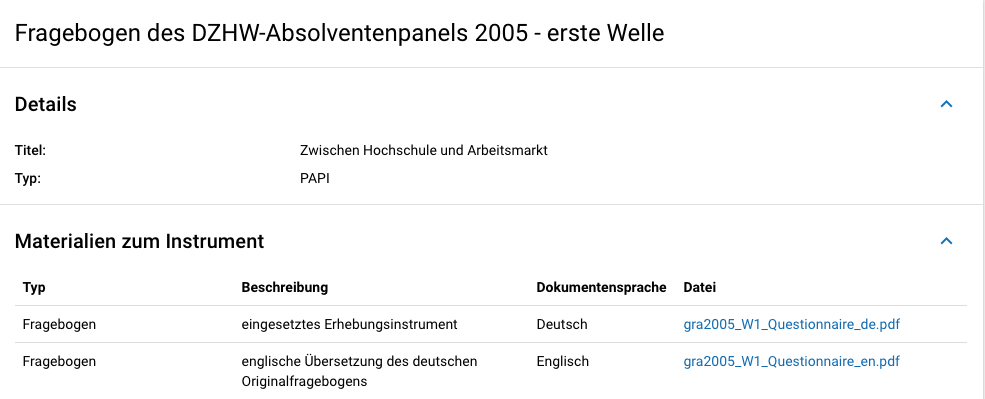
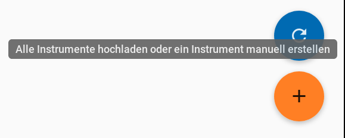
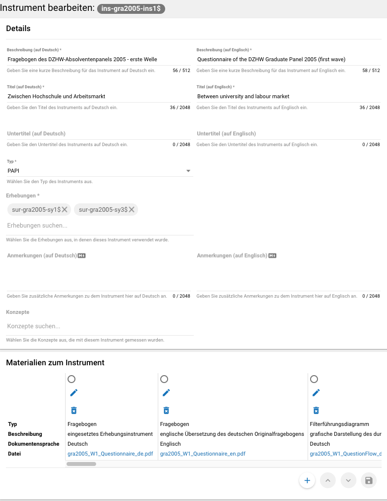

.. _Instrumente:

Erhebungsinstrumente (instruments)
---------------------------------

Als Instrument wird das Erhebungsinstrument bezeichnet (z.B. Fragebogen).

**Übersicht**

Wenn Sie Informationen über Ihre Erhebungsinstrumente aufnehmen, wird
folgende Übersicht im MDM erstellt:

   Instrumentenübersicht im MDM am Beispiel des Fragebogens der ersten Welle im Absolventenpanel 2005

**Eingabemaske**

Erhebungsinstrumente lassen sich per Eingabemaske erfassen und editieren.
Dafür darf das Datenpaket aktuell nicht released sein.
Um ein Erhebungsinstrument mittels Eingabemaske anzulegen, wird im
Projektcockpit unter Instrumente auf den Neu-Button oder geht über die Suche in
die Instrumentenebene und klickt auf den Plus-Button. Es öffnet sich bei beiden
Herangehensweisen die Eingabemaske um ein neues Instrument anzulegen.

   Plusbutton

Die Eingabemaske besteht
aus den Pflichtfeldern Beschreibung, Titel, Typ und Erhebung, sowie
den nicht verpflichtenden Feldern Untertitel, Anmerkungen und Konzepte (s. :numref:`eingabemaske_instrument_de`).
Konzepte müssen zuerst, wie gleichnamigen Kapitel erklärt, angelegt werden und können danach über die Eingabemaske verlinkt werden.

   Eingabemaske Instrument

Des weiteren können weitere Materialien zum Instrument
hochgeladen werden. Um weitere Materialien hochzuladen muss zunächst das
Instrument abgespeichert sein.
Im Anschluss muss der Plusbutton gedrückt werden, woraufhin sich ein Dialog
öffnet (s. :numref:`instruments_anhang_dialog`), in welchem der Anhang
hochgeladen werden kann und Metadaten zur Datei
eingegeben werden können. Um die Datei hochzuladen wird auf den
Büroklammer-Button gedrückt und es öffnet sich ein
weiterer Dialog. Alle Felder dieses Dialogs sind verpflichtend. Anschließend
lässt sich der Anhang mit dem Speichern-Button (Diskettensymbol unten rechts)
speichern.

.. figure:: ./_static/instruments_anhang_dialog.png
   :name: instruments_anhang_dialog

   Instrumente Anhang

Zu den möglichen Anhängen zählen z. B. Fragebögen, Variablenfragebögen
sowie Filterführungsdiagramme [4]_. Diese müssen als PDF-Dateien
vorliegen. [5]_ Außerdem können an dieser Stelle Codierlisten, welche
als Excel-Tabelle vorliegen müssen, erfasst werden.

Sollte es Erhebungsinstrumente geben, welche in einer anderen Sprache als
deutsch oder englisch existieren, werden diese nur als Attachment und nicht auf
Variablenebene bereitgestellt.
