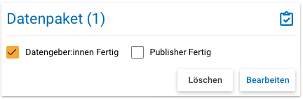

.. _ProjektCockpit:

Projekt-Cockpit
=================================

Die Eingabe der Metadaten wird über das "Projekt-Cockpit" verwaltet.
In der Navigationsleiste links, welche ggfs. aufgeklappt werden muss, finden Sie den Zugang zum Projekt-Cockpit über den Projekt-Cockpit-Button (vgl. :numref:`projectcockpit`).

.. figure:: ./_static/cockpit-button.png
   :name: projectcockpit

   Projekt-Cockpit-Button

Innerhalb des Projekt-Cockpits sehen Sie unter dem Reiter "Einstellungen" (vgl. :numref:`project_cockpit_settings`), 
welche Publisher (FDZ-Mitarbeiter:innen) und Datengeber:innen dem Projekt zugewiesen sind und welche Metadaten erwartet werden.
Die erwarteten Metadaten werden im Vorfeld zwischen Ihnen und den Publishern abgestimmt.

.. figure:: ./_static/projectcockpit_settings_dataprovider.png
   :name: project_cockpit_settings

   Projekt-Cockpit Einstellungen

**Es werden lediglich die erwarteten Metadatenebenen im Reiter "Status" angezeigt** (vgl. :numref:`projectcockpit_status_empty`). Zudem wird hier angezeigt, ob das Projekt freigegeben ist, also die eingegebenen Metadaten für alle öffentlichen Nutzer:innen des Rechercheportals sichtbar sind, und ob das Projekt gerade bei den Publishern oder bei den Datengeber:innen zur Bearbeitung liegt.

.. figure:: ./_static/projectcockpit_dataprovider_status_empty.png
   :name: projectcockpit_status_empty

   Projekt-Cockpit-Status mit allen Metadatenebenen (nicht jedes Projekt muss alle Metadatenebenen bedienen)

Anfangs liegt das Projekt immer zur Bearbeitung bei den Publishern und Sie als Datengeber:innen werden per E-Mail benachrichtigt, wenn es Ihnen zugewiesen wird.
**Für die Ebenen Datenpaket, Erhebungen und Erhebungsinstrumente können Sie die Metadaten dann über Eingabemasken selbst erfassen. Zur jeweiligen Eingabemaske gelangen Sie über den Neu-Button.** Genauere Informationen zu den Eingabemasken finden Sie :ref:`hier <Eingabemasken>`.

**Es ist immer möglich, dass Sie Ihre bisherigen Eingaben zu einem späteren Zeitpunkt weiter bearbeiten.** Über den Bearbeiten-Button im Projekt-Cockpit gelangen Sie auf der Datenpaket-Ebene direkt zur Eingabemaske mit dem aktuellen Stand Ihrer Eingaben. Bei den anderen Ebenen werden Sie zunächst zu einer Übersicht mit allen Erhebungen bzw. Instrumenten weitergeleitet. Pro Erhebung bzw. Instrument finden Sie jeweils unten rechts einen Bearbeiten-Button, über den Sie zur Eingabemaske gelangen. Zudem können Sie mit dem Löschen-Button bereits angelegte Erhebungen bzw. Instrumente auch komplett löschen.

**Wenn Sie mit der Eingabe der Metadaten einer Ebene fertig sind**, setzen Sie bitte im Projekt-Cockpit-Status das entsprechende Häkchen (siehe :numref:`projectcockpit_dataprovider_ready`).

   
   Häkchen gesetzt durch Datengeber:innen auf Datenpaket-Ebene

**Wenn Sie alle von Ihnen zu bearbeitenden Ebenen als "fertig" markiert haben**, können Sie das Projekt wieder den Publishern zuweisen.
Dafür klicken Sie den "Papierflieger"-Button (siehe :numref:`papierflieger`).

.. figure:: ./_static/cockpit_papierflieger.png
   :name: papierflieger
   
   Papierflieger-Button

Nachdem der Papierflieger-Button geklickt wurde, erscheint der "Nachricht an Publisher"-Dialog. Sie können dem Publisher hier noch einmal den genauen Stand sowie mglw. Fragen und Hinweise schreiben.

Die Publisher nehmen ein Review der eingetragenen Metadaten vor. Falls die Publisher denken, dass noch etwas vergessen wurde oder anders eingegeben werden sollte, weisen sie Ihnen das Projekt zurück zu und Sie werden per E-Mail darüber benachrichtigt. Zudem werden noch weitere Metadaten durch die Publisher ergänzt. Erklären die Publisher die Eingabe der Metadaten auf einer Ebene als "fertig", setzen sie ebenfalls ein entsprechendes Häkchen (siehe :numref:`dp_ready`).

.. figure:: ./_static/cockpit_dp_ready.png
   :name: dp_ready
   
   Häkchen gesetzt durch Datengeber:innen und Publisher auf Datenpaket-Ebene

Sind alle erwarteten Ebenen mit zwei Häkchen markiert, können die Publisher das Projekt für alle öffentlichen Nutzer:innen des Rechercheportals freigeben.
