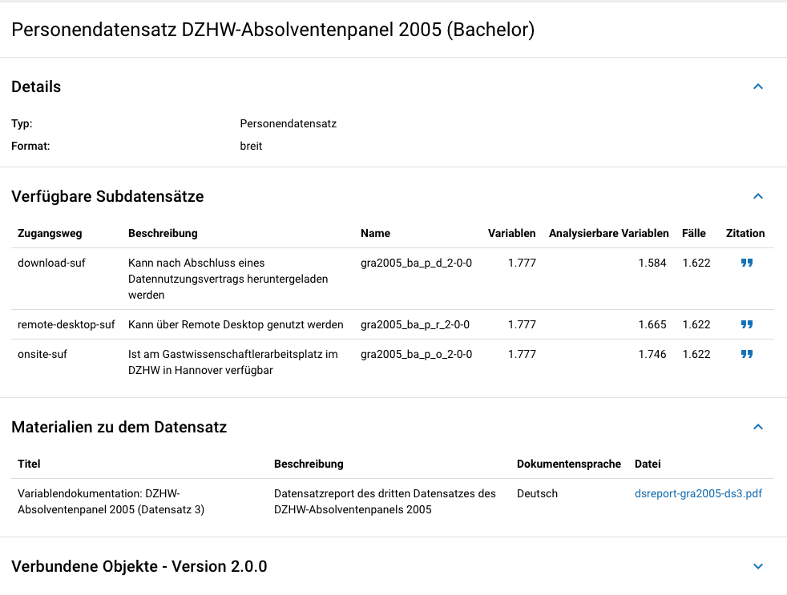
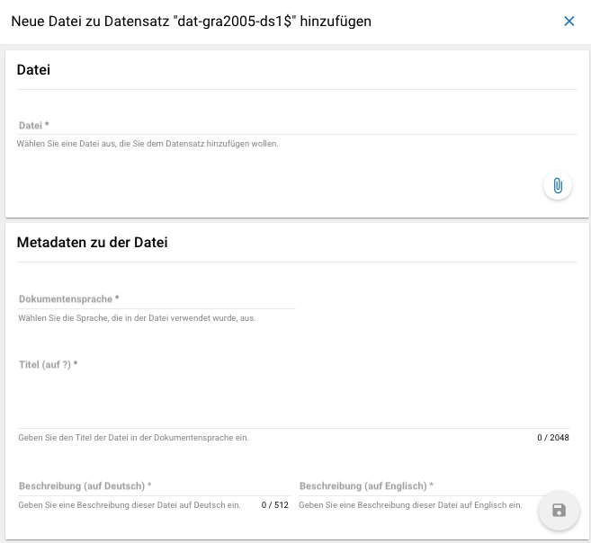

.. _Datensätze:

Datensätze (dataSets)
---------------------------------

**Übersicht**
Für die Dokumentation der Datensätze werden die "Master"(AIP)-Datensätze
(siehe Zwiebelmodell) genutzt. Diese Datensätze sind die größte mögliche
Vereinheitlichung eines Datensatzes, also keine Teilpopulation oder Teilmenge
von Variablen eines Datensatz. Datensätze die sich als Teilmenge eines
"Master"-Datensatzes abbilden lassen werden über die Subdatensätzen
(SubDataSets) dokumentiert. Mit Subdatensätzen sind solche gemeint,
die Sie nach einer Anonymisierung Ihrer Daten erhalten. Sie können mehrere
Stufen der Anonymisierung verwenden, wobei jede Stufe einen eigenen Zugangsweg
zu den anonymisierten Daten mit sich bringt. Für jeden Zugangsweg
wird dann ein eigener Subdatensatz erstellt.

Mit den Informationen über die Datensätze, welche Sie aus den Daten
Ihres Datenpakets erstellt haben, wird für jeden dieser Datensätze folgende
Übersicht im MDM angezeigt:

   Datensatzübersicht im MDM am Beispiel des Personendatensatzes (Bachelor) im
   Absolventenpanel 2005

**Eingabemaske**

Datensätze lassen sich per Eingabemaske anlegen und editieren.
Hierfür muss man entweder über das Projektcockpit gehen, oder in der Suche auf
den Reiter Datensätze klicken (:numref:`mdm-ebenen`),
anschließend auf das Plussymbol (:numref:`neuerdatensatz`) in der unteren
rechten Ecke klicken. Anschließend öffnet sich die Eingabemaske
(siehe :numref:`dataset_eingabemaske`).

.. figure:: ./_static/new_dataset_de.png
   :name: neuerdatensatz

   Neuen Datensatz hinzufügen.

Die mit * markierten Felder sind verpflichtend.
Die verknüpften Erhebungen werden nach einem Klick in das Feld "Erhebungen"
automatisch vorgeschlagen und können per Klick ausgewählt werden.
Im Anschluss werden die Subdatensätze per Eingabemaske auf der selben Seite
eingegeben. Weitere Subdatensätze können per Klick auf das Plussymbol
hinzugefügt werden. Nachdem gespeichert wurde, lassen sich weitere Materialien
zum Datensatz hinzufügen.

.. figure:: ./_static/datensatz_eingabemaske.png
   :name: dataset_eingabemaske

   Eingabemaske der Datensatzebene.

Wenn Sie zusätzliche Materialien (z.B. Variablen-Dokumentation) auf Ebene der
Datensätze haben, können Sie diese hinzufügen. Hierfür muss zunächst der
Datensatz angelegt sein. Anschließend wird in der unteren linken Ecke auf den
blauen Plus-Button geklickt. [6]_

   Datensatz Anhänge

Es öffnet sich ein Fenster (siehe :numref:`dataset_attachments`) in dem Sie
eine Datei hochladen können und Metadaten zur Datei angeben müssen.
