.. _bilderfassung_pdf-label:

Bilderfassung aus PDF Dateien
=============================

Voraussetzungen:
~~~~~~~~~~~~~~~~

Fragebögen, die als eine pdf Datei vorliegen sollen gemäß der nächsten Schritte
bearbeitet werden.

Liegt zu dem Fragebogen, den es von Ihnen zu bearbeiten gilt, eine äquivalente
Excel Datei vor, so wäre es ratsam diese als Grundlage für die weitere Arbeit
zu verwenden. Hierbei ist es notwendig, dass jeder aufgeführten Frage in der
Excel Datei eine finale Bilddatei gegenüber steht.

Für die Bilderfassung aus einer pdf Datei kann sowohl der Adobe Acrobat XI Pro
als auch der Adobe Acrobat DC genutzt werden. In dieser Anleitung soll es aber
im Detail um das Arbeiten mit dem Adobe Acrobat XI Pro gehen, während die
Vorgehensweise mit dem Adobe Acrobat DC nur sehr knapp dargestellt wird.

Adobe Acrobat DC (knapp):
~~~~~~~~~~~~~~~~~~~~~~~~~

- Schritt 1: Öffnen der Datei in Adobe Acrobat DC

- Schritt 2: Klicken Sie mittels der linken Maustaste auf "Werkzeuge". Unter
  dieser Schlagzeile öffnet sich eine weitere Leiste. Wählen Sie nun "pdf Datei
  bearbeiten" und anschießend "Seite beschneiden" aus. Nun sind Sie in der Lage
  einzelne Fragen auszuschneiden.

- Schritt 3.1: Nachdem Sie alle Fragen mittels der in Schritt 2 genannten Tools
  ausgeschnitten haben, können Sie diese nun Extrahieren und speichern. Dies
  erfolgt mit dem Werkzeug "Seiten verwalten". Wählen Sie auch dies durch einen
  Linksklick mittels der Maus aus. Hier sind zwei Wege denkbar um Fortzufahren.

- Schritt 3.2.1 Wählen Sie die jeweiligen Seite, die es zu extrahieren gilt aus
  und ziehen Sie in einen von Ihnen gewählten Ordner (durch stetiges Festhalten
  der linken Maustaste).

  oder

  - 3.2.2 Wählen Sie in der rechten Leiste (Werkzeuge) "exportieren", bestimmen
    Sie die Seite, die exportiert werden soll und speichern Sie es in einem von
    Ihnen gewählten Ordner.

  Achten Sie darauf, dass der jeweilige Dateiname der Fragenummer entspricht!
  (zur Not auch nochmal mit Excel Tabelle abgleichen, falls vorhanden)

Adobe Acrobat XI Pro
~~~~~~~~~~~~~~~~~~~~

- Schritt 1: Öffnen Sie die Datei mit dem Adobe Acrobat XI Pro.
- Schritt 2.1.1: Es erscheint eine obere Leiste in der rechts der Begriff
  "Werkzeuge" zu finden ist. Wählen Sie diesen Befehl durch einen Linksklick der
  Maus aus (siehe Abb. 1.1).

*Abb. 1.1*

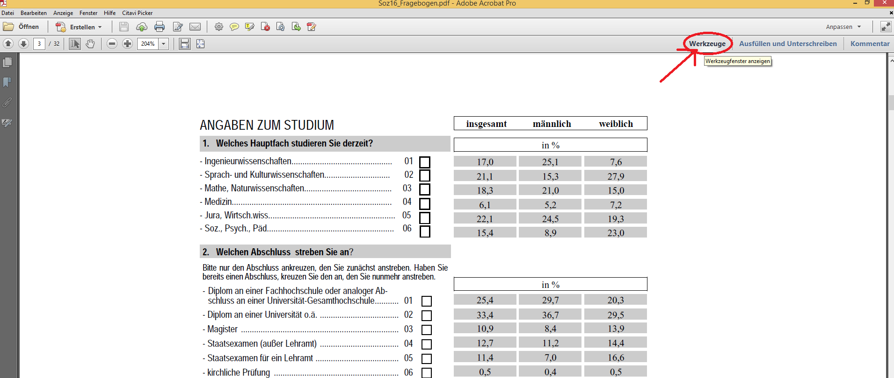

Nun sollte sich ein weiterer Spaltenblock öffnen (siehe Abb. 1.2).

*Abb. 1.2*

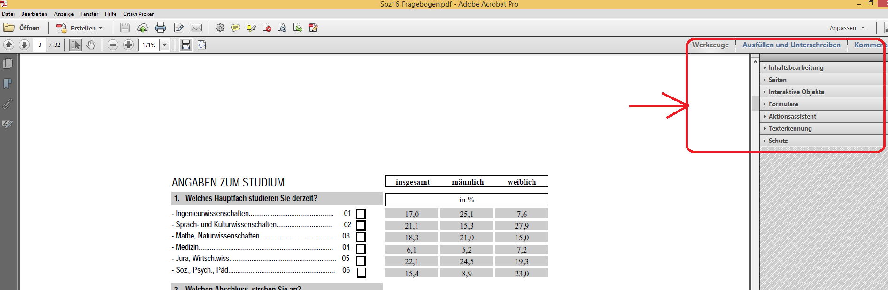

An dieser Stelle klicken Sie auf "Seiten". Auch hier eröffnet sich ein weiterer
Spaltenblock mit ergänzenden Werkzeugen. Unter der Rubrik "Seiten manipulieren"
finden Sie die Instrumente "Zuschneiden" sowie "Extrahieren". Diese sind für
unser weiteres Vorgehen wesentlich (siehe Abb. 1.3)

*Abb. 1.3*

.. figure:: ./_static/pdf_extraction_1_3.png

Um nun mit dem Zu- und Ausschneiden der einzelnen Fragen zu beginnen, wählen Sie
den Befehl "Zuschneiden" aus. Klicken sie durch Betätigen der linken Maustaste
links oberhalb der Frage, die es auszuschneiden gilt und markieren Sie durch
stetiges Festhalten der linken Maustaste alle relevanten Elemente der Frage.
Dabei erscheint ein schwarz umrandetes Viereck. In diesem müssen alle
Bestandteile der Frage enthalten sein!(siehe Abb. 1.4)

*Abb. 1.4*

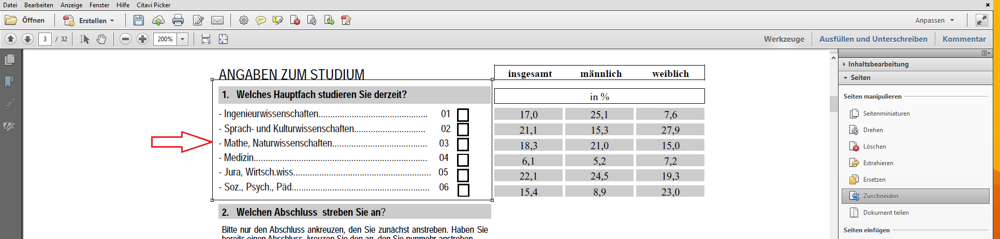

Anschließend betätigen Sie die Enter Taste ihrer Tastatur. Dabei eröffnet sich
eine Maske (siehe Abb. 1.5) welche Sie mit "OK" bestätigen.

*Abb. 1.5*

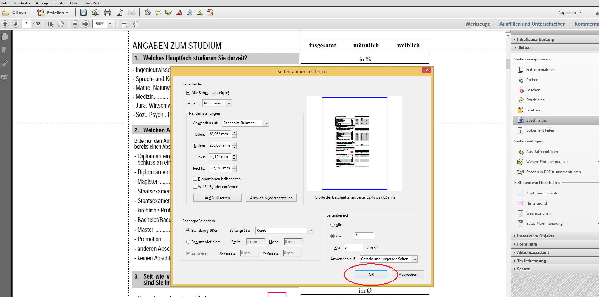

Nachdem Sie die Maske durch das Bestätigen des "OK" Buttons geschlossen haben,
sollte auf ihrem Bildschirm nun eine ähnliche Darstellung wie in Abb. 1.6 erscheinen.

*Abb. 1.6*

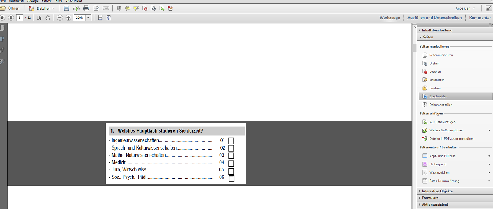

**Hinweis**:
Dies ist der einfachste Fall der in Schritt 2.1 beschrieben wird. Es kann aber
durchaus vorkommen, dass eine Frage sich über zwei Seiten erstreckt, was das
Ausschneiden der Frage erschwert. Hierbei ist erst einmal das Zusammenführen der
Frage auf einer gemeinsamen Seite notwendig, bevor man mit dem Zuschneiden
beginnen kann. Wie dies zum Beispiel aussehen kann ist in Abb. 1.7 zu sehen.

*Abb. 1.7*
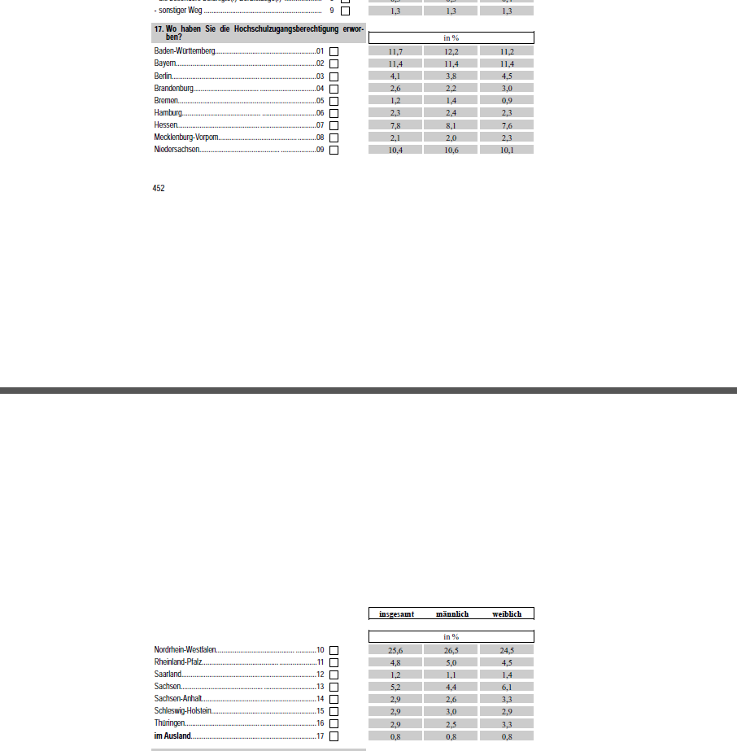

- Schritt 2.1.2 Liegt diese Ausgangssituation vor, so ist es notwendig Werkzeuge
  unter dem Begriff "Inhaltsbearbeitung" zu verwenden. Dies ist ebenfalls in der
  rechten Leiste unter Werkzeuge zu finden (Siehe Abb. 1.8)

*Abb. 1.8*

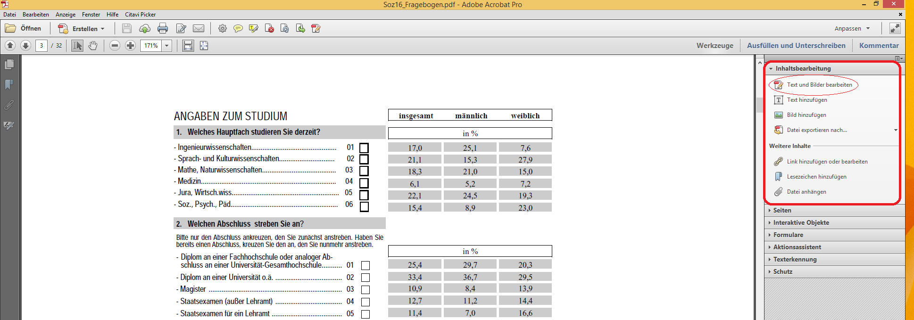

In diesem Zusammenhang ist lediglich der Befehl "Text und Bilder bearbeiten"
relevant. Äquivalent zum Vorgang des Zuschneidens, klicken wir auch hier per
Linksklick neben die auszuschneidenden Elemente und ziehen durch Halten der
linken Maustaste ein Viereck um diese. Alle ausgewählten Elemente müssen nun
blau umrandet sein (siehe Abb. 1.9).

*Abb. 1.9*

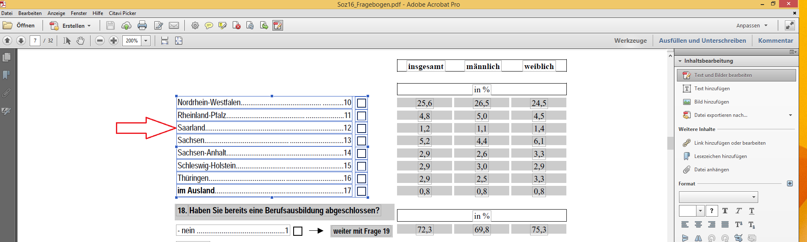

Als nächstes klickt man mittels der rechten Maustaste in das Viereck und wählt
schließlich "ausschneiden" aus (siehe Abb. 1.10).

*Abb. 1.10*

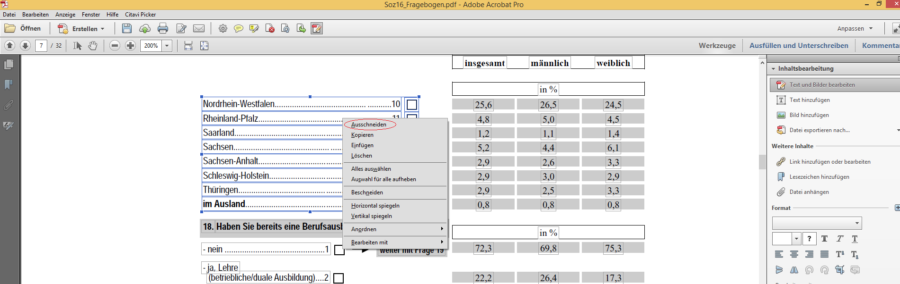

Um die Frage nun auf einer Seite zusammenzuführen, klicken Sie nun mit der
rechten Maustaste auf die Seite, auf der die soeben ausgeschnittenen Elemente
hinzugefügt werden sollen. Dabei eröffnet sich ein Spaltenblock in dem Sie bitte
"einfügen" auswählen (siehe Abb. 1.11).

*Abb. 1.11*

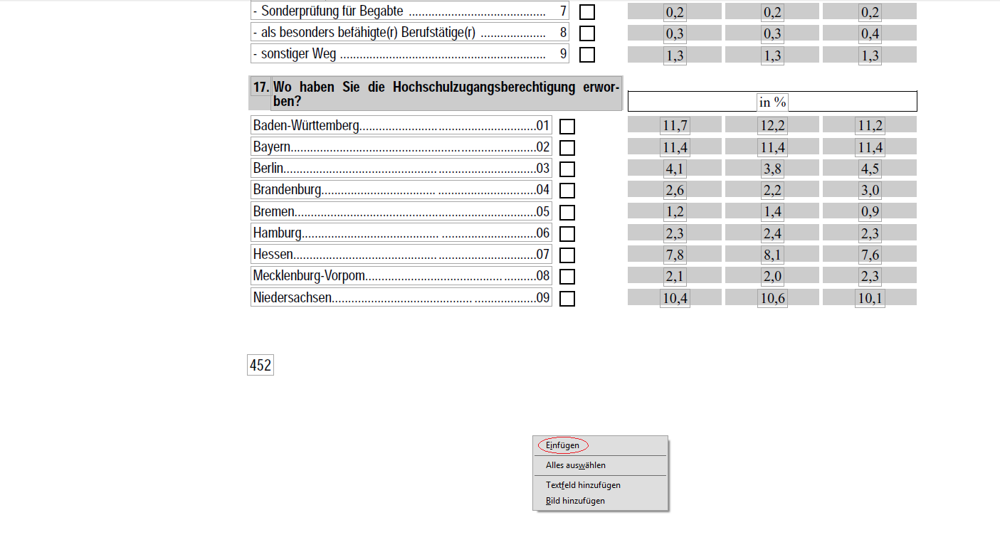

Schließlich können Sie die Frageelemente so verschieben, dass die Frage
vollständig auf einer gemeinsamen Seite vorliegt. Verschieben Sie die
Frageelemente, indem Sie den Mauszeiger auf den äußersten blauen Rand bewegen,
wodurch dann ein Kreuz aufzeigen müsste, welches an jedem Ende mit Pfeilen
versehen ist. Klicken sie mittels der linken Maustaste darauf und verschieben
Sie die Elemente unter stetigem Halten der linken Maustaste an den gewünschten
Ort. Es ist möglich, dass vorher allerdings noch weitere Elemente auf der Seite
zu entfernen sind, da es sonst zu Überschneidungen und damit zu
Unleserlichkeiten kommen könnte (siehe Abb. 1.12/ 1.13)

*Abb. 1.12*

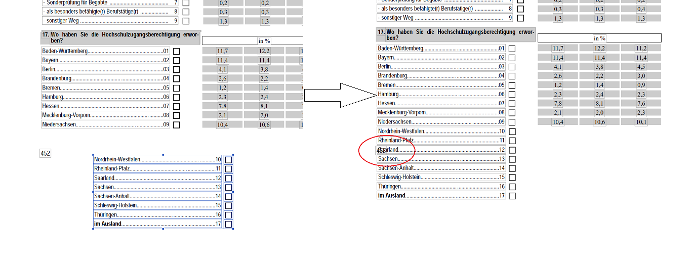

*Abb. 1.13*

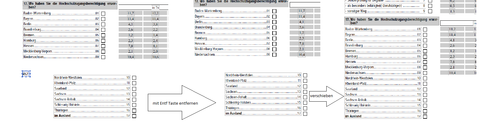

In Abbildung 1.12 und 1.13 sehen Sie eine beispielhafte Vorgehensweise. In
Abbildung 1.13 wurde die Zahl 452 entfernt, indem es ebenfalls mittels des
Instruments "Texte und Bilder bearbeiten" markiert wurde und durch
anschließendes Drücken der "Entf" Taste der Tastatur gelöscht worden ist.

Im Anschluss daran können Sie wie in Schritt 2.1.1 dargestllet mit dem
Zuschneiden der Frage fortfahren.

- Schritt 2.2: Nun können wir die ausgeschnittene Frage transportieren. Dafür
  wählen Sie das Instrument "Extrahieren" aus. Wie bereits in Abb. 1.3
  dargestellt, befindet sich dieses Werkzeug ebenfalls unter der Kategorie
  "Seiten manipulieren". Dabei öffnet sich erneut eine Maske, in der Sie die zu
  entnehmende Seite auswählen sollen. Hierbei ist meist, die zuvor
  zugeschnittene Seite vorausgewählt. Überprüfen Sie es gegebenenfalls noch
  einmal und Bestätigen Sie dann durch Klicken auf den "OK" Button.
  Dies ist in Abb. 1.14 dargestellt.

*Abb. 1.14*

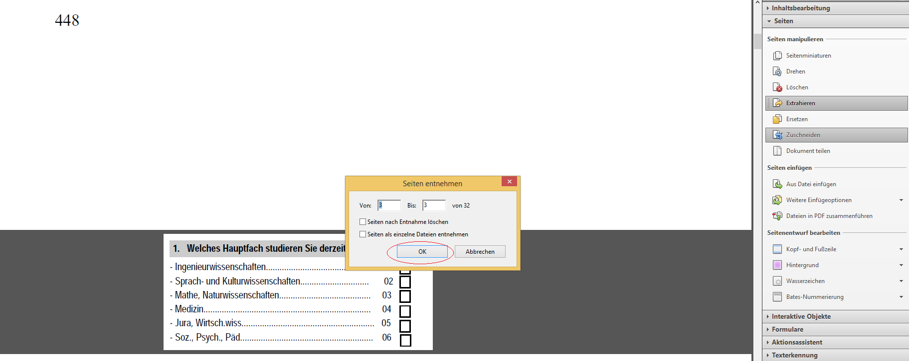

Anschließend sollte auf Ihrem Bildschirm ein ähnliches Bild erscheinen, wie in
Abb. 1.15 abgebildet.

*Abb. 1.15*

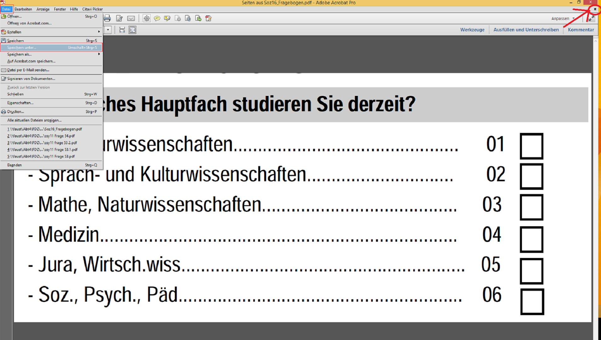

Um das Transportieren nun vollständig abzuschließen klicken Sie oben rechts auf
Datei und anschließend auf "Speichern unter". Wichtig ist hierbei, dass der
ausgewählte Dateiname, unter dem die neue Datei gespeichert werden soll der
Fragenummer entspricht. (eventuell mit der Excel Tabelle abgleichen)

- Schritt 2.3: Um nun fortzufahren und weitere Fragen als pdf Datei zu
  extrahieren, klicken Sie auf das kleine Kreuz (wie in Abb. 1.15
  gekennzeichnet). Dabei wird das Fenster geschlossen. Damit die ursprüngliche
  Datei wieder als solche vorliegt, wie es vor dem Beschneiden der Seiten der
  Fall war, wählen Sie nun in der oberen Leiste erst "Bearbeiten" aus und
  anschließend "Rückgängig: Seiten beschneiden" (siehe Abb. 1.16). Dieser
  Schritt ist vor allem empfehlenswert, wenn sich mehrere Fragen auf einer Seite
  befinden. Hierdurch wird das stetige Wiederöffnen der Datei vermieden und es
  wirkt sich zeitsparend aus.

*Abb. 1.16*

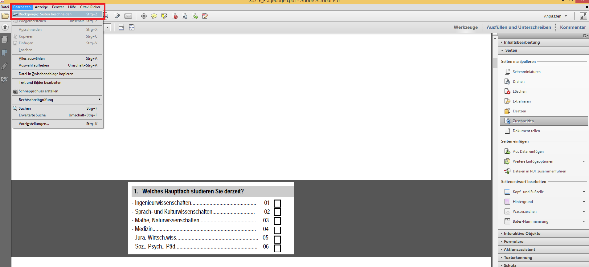

- Schritt 3: Der letzte Schritt beinhaltet das Konvertieren der extrahierten
  Fragen vom pdf Format ins png Format. Hierfür können Sie den Online Converter
  "pdf2png" nutzen. https://online2pdf.com/de/pdf-zu-png-konvertieren

**ACHTUNG**: Hier ist nur ein begrenztes Volumen an Konvertierungen pro Tag von
150MB möglich.
