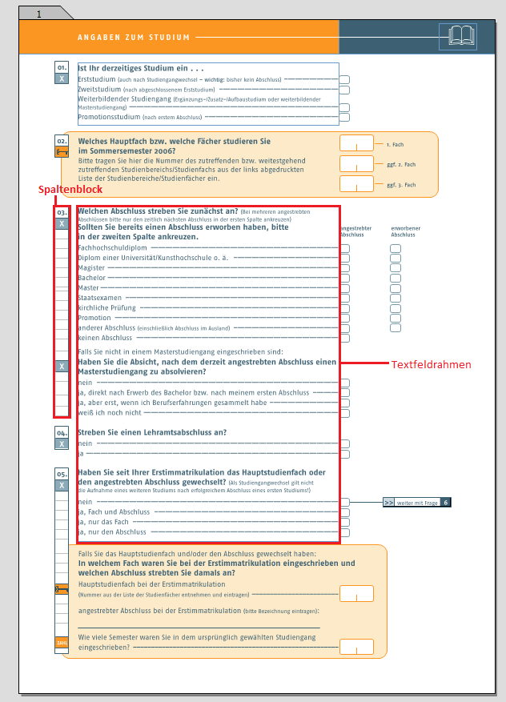
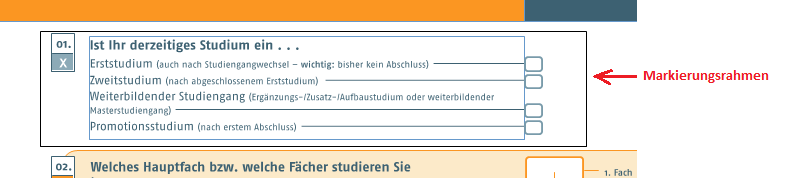
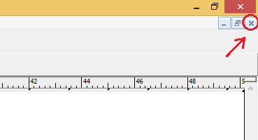
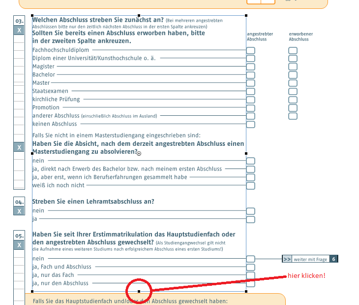
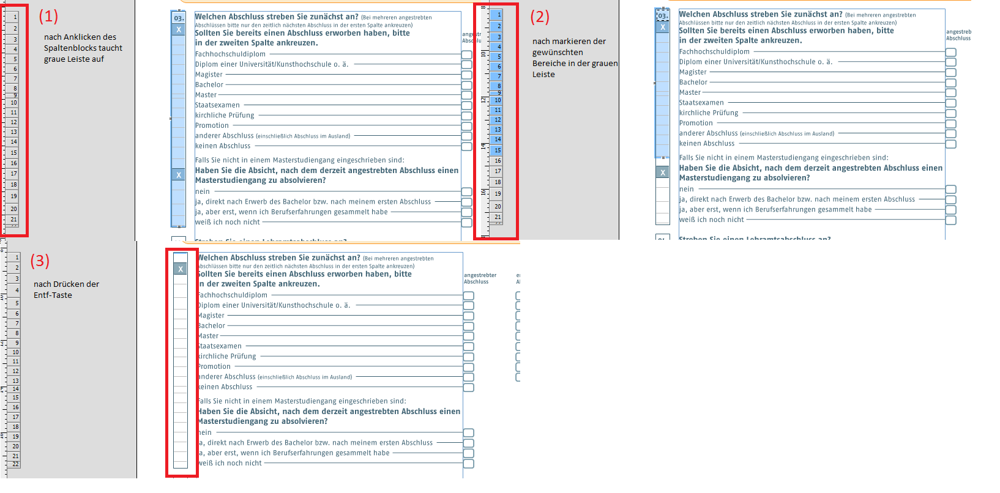
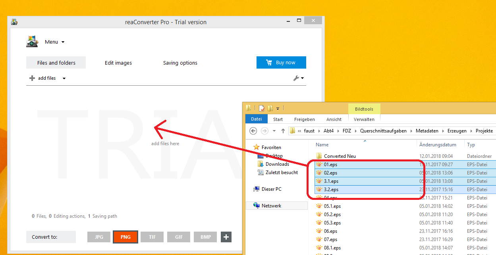
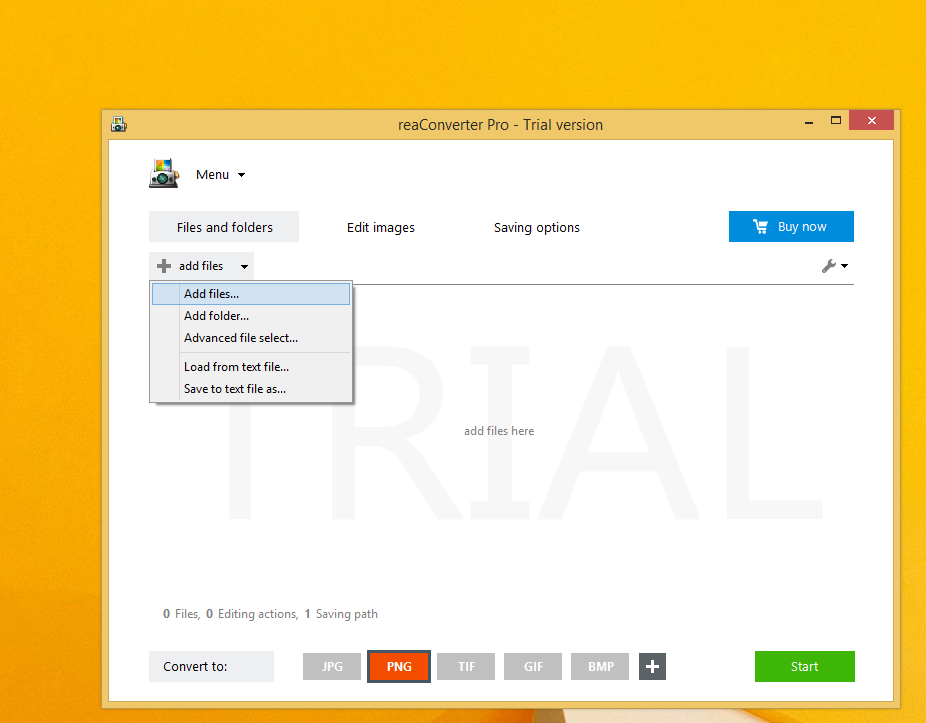
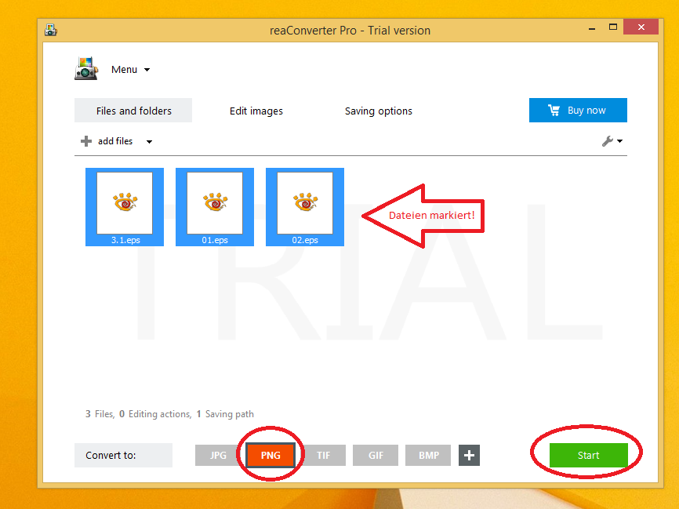

    .. _bilderfassung_ragtime-label:

Bilderfassung aus RagTime
=========================

Vorraussetzungen
~~~~~~~~~~~~~~~~

Fragebögen, die als eine Ragtime Datei vorliegen sollen gemäß der
nächsten Schritte bearbeitet werden.

Liegt zu dem Fragebogen, den es von Ihnen zu bearbeiten gilt, eine
äquivalente Excel Datei vor, so wäre es ratsam diese als Grundlage für die
weitere Arbeit zu verwenden. Hierbei ist es notwendig, dass jeder aufgeführten
Frage in der Excel Datei eine finale Bilddatei gegenüber steht.

**Schritt 1:**

Zuerst öffnen Sie die zu bearbeitende Datei mit Ragtime.

**Schritt 2:**

**Schritt 3.0: Markieren von Elementen in Ragtime**

Wählen Sie nun die Elemente aus, die es als Bilddatei zu exportieren gilt.
Markieren Sie die ausgewählten Inhalte, indem Sie den Mauszeiger vom Beginn
des zu markierenden Feldes unter Festhalten der linken Maustaste bis zum Ende
des gewünschten Feldes bewegen (ziehen). Während dieses Vorgangs bildet sich
ein schwarzes Rechteck, in welchem alle zu markierenden Elemente vollständig
enthalten sein müssen; Elemente außerhalb dieses Vierecks werden nicht markiert.

   Elemente markieren.

- Falls der Text nicht markiert wurde, da der Textfeldrahmen noch weitere
  Fragen beinhaltet fahren Sie fort mit Schritt 3.1 ff.
- Ist dies nicht der Fall; weiter mit Schritt 4

**Schritt 3.1: Text in einem Textfeldelement bearbeiten**

Um gewünschte Textelemente aus einem zu großen Textfeldrahmen auszuschneiden,
muss eine Platzierung des Mauszeigers innerhalb des Textfeldes erfolgen.
Durch einen darauffolgenden Rechtsklick öffnet sich ein Menü, in welchem Sie die
Auswahlmöglichkeit "Komponente öffnen" erwählen. Dadurch öffnet sich ein neues
Fenster, in dem die Bearbeitung des gesamten Textes des ausgewählten
Textfeldrahmens möglich ist. Nun können Sie den Text bearbeiten: Löschen Sie
alle irrelevanten Textpassagen und schließen Sie das Fenster.

*ACHTUNG*: Beachten Sie, dass Sie das kleine, graue X drücken, um das
Komponentenfenster zu schließen.

   Komponentenfenster schließen.

**Schritt 3.2: Anpassen des Textfeldrahmens**

Durch das Löschen irrelevanter Elemente kann sich der Text innerhalb des
Textfeldrahmens verschieben. Deswegen muss der Textfeldrahmen in diesem Schritt
angepasst werden: Durch Anklicken des Textfeldrahmens ist dies möglich. Bewegen
Sie hierfür den Mauszeiger auf den mittleren schwarzen Markierungspunkt des
unteren Randes des Textfeldrahmens. Dabei müsste sich der Mauszeiger zu einem
Kreuz verändern. Durch Linksklick und anschließendes Festhalten können Sie den
Rahmen sowohl nach unten als auch nach oben anpassen. Ziehen Sie den Rahmen bis
zum Ende der letzten Textpassage des Textelementes hoch. Dadurch ist
gewährleistet, dass der Text ebenfalls bei dem Exportieren markiert werden kann.

   Textfeldrahmen anpassen

**Schritt 3.3: Verschieben der zusätzlichen Elemente**

Durch das mögliche Verschieben des Textes, müssen die dazugehörigen Elemente wie
z.B. Antwortkästchen einer Frage etc. ebenfalls angepasst werden. Solche
Elemente können wie in Schritt 3.0 beschrieben verschoben werden.

**Schritt 3.4: Anpassen des Spaltenblocks**

Es kann zudem der Fall eintreten, dass der Spaltenblock angepasst werden muss.
Dazu wählt man diesen durch einen Klick aus. Dabei öffnet sich auf der linken
Seite des Fensters eine graue, durchnummerierte Leiste (1). In dieser ist es
möglich Elemente wie z.B. grau unterlegte Kreuze zu entfernen. Durch das
Markieren einer Nummer wird das dazugehörige Kästchen des Spaltenblocks blau
unterlegt (2) und man kann es durch Drücken der Entf - Taste löschen (3). Wie
bei dem Textfeldrahmen, ist es bei dem Spaltenblock möglich die Ränder durch die
schwarzen Punkte zu verschieben.

   Anpassen des Spaltenblocks

**Schritt 3.5: Fertigstellung**

Liegen nun alle gewünschten Elemente in der richtigen Anordnung, werden alle
markiert und setzt mit Schritt 4 fort.

**Schritt 4: Exportieren**

Sind alle Elemente markiert (WICHTIG: überprüfen Sie, ob wirklich jedes Element
von Markierungspunkten umrandet ist, ansonsten werden nicht markierte Elemente
nicht exportiert), kann durch Betätigen der rechten Maustaste der markierte
Bereich exportiert werden. Hierbei ist es wichtig darauf zu achten, dass der
Mauszeiger auf einem der schwarzen Markierungspunkte liegt, da ansonsten die
Markierung aufgehoben wird.
Im weiteren Verlauf öffnet sich ein Menü, in welchem die Option "Exportieren..."
aufzufinden ist. Wählen Sie diese Option aus um die ausgewählten Elemente
gesondert von der ursprünglichen Datei zu speichern.

**Schritt 5: Speichern**

Beim Speichern müssen Sie folgende Details beachten:

- Falls eine Excel- Datei vorhanden ist, achten Sie auf übereinstimmenden
  Dateinamen und der dazugehörigen Fragennummer (die in der Excel-Datei
  aufgeführt ist).
- Stellen sie sicher, dass der Dateityp "PostScript-Illustraition (EPSF)
  (\*.eps)" ausgewählt ist.
- Unter dem Punkt "Exportieren" muss zudem die Option "Auswahl" gewählt sein.

**Schritt 6: Konvertieren von .eps zu .png**

Die abgespeicherten .eps - Dateien müssen in einem weiteren Schritt in .png -
Dateien konvertiert werden. Dies erfolgt am Besten mit dem ReaConverter7Pro.
(dieser Konverter ist kostenpflichtig, daher handelt es sich hierbei um eine
Testversion. Aus diesem Grund können hierbei lediglich fünf Dateien gleichzeitig
konvertiert werden.)

- Um die Dateien zu konvertieren, zieht man die eps Dateien in das offene Feld
  indem man Dateien markiert, die rechte Maustaste festhält und Dateien mittels
  Bewegens des Mauszeigers schließlich rüberzieht.

- Wenn Sie ab einem bestimmten Punkt alle Objekte markieren wollen, dann klicken
  Sie mit der linken Maustaste zunächst auf die erste Datei / Ordner und halten
  Sie die Shift-Taste gedrückt, während Sie auf das letzte Objekt Ihrer Auswahl
  mit der linken Maustaste klicken.

   Anpassen des Spaltenblocks

- Oder man klickt auf "add files". Der Computer kann dann auf Dateien durchsucht
  werden und ausgewählte Dateien können hinzugefügt werden.

- Als nächstes wählt man unter Convert to: das gewünschte Format "PNG" aus.
  Das ausgewählte Format sollte nun orange aufleuchten. Als letztes markiert
  man die zu konvertierenden Dateien und klickt unten rechts auf den grünen
  Button "Start".

