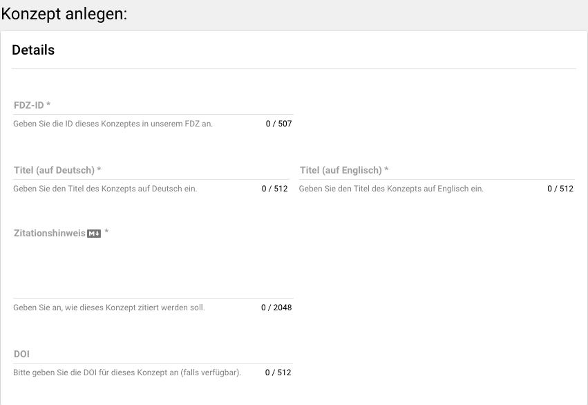
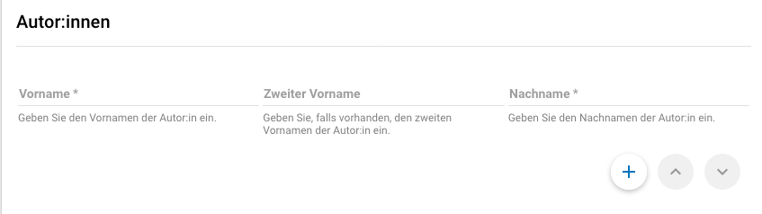
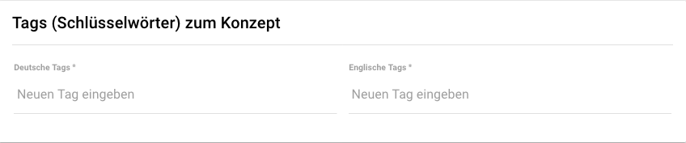

Konzepte (concepts)
---------------------------------

Konzepte können ausschließlich von Publishern angelegt werden.
Der Begriff "Konzept" kann auf mehreren Ebenen angewendet werden. Im Kontext des MDM
sind konkrete Konzept-Instrumente gemeint. Im folgendes wird es am Beispiel des Konzeptes Persönlichkeit erklärt:
Es gibt mehrere Modelle, die das Konzept "Persönlichkeit" erfassen können: z.B. Big5 und DISG.
Ins MDM tragen Sie bitte konkrete Messinstrumente ein, also z.B. eine bestimmte Big5 Kurzskala.
Da so eingetragene Konzepte mit mehreren Datenpaketen (auf verschiedenen Ebenen) verknüpft werden können,
kann der/die EndnutzerIn so Datenpakete heraussuchen, die ein bestimmtes Konzept auf gleiche Art und Weise
gemessen haben.

   Konzeptdetails

Zunächst müssen Sie eine Konzept-ID festlegen. Diese folgt der Form Abkürzung.Jahreszahl, wobei sich
die Jahreszahl auf das Publikationsdatum des Zitationshinweises bezieht. Die ID, Titel und Zitationshinweis sind verpflichtend
auszufüllen, während die DOI lediglich angegeben werden muss, wenn eine DOI registriert wurde.

.. figure:: ./_static/concept_description.png
   :name: konzept_beschreibung

   Konzeptbeschreibung

Eine Beschreibung des Konzepts ist verpflichtend auf Deutsch und Englisch.

   Konzept-Autor:innen

Bitte geben Sie außerdem alle Autor:innen des Konzeptes an.

   Konzept-Tags

Sie können außerdem Tags, also Schlüsselwörter zum Konzept angeben. Diese sind nicht verpflichtend,
erleichtern es aber Datennutzer:innen sehr, für sie relevante Datenpakete zu finden.

.. figure:: ./_static/concept_license.png
   :name: konzept_license

   Konzept-Lizenz

Idealerweise hat ein Konzept eine Lizenz, sodass rechtlich geregelt ist, unter welchen Umständen
das Konzept weitergegeben, verwendet oder modifiziert werden darf. Dieses wird auf Englisch eingetragen (ggfs. muss es übersetzt werden).
Außerdem kann ein Link zur Lizenz angegeben werden.

.. figure:: ./_static/concept_language_materials.png
   :name: concept_language_materials

   Konzept-Sprache und -Materialien

Die ursprüngliche Sprache(n) des Konzepts müssen Sie auch angeben. Materialien zum Konzept, also Anhänge, können
erst nachdem das Konzept gespeichert wurde angehängt werden.

Fragen und Instrumente können mit Konzepten verbunden werden. Die Verknüpfung von Fragen und Konzepten
geschieht im Handcrafted-to-MDM-Schritt der Frage-Metadatenerstellung.
