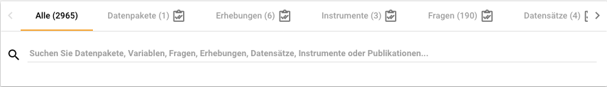
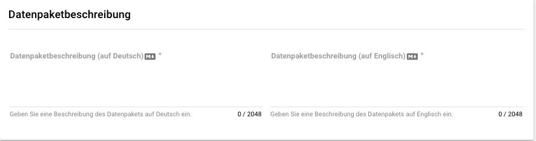
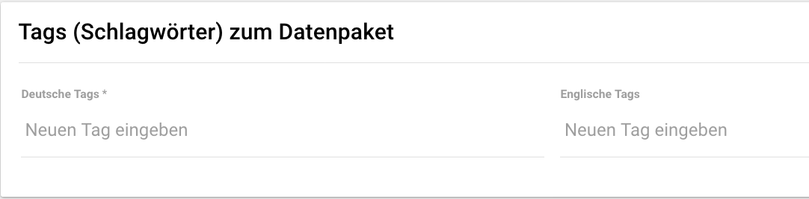
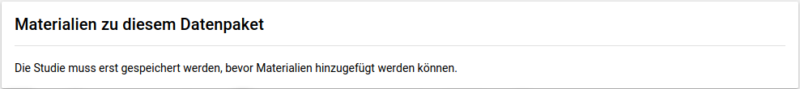
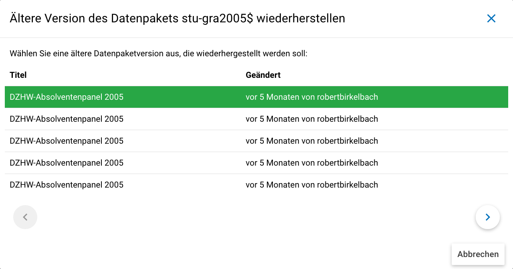

.. _metadatenabgabe-label:

Metadatenabgabe (DatengeberInnen)
=================================
.. index:: data provider, Datenaufnahme

Allgemeines
-----------

Der Datenaufnahmeprozess im FDZ des DZHW
~~~~~~~~~~~~~~~~~~~~~~~~~~~~~~~~~~~~~~~~

Das FDZ des DZHW stellt Daten quantitativer und qualitativer Erhebungen
aus dem Feld der Hochschul- und Wissenschaftsforschung zur Verfügung.
Ein fester Bestandteil dieser Arbeit ist zunächst der Prozess der
Datenaufnahme, welcher im FDZ des DZHW durch das Metadatenmanagementsystem
(MDM) unterstützt wird. Im Metadatenmanagementsystem werden Metadaten
über die von Ihnen bereitgestellten Daten erfasst.
Dies erleichtert es SekundärforscherInnen für sie passende Datenpakete auszuwählen.
Für die strukturierte Aufnahme der Metadaten sind sieben unterschiedliche
Ebenen im MDM vorgesehen: *Datenpaket*, *Erhebungen*, *Erhebungsinstrumente*,
*Fragen*, *Datensätze*, *Variablen*, *Konzepte* und *Publikationen*.

Hierbei wird erfasst, welchem Datenpaket sowie welcher Erhebung die Daten
angehören, welche Erhebungsinstrumente genutzt wurden, welche Fragen
darin gestellt wurden, welche Datensätze existieren, welche Variablen
sich darin befinden und welche Veröffentlichungen bereits mit den Daten
realisiert worden sind. Dadurch, dass alle Ebenen miteinander verknüpft
sind, wird eine umfassende Durchsuchbarkeit aller verfügbaren Daten, die
vom FDZ des DZHW über das MDM verwaltet werden, ermöglicht. Das System
ist über die Website https://metadata.fdz.dzhw.eu zu erreichen.

   Darstellung der verschiedenen Ebenen im MDM; Pfeil rechts klicken um die weiteren Ebenen anzuzeigen

Die eigenständige Abgabe von Metadaten
~~~~~~~~~~~~~~~~~~~~~~~~~~~~~~~~~~~~~~

Wenn Sie Ihre Daten im FDZ des DZHW abgeben möchten, erfassen Sie die
projektbezogenen Metadaten selbst und können diese größtenteils
eigenständig in das MDM hochladen.

Die Abgabe der Metadaten ist innerhalb der einzelnen Ebenen
unterschiedlich komplex, sodass die Daten für jede der acht Ebenen
separat erfasst werden müssen. Hierfür hat das FDZ des
DZHW feste Strukturen entwickelt, die im weiteren Verlauf dieser
Anleitung für jede Ebene detailliert erläutert werden. Diesen Vorgaben
ist unbedingt Folge zu leisten, damit eine erfolgreiche Erfassung der
einzelnen Metadaten gewährleistet werden kann.

Aktuell können einige Metadaten über eine Eingabemaske im MDM direkt
eingetragen werden. Für die übrigen Ebenen müssen JSON-Dateien hochgeladen
werden, bzw eine Exceldatei ans FDZ übergeben werden bzw. hochgeladen werden.
In dieser Dokumentation wird lediglich auf den Standardfall eingegangen, bei dem die
Metadaten per Eingabemaske eingetragen werden. Zusätzlich ist auf manchen
Ebenen das Erstellen von weiteren Anhängen (vgl. :ref:`Anhänge`) vorgesehen.
Die Excel-Tabellen und eventuelle Anhänge müssen für jede Ebene dann entweder
ins MDM hochgeladen werden oder zunächst dem
FDZ zur weiteren Bearbeitung geschickt werden. Tabelle 1 zeigt eine
erste Übersicht über das Vorgehen der Metadateneingabe auf jeder Ebene,
detaillierte Erläuterungen werden in den nachstehenden Kapiteln folgen.

Tabelle 1: Vorgehen bei der Metadateneingabe pro Ebene

+-----------------+---------------------+-----------------+-----------------+
| Ebene           | Metadaten           | Zusätzliche     | Metadaten       |
|                 | eingeben            | Dateien         | abgeben         |
+=================+=====================+=================+=================+
| Datenpaket      | Eingabemaske        | Anhänge (PDF)   | Eingabemaske    |
|                 |                     |                 | ausfüllen       |
+-----------------+---------------------+-----------------+-----------------+
| Erhebungen      | Eingabemaske        | Anhänge (PDF)   | Eingabemaske    |
|                 |                     |                 | ausfüllen       |
+-----------------+---------------------+-----------------+-----------------+
| Erhebungs-      | Eingabemaske        | Anhänge (PDF,   | Eingabemaske    |
| instrumente     |                     | Excel)          | ausfüllen       |
+-----------------+---------------------+-----------------+-----------------+
| Fragen          | Excel-Tabelle       | Fragebilder     | Im              |
|                 | (oder JSON-         | (.png)          | Vorlage-Ordner  |
|                 | Dateien von Zofar)  |                 | speichern       |
+-----------------+---------------------+-----------------+-----------------+
| Datensätze      | Eingabemaske        | Anhänge (PDF)   | Eingabemaske    |
|                 |                     |                 | ausfüllen       |
+-----------------+---------------------+-----------------+-----------------+
| Variablen       | mind. 1             | mind. 1         | Im              |
|                 | Excel-Tabelle       | Datensatz       | Vorlage-Ordner  |
|                 |                     | (Stata)         | speichern       |
+-----------------+---------------------+-----------------+-----------------+
| Publikationen   | -                   | -               | Informationen   |
|                 |                     |                 | dem FDZ         |
|                 |                     |                 | schicken        |
+-----------------+---------------------+-----------------+-----------------+
| Konzepte        | -                   | -               | Informationen   |
|                 |                     |                 | dem FDZ         |
|                 |                     |                 | schicken        |
+-----------------+---------------------+-----------------+-----------------+

Vorbereitende Schritte
----------------------

Vergabe der DAP-ID
~~~~~~~~~~~~~~~~~~

Die Data Acquisition Project-ID (DAP-ID) ist das Kürzel des Datenpakets.
Bitte sprechen Sie mit dem Publisher einen Vorschlag ab, welcher dann mit dem Release-Manager
(aktuell Robert Birkelbach, stellv. Anne Weber) rückgesprochen wird, sodass es zu keinen
Inkonsistenzen kommt.

Registrierung
~~~~~~~~~~~~~

Sie müssen sich zunächst auf https://metadata.fdz.dzhw.eu registrieren,
um die Berechtigung für das Erfassen von Metadaten zu erhalten. Dies können Sie
über die Sidebar links auf der Website erledigen:

.. figure:: ./_static/registrierung_1_de.png
   :name: registrierung

   Registrierung im MDM Schritt 1

.. figure:: ./_static/registrierung_2_de.png
   :name: registrierung_2

   Registrierung im MDM Schritt 2

Im Anschluss erhalten Sie eine Bestätigungsmail. In dieser müssen Sie auf den
Aktivierungslink klicken, welcher nach drei Tagen automatisch abläuft. Im
Anschluss werden Sie von uns dem Projekt in der Rolle Datengeber/in
hinzugefügt.
Sie erhalten jeweils eine E-Mail wenn Sie Ihrem Datenaufbereitungsprojekt
hinzugefügt wurden und wenn das Projekt Ihnen von einer FDZ-Mitarbeiterin zur
Bearbeitung freigegeben wurde.
Falls Sie nicht kurz darauf dem Projekt zugewiesen worden sind, sprechen Sie bitte noch einmal den/die
FDZ-MitarbeiterIn an. Der/die FDZ-MitarbeiterIn muss einem der Admins Bescheid geben,
zu welchem Projekt Sie hinzugefügt werden sollen.

Allgemeiner Hinweis zur Formatierung
~~~~~~~~~~~~~~~~~~~~~~~~~~~~~~~~~~~~

An einigen Stellen gibt es die Möglichkeit Texte mittels Markdown zu formatieren.
`Hier <https://www.markdownguide.org/basic-syntax/>`_ finden Sie eine Anleitung.
Eingabefelder welche mit einem M↓-Symbol gekennzeichnet sind, können mit Markdown formatiert werden.
Es kann sein, dass die konkreten Überschriften-Ebenen nicht der angegebenen Überschriften-Ebene ensprechen.
So kann es sein, dass eine H1-Überschrift auf Ebene H2 "rutscht". Das liegt daran, dass die Überschriften-Ebenen
auf der gesamten Detailseite vom System konsistent gemacht werden. Die niedrigste Überschriften-Ebene ist H6.

   Beispiel eines Eingabefeldes mit Markdown-Unterstützung.

Verwaltung des Projektes im Projekt-Cockpit
~~~~~~~~~~~~~~~~~~~~~~~~~~~~~~~~~~~~~~~~~~~

Das Projekt-Cockpit dient der Zusammenarbeit zwischen FDZ-MitarbeiterInnen und
den DatengeberInnen (also Ihnen).
In der Navigationsleiste links, welche ggfs.
aufgeklappt werden muss, finden Sie den Zugang zum Projekt-Cockpit
(vgl. :numref:`projectcockpit`).
Wenn Sie ins Projekt-Cockpit gehen, sehen Sie unter dem Punkt Einstellungen
(vgl. :numref:`project_cockpit_settings`), welche Publisher (
FDZ-MitarbeiterInnen) und DatengeberInnen dem Projekt zugewiesen sind
und welche Metadaten erwartet werden. Es werden lediglich die erwarteten
Metadatenebenen im Projektcockpit angezeigt.

.. figure:: ./_static/cockpit-button.png
   :name: projectcockpit

   Projekt-Cockpit Button.

.. figure:: ./_static/projectcockpit_settings_dataprovider.png
   :name: project_cockpit_settings

   Projekt-Cockpit Einstellungen.

Das Status-Menü (siehe :numref:`projectcockpit_status_empty`) hat einerseits
Funktionen zum Projektmanagement und andererseits Funktionen um Metadaten
anzulegen:

.. figure:: ./_static/projectcockpit_dataprovider_status_empty.png
   :name: projectcockpit_status_empty

   Projekt-Cockpit Status.

Es wird angezeigt, ob das Projekt freigegeben ist, also die
eingegebenen Metadaten für alle öffentlichen Nutzer des Systems sichtbar sind.
Daneben wird angezeigt, ob das Projekt gerade bei den Publishern liegt,
oder bei den DatengeberInnen zur Bearbeitung liegt.

Zuerst liegt das Projekt zur Bearbeitung bei den Publishern und Sie als
Datengeber/in werden per Mail benachrichtigt, wenn es Ihnen zugewiesen wird.
Um das Projekt wieder den Publishern zuzuweisen, klicken Sie den
"Papierflieger"-Button (siehe :numref:`papierflieger`) über dem "Zugewiesen
an Datengeber" bzw "Assigned to Publishers" steht.

.. figure:: ./_static/projectcockpit_papierflieger.png
   :name: papierflieger

Die Vorraussetzung, dass Sie das Projekt zurückgeben können ist, dass Sie die
erwarteten Metadaten eingegeben haben mittels des "Neu" bzw. "Hochladen"
Buttons und als "fertig" markiert haben (siehe
:numref:`projectcockpit_dataprovider_ready`).

Wenn Sie auf den Neu-Button klicken, gelangen Sie zur Eingabemaske der
jeweiligen Ebene und mit Klick auf den Hochladen Button erscheint ein
File-Explorer Fenster. Details zur Abgabe der Metadaten der einzelnen Ebenen
wird im jeweiligen Kapitel erklärt. Wenn Sie fertig mit der Eingabe der
Metadaten einer Ebene sind, setzen Sie bitte das entsprechende Häkchen.
Es wird automatisch abgespeichert.

.. figure:: ./_static/projectcockpit_dataprovider_ready.png
   :name: projectcockpit_dataprovider_ready

Sie sehen, dass sich der Status von keinem Häkchen hin zu einem Häkchen ändert,
nachdem Sie "fertig" angeklickt haben.
Nachdem der Papierflieger-Button geklickt wurde, erscheint der
"Nachricht an Publisher" Dialog (siehe
:numref:`nachricht_an_publisher`).

.. figure:: ./_static/cockpit_nachricht_an_publisher.png
   :name: nachricht_an_publisher

Falls die Publisher denken, dass noch irgend etwas vergessen wurde oder anders
eingegeben werden sollte, weisen die Publisher Ihnen das Projekt zurück zu und
Sie werden per Email darüber benachrichtigt.
Sollte der Publisher denken, dass die Eingabe der Metadaten auf der jeweiligen
Ebene fertig sind, markiert er/sie die Ebene
auch als "fertig", was durch einen zweiten Haken signalisiert wird
(siehe :numref:`dp_ready`). Sind alle erwarteten Ebenen mit zwei Häkchen
markiert, können die Publisher das Projekt für alle öffentlichen Nutzern des
Systems freigeben.

.. figure:: ./_static/cockpit_dp_ready.png
   :name: dp_ready

Sie können nun beginnen, Ihr Projekt mit Metadaten zu füllen. Wie genau
dies funktioniert, wird im Folgenden zunächst prinzipiell erläutert, ehe
die konkret geforderten Metadaten in den einzelnen Ebenen in
:ref:`Abgabe_von_Metadaten_für_die_einzelnen_Ebenen`
detailliert beschrieben werden.

Notwendige Schnittstellen und Dateien
-------------------------------------

Entweder werden Metadaten über Eingabemasken oder per Dateiupload angelegt.
Die Eingabemasken ermöglichen eine komfortable Abgabe der Metadaten direkt
auf der Website und in den meisten Fällen werden Sie die
Metadaten lediglich per Eingabemaske anlegen und editieren.

Eingabemasken
~~~~~~~~~~~~~

Für die Ebenenen Datenpakete, Erhebungen, Datensätze und Instrumente steht die
Nutzung von Eingabemasken im MDM zur Verfügung. Jede Maske umfasst verschiedene
Felder, welche mit den einzutragenden Informationen beschriftet sind.
Einige Felder sind verpflichtend auszufüllen und deshalb mit einem
Sternchen versehen. Sie werden beim Speichern der Eingaben automatisch
darauf hingewiesen, wenn noch Felder offen sind, die nicht leer bleiben
dürfen. Im Rahmen der relevanten Ebenen Datenpakete,
Erhebungen, Datensätze und Instrumente wird die Handhabung der jeweiligen
Eingabemasken dann konkret gezeigt (s. :ref:`Erhebungen` :ref:`Instrumente`).

Für die Ebenen Fragen, Variablen und Publikationen müssen Dateien hochgeladen
werden -- wenden Sie sich hierfür bitte ans FDZ. Konzepte werden vom FDZ
angelegt.

.. _Anhänge:

Anhänge
~~~~~~~

Anhänge werden über die Eingabemasken im MDM hochgeladen.
Zu den Anhängen zählen z.B. der
Daten- und Methodenbericht auf der Datenpaketebene sowie Fragebögen oder
Codierlisten auf Instrumentenebene. Diese Dokumente müssen als Dateien
im PDF- oder Excel-Format vorliegen (Details dazu finden Sie in den jeweils
relevanten Kapiteln zu den einzelnen Ebenen) und zudem nach bestimmten
Richtlinien benannt werden. Für die Anhänge im PDF-Format gilt es darüber
hinaus zu beachten, dass dokumenteigene Metadaten wie Autor und Titel der
PDF-Datei gelöscht werden. Eine Anleitung finden Sie hier:
https://helpx.adobe.com/acrobat/using/pdf-properties-metadata.html

.. _Abgabe_von_Metadaten_für_die_einzelnen_Ebenen:

Die Abgabe von Metadaten für die einzelnen Ebenen
-------------------------------------------------

.. _Datenpaket:

Datenpaket (data package; ehemals Studie/study)
~~~~~~~~~~~~~~~~~~~~~~~~~~~~~~~~~~~~~~~~~~~~~~~

**Übersicht**

Anhand der Informationen, die Sie bzgl. Ihres Datenpakets im MDM erfassen,
wird dort später eine Übersichtsseite erstellt, die im Folgenden am
Beispiel des Absolventenpanels 2005 dargestellt wird:

.. figure:: ./_static/dp_details_overview.png
   :name: datenpaketübersicht

   Datenpaketübersicht im MDM am Beispiel des Absolventenpanels 2005

**Eine neues Datenpaket anlegen**

Nachdem ein neues Projekt erstellt wurde, können
Sie nun innerhalb des Projektes ein Datenpaket über das Project-Cockpit
anlegen.

**Datenpaket anlegen über das Projekt-Cockpit**

Im Projekt-Cockpit sehen Sie im Status-Bereich die Felder zu den einzelnen
Metadatenebenen. Wenn Sie unter dem Punkt Datenpaket auf den "Neu"-Button klicken,
gelangen Sie zur Eingabemaske. Machen Sie beim Punkt Eingabemaske_
weiter.

.. figure:: ./_static/dp_empty.png
   :name: dp_leer

   Datenpaket per Cockpit anlegen

**Datenpaket anlegen über die Suche**

Dazu finden Sie im
Reiter „Datenpakete“ unten rechts auf der Seite einen orangefarbenen
Plus-Button (vgl. :numref:`dp_anlegen_per_suche`).

   Datenpaket per Suche anlegen

Mit einem Klick auf den
Plus-Button öffnet sich die Eingabemaske, in der Sie Ihre Informationen
zum Datenpaket ablegen können.

**Eingabemaske**

.. _Eingabemaske:

Die Eingabemaske auf Datenpaketebene besteht aus den vier Abschnitten
„Details“, „Datenpaketbeschreibung“, „Projektmitarbeiter(innen)“ sowie
„Materialien zum Datenpaket“. Der Abschnitt „Details“ ist der
umfangreichste und wird im Folgenden aufgrund der Veranschaulichung mit
bereits eingetragenen Informationen dargestellt (hier beispielhaft: 21.
Sozialerhebung):

.. figure:: ./_static/dp_edit_details_page.png
   :name: dpebene_eingabemaske

   Eingabemaske auf Datenpaketebene, Abschnitt "Details" am Beispiel der 21.
   Sozialerhebung

Nach dem Öffnen der Eingabemaske erscheint ganz oben die aus ihrem
Projektnamen automatisch generierte ID für die Datenpaketseite (s. rotes
Kästchen in :numref:`dpebene_eingabemaske`). Einige Felder, die Sie frei
ausfüllen können,
verfügen über einen Zeichenzähler, der Sie darüber informiert, wie viele
Zeichen Sie dort insgesamt eintragen dürfen und wie viele Zeichen Sie
bereits eingetragen haben (s. blaues Kästchen in
:numref:`dpebene_eingabemaske`). Außerdem
finden Sie teilweise Drop-Down-Menüs vor, in denen Sie aus vorgegebenen
Alternativen auswählen können (s. grünes Kästchen in
:numref:`dpebene_eingabemaske`).

.. figure:: ./_static/dp_edit_details_institution.png
   :name: eingabemaske_dpbeschreibung_institution

Im Feld Erhebende Institution(en) (s.
:numref:`eingabemaske_dpbeschreibung_institution`)
geben Sie an welche Institution die Konzeption und Durchführung der Erhebung
des Datenpakets durchgeführt hat.
Es werden Institutionen vorgeschlagen, die bereits andere Datenpakete
durchgeführt haben. Sollte kein Vorschlag passen, geben Sie bitte den
Institutionsnamen auf Deutsch und Englisch ein.

Im zweiten Abschnitt der Eingabemaske müssen Sie eine Beschreibung Ihres Datenpaket
sowohl auf Deutsch als auch auf Englisch eingeben. Als
Beispiel ist im Folgenden die Beschreibung der 21. Sozialerhebung
abgebildet:

   Eingabemaske auf Datenpaketebene, Abschnitt "Datenpaketbeschreibung" am Beispiel
   der 21. Sozialerhebung

Im dritten Abschnitt der Eingabemaske geben Sie die Mitarbeiter(innen)
Ihres Projekts ein. Für die Eingabe weiterer Personen klicken Sie
einfach auf den blauen Plus-Button (s.
:numref:`dpebene_eingabemaske_mitarbeiter`).
Wenn mindestens zwei
Personen eingetragen sind, erscheinen die Pfeil-Buttons als aktiv
(Farbwechsel von grau zu blau). Dann können Sie die Reihenfolge der
Personen ändern, indem Sie die Namen nach oben oder unten verschieben.
Links neben den bereits aufgeführten Personen erscheint in jeder Zeile
ein blauer Button mit einem Mülleimer-Symbol, mit dem Sie den jeweiligen
Namen wieder löschen können. Mit dem orangefarbenen Save-Button unten
rechts können Sie Ihre Eingaben jederzeit abspeichern. Dies müssen Sie
spätestens jetzt tun, da Sie ansonsten den letzten Abschnitt der
Eingabemaske („Materialien zum Datenpaket“) nicht bearbeiten können.

.. figure:: ./_static/dp_edit_details_authors.png
   :name: dpebene_eingabemaske_mitarbeiter

   Eingabemaske auf Datenpaketebene, Abschnitt "Projektmitarbeiter(innen)"

   Eingabemaske Schlagwörter/ Tags

Im Feld Tags (Schlagwörter) zum Datenpaket sind kurze Schlagwörter anzugeben,
die dabei helfen, schnell einen Überblick über die wichtigsten Themen des Datenpakets
zu erhalten und ihr Datenpaket schnell auffindbar zu machen.
Außerdem erleichtert es forschenden ähnliche Datenpakete, die das selbe
Schlagwort verwendet haben, zu finden.

Im vierten und letzten Abschnitt der Eingabemaske können Sie Materialien
zum Datenpaket ablegen. Dazu klicken Sie auf den blauen Plus-Button (s.
:numref:`eingabemaske_dp_materialien`), woraufhin sich ein Dialog öffnet,
in dem Sie eine Datei hochladen und diese näher beschreiben können.
Die hier relevanten Materialien sind momentan der deutsch- und
englischsprachige Daten- und Methodenbericht (DMB) sowie eine
deutsch oder englischsprachige *Datenpaketübersicht/data package overview*. [1]_
Die Sprache der Materialien muss nach ISO 639-1_ angegeben werden.
Bei den Metadaten der Materialien ist darauf zu achten, dass diese korrekt
eingegeben worden sind.
Die Eingaben müssen Sie
anschließend über den orangefarbenen Save-Button abspeichern.
Mit den Pfeil-Buttons können Sie dann ggf. die Reihenfolge bereits
eingegebener Materialien verändern. Wenn Sie eine geänderte Reihenfolge
beibehalten möchten, müssen Sie erneut speichern.

.. _639-1: https://en.wikipedia.org/wiki/List_of_ISO_639-1_codes

   Materialienabschnitt ist noch ausgegraut

.. figure:: ./_static/dp_edit_details_attachments_after_details_are_saved.png
   :name: eingabemaske_dp_materialien_koennen_angegeben werden

   Materialien können hinzugefügt werden

.. figure:: ./_static/dp_edit_details_attachments_details.png
   :name: eingabemaske_dp_materialien

   Eingabemaske zu den Materialien des Datenpakets

@TODO describe attachments

**Editieren und historisieren**

Falls Sie Ihre Informationen auf Datenpaketebene nicht in einem Vorgang
eingeben und hochladen können oder möchten, ist es immer möglich, dass
Sie Ihre bisherigen Eingaben abspeichern und zu einem späteren Zeitpunkt
weiter bearbeiten. Hierfür wird Ihnen im Reiter „Datenpakete“ am rechten
Rand neben Ihrers Datenpakets ein Stift-Button angezeigt, über den Sie wieder
in die Eingabemaske gelangen (s. :numref:`bearbeitung_gespeicherte_dp`).

.. figure:: ./_static/dp_edit_later.png
   :name: bearbeitung_gespeicherte_dp

   Weitere Bearbeitung eines bereits abgespeicherten Datenpakets

Ebenso können Sie ältere Versionen Ihrer abgespeicherten Eingaben
wiederherstellen, indem Sie im Bearbeitungsmodus den
Historisierungs-Button (blauer Pfeil-Button über dem Save-Button unten
rechts auf der Seite) verwenden (s. :numref:`versionierung`).

.. figure:: ./_static/historization_undo.png
   :name: versionierung

   Ältere Versionen eine Datenpakets wiederherstellen

Bei einem Klick auf den Historisierungs-Button öffnet sich ein Dialog,
der die verschiedenen Versionen des Datenpakets anzeigt
(s. :numref:`historisierung_dp`).
Zudem sind der Name des Nutzers, der die entsprechende Version des Datenpakets
gespeichert hat, sowie das Änderungsdatum sichtbar. Durch Klicken auf
die Version wird diese wiederhergestellt, aber nicht automatisch als
aktuelle Version gespeichert. Dies müsste über einen Klick auf den
Save-Button erfolgen. Zu beachten ist, dass Materialien zum Datenpaket
(Dateianhänge) nicht historisiert werden, sondern lediglich deren ins MDM
eingegebene Metadaten.

   Dialog zur Historisierung innerhalb eines Datenpakets

.. _Erhebungen:

Erhebungen (surveys)
~~~~~~~~~~~~~~~~~~~~

**Übersicht**

Mit den Informationen über die Erhebung(en), die Sie innerhalb Ihres
Datenpakets durchgeführt haben, wird im MDM folgende Übersichtsseite
erstellt:

.. figure:: ./_static/surveys_public-view.png
   :name: erhebungsübersicht

   Erhebungsübersicht im MDM am Beispiel der ersten Welle (traditioneller Studiengänge) im Absolventenpanel 2005

**Eine neue Erhebung anlegen**

Wenn Sie ein Datenpaket angelegt haben (vgl. Kapitel :ref:`Datenpaket`), können
Sie über den Reiter „Erhebungen“ eine neue Erhebung innerhalb Ihres Datenpakets
erstellen. Hierzu finden Sie unten rechts auf der Seite – ebenso wie bei Datenpaketen – einen orangefarbenen Plus-Button. Wenn
Sie mit dem Mauszeiger darüberfahren, erscheinen die beiden weißen
Buttons, von denen Sie den Plus-Button anklicken, um die Eingabemaske zu
öffnen. Bitte beachten Sie, dass Sie mehrere Erhebungen über die
Eingabemaske in der richtigen Reihenfolge eingeben müssen, da die IDs
beim Anlegen einer neuen Erhebung automatisch generiert werden und sich
später nicht mehr verändern lassen.

**Eingabemaske**

Die Eingabemaske auf Erhebungsebene besteht aus den drei Abschnitten
„Details“, „Weitere Informationen zum Rücklauf“ sowie „Materialien zu
der Erhebung“. Im Folgenden wird der Abschnitt „Details“ – aufgrund der
Länge in zwei Teilen – dargestellt:

   Eingabemaske der Erhebungsebene, Abschnitt "Details" Teil 1

Beim Anlegen einer Erhebung wird automatisch die ID auf Basis des
Projektnamens generiert (s. rotes Kästchen,
:numref:`eingabemaske_erhebung_details_1`, hier als Beispiel der
21. Sozialerhebung). Neben den bereits aus der
Datenpaketebene bekannten Funktionen gibt es in dieser Eingabemaske
zusätzlich eine Kalenderfunktion (s. blaue Kästchen,
:numref:`eingabemaske_erhebung_details_1`),
welche die Feldzeit des Projekts erfasst und in :numref:`kalender_erhebung`
dargestellt ist:

.. figure:: ./_static/surveys_calendar.png
   :name: kalender_erhebung

   Kalenderfunktion auf der Erhebungsebene

Die Rücklaufquote wird automatisch ermittelt. Sie können den Rücklauf
auch manuell eingeben. Hierbei ist zu jedoch beachten, dass sich bereits
eingegebene Zahlen bei Brutto- und Netto-Stichprobe bei nicht automatisch
anpassen.

Um den nächsten Abschnitt in der Eingabemaske („Weitere Informationen
zum Rücklauf“ [2]_) bearbeiten zu können, müssen Sie die bisherigen
Eingaben abspeichern. Dann können Sie deutschsprachige und/oder
englischsprachige Grafiken zum Rücklauf entweder über den blauen
Plus-Button oder per Drag & Drop hochladen und dann mit dem Save-Button
speichern. Diese Grafiken dürfen im svg-Format
vorliegen. Über den Button mit dem Mülleimer-Symbol lassen sich
hochgeladene Dateien wieder löschen (s. :numref:`weitere_infos_rücklauf`).

.. figure:: ./_static/ruecklaufhochladen_de.png
   :name: weitere_infos_rücklauf

   Eingabemaske der Erhebungsebene, Abschnitt „Weitere Informationen zum Rücklauf“

Im letzten Abschnitt der Eingabemaske können – wie auch beim Datenpaket –
Materialien hinzugefügt werden
(s. :numref:`eingabemaske_erhebung_materialien`).
Die Funktionsweise ist identisch zu der auf Datenpaketebene. [3]_

.. figure:: ./_static/eingabemaske_erhebung_materialien.png
   :name: eingabemaske_erhebung_materialien

   Eingabemaske der Erhebungsebene, Abschnitt „Materialien zu der Erhebung“

**Editieren und historisieren**

Falls Sie Ihre Informationen auf Erhebungsebene nicht in einem Vorgang
eingeben und hochladen können oder möchten, ist es immer möglich, dass
Sie Ihre bisherigen Eingaben abspeichern und zu einem späteren Zeitpunkt
weiter bearbeiten. Hierfür wird Ihnen im Reiter „Erhebungen“ am rechten
Rand ein Stift-Button angezeigt, über den Sie wieder in die Eingabemaske
gelangen. Außerdem finden Sie dort auch einen Button mit
Mülleimer-Symbol, mit dem Sie die Erhebung komplett löschen können (s.
:numref:`bearbeitung_erhebung`).

.. figure:: ./_static/survey_edit_de.png
   :name: bearbeitung_erhebung

   Weitere Bearbeitung einer bereits abgespeicherten Erhebung

Es ist außerdem möglich, ältere Versionen der bereits gespeicherten
Eingaben wiederherzustellen. Im Bearbeitungsmodus gibt es auch auf der
Erhebungsebene einen Historisierungs-Button, den Sie rechts unten über
dem Save-Button betätigen können
(s. :numref:`version_erhebung_wiederherstellen`).

   Ältere Versionen einer Erhebung wiederherstellen

Bei einem Klick auf den Historisierungs-Button öffnet sich ein
Dialog, der die verschiedenen Versionen der Erhebung anzeigt
(s. :numref:`historisierungsdialog_erhebung`). Zudem
sind der Name des Nutzers, der die entsprechende Version des Datenpakets
gespeichert hat, sowie das Änderungsdatum sichtbar. Durch Klicken auf
die Version wird diese wiederhergestellt, aber nicht automatisch als
aktuelle Version gespeichert. Dies müsste über einen Klick auf den
Save-Button erfolgen. Zu beachten ist, dass Materialien zur Erhebung
nicht historisiert werden.

.. figure:: ./_static/history_dialog_de.png
   :name: historisierungsdialog_erhebung

   Dialog zur Historisierung innerhalb einer Erhebung

**Prüfschritte**

Der Titel der Erhebung wird bei Veröffentlichung (mit Versionsnummer
von mindestens 1.0.0) bei da|ra vor einige Attribute (z.B. Referenzzeitraum)
gehängt. Der Titel der Erhebung muss daher eindeutig sein und
im Falle von längsschnittlich erhobenen Datenpaketen die Welle enthalten.

.. _Instrumente:

Erhebungsinstrumente (instruments)
~~~~~~~~~~~~~~~~~~~~~~~~~~~~~~~~~~
Als Instrument wird das Erhebungsinstrument bezeichnet (z.B. Fragebogen).

**Übersicht**

Wenn Sie Informationen über Ihre Erhebungsinstrumente aufnehmen, wird
folgende Übersicht im MDM erstellt:

.. figure:: ./_static/instrument_overview_de.png
   :name: instrumentenübersicht_fragebogen

   Instrumentenübersicht im MDM am Beispiel des Fragebogens der ersten Welle im Absolventenpanel 2005

**Eingabemaske**

Erhebungsinstrumente lassen sich per Eingabemaske erfassen und editieren.
Dafür darf das Datenpaket aktuell nicht released sein.
Um ein Erhebungsinstrument mittels Eingabemaske anzulegen, wird im
Projektcockpit unter Instrumente auf den Neu-Button oder geht über die Suche in
die Instrumentenebene und klickt auf den Plus-Button. Es öffnet sich bei beiden
Herangehensweisen die Eingabemaske um ein neues Instrument anzulegen.

.. figure:: ./_static/add_instrument_de.png
   :scale: 50 %
   :name: instruments_plusbutton

   Plusbutton

Die Eingabemaske besteht
aus den Pflichtfeldern Beschreibung, Titel, Typ und Erhebung, sowie
den nicht verpflichtenden Feldern Untertitel, Anmerkungen und Konzepte (s. :numref:`eingabemaske_instrument_de`).
Konzepte müssen zuerst, wie gleichnamigen Kapitel erklärt, angelegt werden und können danach über die Eingabemaske verlinkt werden.

.. figure:: ./_static/eingabemaske_instrument_de.png
   :scale: 50 %
   :name: eingabemaske_instrument_de

   Eingabemaske Instrument

Des weiteren können weitere Materialien zum Instrument
hochgeladen werden. Um weitere Materialien hochzuladen muss zunächst das
Instrument abgespeichert sein.
Im Anschluss muss der Plusbutton gedrückt werden, woraufhin sich ein Dialog
öffnet (s. :numref:`instruments_anhang_dialog`), in welchem der Anhang
hochgeladen werden kann und Metadaten zur Datei
eingegeben werden können. Um die Datei hochzuladen wird auf den
Büroklammer-Button gedrückt und es öffnet sich ein
weiterer Dialog. Alle Felder dieses Dialogs sind verpflichtend. Anschließend
lässt sich der Anhang mit dem Speichern-Button (Diskettensymbol unten rechts)
speichern.

.. figure:: ./_static/instruments_anhang_dialog.png
   :name: instruments_anhang_dialog

   Instrumente Anhang

Zu den möglichen Anhängen zählen z. B. Fragebögen, Variablenfragebögen
sowie Filterführungsdiagramme [4]_. Diese müssen als PDF-Dateien
vorliegen. [5]_ Außerdem können an dieser Stelle Codierlisten, welche
als Excel-Tabelle vorliegen müssen, erfasst werden.

Sollte es Erhebungsinstrumente geben, welche in einer anderen Sprache als
deutsch oder englisch existieren, werden diese nur als Attachment und nicht auf
Variablenebene bereitgestellt.

.. _Datensätze:

Datensätze (dataSets)
~~~~~~~~~~~~~~~~~~~~~

**Übersicht**
Für die Dokumentation der Datensätze werden die "Master"(AIP)-Datensätze
(siehe Zwiebelmodell) genutzt. Diese Datensätze sind die größte mögliche
Vereinheitlichung eines Datensatzes, also keine Teilpopulation oder Teilmenge
von Variablen eines Datensatz. Datensätze die sich als Teilmenge eines
"Master"-Datensatzes abbilden lassen werden über die Subdatensätzen
(SubDataSets) dokumentiert. Mit Subdatensätzen sind solche gemeint,
die Sie nach einer Anonymisierung Ihrer Daten erhalten. Sie können mehrere
Stufen der Anonymisierung verwenden, wobei jede Stufe einen eigenen Zugangsweg
zu den anonymisierten Daten mit sich bringt. Für jeden Zugangsweg
wird dann ein eigener Subdatensatz erstellt.

Mit den Informationen über die Datensätze, welche Sie aus den Daten
Ihres Datenpakets erstellt haben, wird für jeden dieser Datensätze folgende
Übersicht im MDM angezeigt:

.. figure:: ./_static/dataset_overview_de.png
   :name: datensatzübersicht

   Datensatzübersicht im MDM am Beispiel des Personendatensatzes (Bachelor) im
   Absolventenpanel 2005

**Eingabemaske**

Datensätze lassen sich per Eingabemaske anlegen und editieren.
Hierfür muss man entweder über das Projektcockpit gehen, oder in der Suche auf
den Reiter Datensätze klicken (:numref:`mdm-ebenen`),
anschließend auf das Plussymbol (:numref:`neuerdatensatz`) in der unteren
rechten Ecke klicken. Anschließend öffnet sich die Eingabemaske
(siehe :numref:`dataset_eingabemaske`).

.. figure:: ./_static/new_dataset_de.png
   :name: neuerdatensatz

   Neuen Datensatz hinzufügen.

Die mit * markierten Felder sind verpflichtend.
Die verknüpften Erhebungen werden nach einem Klick in das Feld "Erhebungen"
automatisch vorgeschlagen und können per Klick ausgewählt werden.
Im Anschluss werden die Subdatensätze per Eingabemaske auf der selben Seite
eingegeben. Weitere Subdatensätze können per Klick auf das Plussymbol
hinzugefügt werden. Nachdem gespeichert wurde, lassen sich weitere Materialien
zum Datensatz hinzufügen.

.. figure:: ./_static/datensatz_eingabemaske.png
   :name: dataset_eingabemaske

   Eingabemaske der Datensatzebene.

Wenn Sie zusätzliche Materialien (z.B. Variablen-Dokumentation) auf Ebene der
Datensätze haben, können Sie diese hinzufügen. Hierfür muss zunächst der
Datensatz angelegt sein. Anschließend wird in der unteren linken Ecke auf den
blauen Plus-Button geklickt. [6]_

.. figure:: ./_static/datensatz_attachments.png
   :name: dataset_attachments

   Datensatz Anhänge

Es öffnet sich ein Fenster (siehe :numref:`dataset_attachments`) in dem Sie
eine Datei hochladen können und Metadaten zur Datei angeben müssen.

Fragen
~~~~~~

Sollten Sie mit uns die Eingabe von Frage-Metadaten vereinbart haben, sprechen
Sie uns bitte darauf an. Wir erläutern Ihnen dann den Prozess.
Metadaten für Fragen müssen als JSON und png Dateien vorliegen.
Sollte eine Umfrage mit Zofar durchgeführt worden sein, bitten wir Sie uns die
Metadaten zukommen zu lassen. Die Fragen-Metadaten werden von uns hochgeladen.
`Hier <https://dzhw.github.io/questionMetadataPreparation/>`_ befindet sich die technische Dokumentation zur Erstellung der Fragemetadaten.
Um Fragen ins MDM zu laden benutzen Sie den Upload-Button im Projektcockpit.

Variablen
~~~~~~~~~

Sollten Sie die Bereitstellung von Variablenmetadaten mit uns vereinbart haben,
sprechen Sie uns bitte an. Wir erläutern Ihnen dann die notwendigen Schritte.
`Hier <https://dzhw.github.io/variableMetadataPreparation/>`_ befindet sich die technische Dokumentation zur Erstellung der Variablenmetadaten.
Um Variablen ins MDM zu laden benutzen Sie den Upload-Button im Projektcockpit.

Publikationen (relatedPublications)
~~~~~~~~~~~~~~~~~~~~~~~~~~~~~~~~~~~

**Überblick**

Auf der Ebene der Publikationen werden wissenschaftliche
Veröffentlichungen, welche auf Grundlage von Daten Ihres Projekts
verfasst worden sind, erfasst. Die Informationen, die Sie im Hinblick
auf Ihre Publikationen abgeben, werden im MDM für jede Veröffentlichung
wie folgt dargestellt:

   Publikationsübersicht im MDM am Beispiel einer Veröffentlichung, welche im
   Rahmen des Absolventenpanels 2005 verfasst wurde

Wenn Sie Publikationen zu Ihren Daten abgeben möchten, senden Sie dem
FDZ per Mail die PDF-Datei Ihrer Publikation sowie den dazugehörigen
Zitationshinweis zu.

Konzepte
~~~~~~~~

Konzepte können ausschließlich von Publishern angelegt werden.
Der Begriff "Konzept" kann auf mehreren Ebenen angewendet werden. Im Kontext des MDM
sind konkrete Konzept-Instrumente gemeint. Im folgendes wird es am Beispiel des Konzeptes Persönlichkeit erklärt:
Es gibt mehrere Modelle, die das Konzept "Persönlichkeit" erfassen können: z.B. Big5 und DISG.
Ins MDM tragen Sie bitte konkrete Messinstrumente ein, also z.B. eine bestimmte Big5 Kurzskala.
Da so eingetragene Konzepte mit mehreren Datenpaketen (auf verschiedenen Ebenen) verknüpft werden können,
kann der/die EndnutzerIn so Datenpakete heraussuchen, die ein bestimmtes Konzept auf gleiche Art und Weise
gemessen haben.

.. figure:: ./_static/concept_create.png
   :name: konzept_anlegen

   Konzeptdetails

Zunächst müssen Sie eine Konzept-ID festlegen. Diese folgt der Form Abkürzung.Jahreszahl, wobei sich
die Jahreszahl auf das Publikationsdatum des Zitationshinweises bezieht. Die ID, Titel und Zitationshinweis sind verpflichtend
auszufüllen, während die DOI lediglich angegeben werden muss, wenn eine DOI registriert wurde.

   Konzeptbeschreibung

Eine Beschreibung des Konzepts ist verpflichtend auf Deutsch und Englisch.

.. figure:: ./_static/concept_authors.png
   :name: konzept_autoren

   Konzept-Autor:innen

Bitte geben Sie außerdem alle Autor:innen des Konzeptes an.

.. figure:: ./_static/concept_tags.png
   :name: konzept_tags

   Konzept-Tags

Sie können außerdem Tags, also Schlüsselwörter zum Konzept angeben. Diese sind nicht verpflichtend,
erleichtern es aber Datennutzer:innen sehr, für sie relevante Datenpakete zu finden.

   Konzept-Lizenz

Idealerweise hat ein Konzept eine Lizenz, sodass rechtlich geregelt ist, unter welchen Umständen
das Konzept weitergegeben, verwendet oder modifiziert werden darf. Dieses wird auf Englisch eingetragen (ggfs. muss es übersetzt werden).
Außerdem kann ein Link zur Lizenz angegeben werden.

   Konzept-Sprache und -Materialien

Die ursprüngliche Sprache(n) des Konzepts müssen Sie auch angeben. Materialien zum Konzept, also Anhänge, können
erst nachdem das Konzept gespeichert wurde angehängt werden.

Fragen und Instrumente können mit Konzepten verbunden werden. Die Verknüpfung von Fragen und Konzepten
geschieht im Handcrafted-to-MDM-Schritt der Frage-Metadatenerstellung.

Projekte freigeben
------------------

Wenn Sie alle Metadaten ausgefüllt bzw. ans FDZ gesendet haben,
markieren Sie im Project-Cockpit die Metadaten als fertig.
Das FDZ nimmt ihre Daten dann in die sogenannte
Release-Pipeline auf. Die finale Freigabe erfolgt dann über einen dafür
benannten Mitarbeiter des FDZ, den Release-Manager. Mit der Freigabe sind Ihre
Metadaten und damit auch Ihre Datenprodukte für alle öffentlichen Nutzer des
Systems verfügbar.

Checkliste für Abgabe der Metadaten
~~~~~~~~~~~~~~~~~~~~~~~~~~~~~~~~~~~

Vor Abgabe bzw. dem Hochladen der Daten sind folgende Punkte zu
überprüfen:

☐ Ordnerstruktur und Dateinamen sind unverändert

☐ Falls nötig: Excel-Dateien sind richtig und vollständig ausgefüllt

-  verpflichtende Felder sind ausgefüllt

-  es sind keine Fehlermeldungen vorhanden

-  die Daten wurden auf Richtigkeit überprüft

☐ Metadaten sind im PDF gelöscht (vgl. :ref:`Anhänge`)

☐ Nicht benötigte Zeilen entfernt (falls Fragen oder Variablen abgegeben
  werden)

-  questions.xlsx: löschen bis Zeile 2000

-  variables.xlsx: löschen bis Zeile 2000

☐ Dateien sind richtig abgegeben worden

   ☐ In das Metadatensystem eingegeben

-  Datenpaket (data package)

-  Erhebungen (surveys)

☐ In der Ordnerstruktur abgelegt

-  questions.xlsx

-  variables.xlsx

.. [1]
   Bitte beachten Sie, die dokumenteigenen Metadaten der PDF-Dateien
   vorab zu löschen (vgl. :ref:`Anhänge`).

.. [2]
   Rücklaufgrafiken sind nur im Dokumentationsstandard der Stufe 3
   gefordert. Die Erläuterungen zu den drei verschiedenen
   Dokumentationsstandards finden Sie in den Dokumenten `„Anforderungen
   an Daten und Dokumentation im FDZ des DZHW“
   <file:///\\faust\Abtuebergreifend\Projekte\FDZ\Allgemeine%20Materialien\Dokumentation>`__.
   Sie erhalten es auf Anfrage.

.. [3]
   Bitte beachten Sie, die dokumenteigenen Metadaten bei PDF-Dateien
   vorab zu löschen (vgl.  :ref:`Anhänge`).

.. [4]
   Filterführungsdiagramme sind erst ab der 2. Dokumentationsstufe
   gefordert. Die Erläuterungen zu den drei verschiedenen
   Dokumentationsstandards finden Sie in den Dokumenten `„Anforderungen
   an Daten und Dokumentation im FDZ des
   DZHW“
   <file:///\\faust\Abtuebergreifend\Projekte\FDZ\Allgemeine%20Materialien\Dokumentation>`__.
   Sie erhalten das Dokument auf Anfrage.

.. [5]
   Bitte beachten Sie, die dokumenteigenen Metadaten der PDF-Dateien
   vorab zu löschen (vgl. :ref:`Anhänge`).

.. [6]
   Bitte beachten Sie, die dokumenteigenen Metadaten bei PDF-Dateien
   vorab zu löschen (vgl.  :ref:`Anhänge`).
