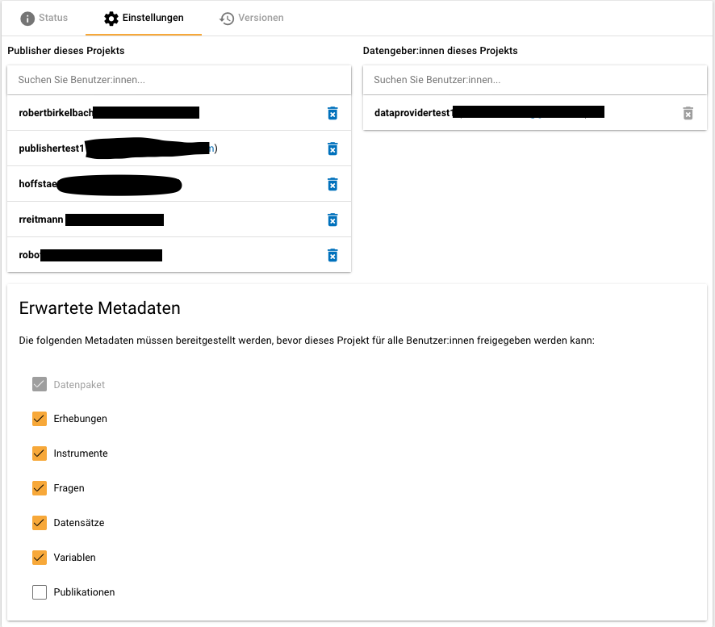
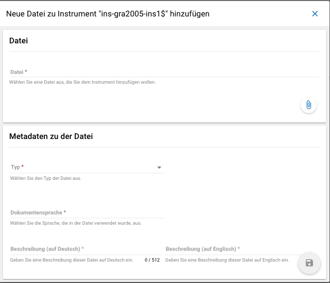

    .. _metadatenabgabe-label:

Metadatenabgabe (Datengeber)
===============================
.. index:: data provider, Datenaufnahme

Allgemeines
-----------

Der Datenaufnahmeprozess im FDZ des DZHW
~~~~~~~~~~~~~~~~~~~~~~~~~~~~~~~~~~~~~~~~

Das FDZ des DZHW stellt Daten quantitativer und qualitativer Erhebungen
aus dem Feld der Hoch-schul- und Wissenschaftsforschung zur Verfügung.
Ein fester Bestandteil dieser Arbeit ist zunächst der Prozess der
Datenaufnahme, welcher im FDZ des DZHW durch ein selbst entwickeltes
System, das Metadatenmanagementsystem (MDM) unterstützt wird. Das
Besondere am MDM ist, dass Informationen über die eigentlich erhobenen
Forschungsdaten, also Metadaten, erfasst werden. Für die strukturierte
Aufnahme der Metadaten sind sieben unterschiedliche Ebenen im MDM
vorgesehen: *Studie*, *Erhebungen*, *Erhebungsinstrumente*, *Fragen*,
*Datensätze*, *Variablen* und *Publikationen*.

Innerhalb der Aufnahme von Forschungsdaten wird anhand der Metadaten auf
diesen Ebenen erfasst, welcher Studie sowie Erhebung die Daten
angehören, welche Erhebungsinstrumente genutzt wurden, welche Fragen
darin gestellt wurden, welche Datensätze existieren, welche Variablen
sich darin befinden und welche Veröffentlichungen bereits mit den Daten
realisiert worden sind. Dadurch, dass alle Ebenen miteinander verknüpft
sind, wird eine umfassende Durchsuchbarkeit aller verfügbaren Daten, die
vom FDZ des DZHW über das MDM verwaltet werden, ermöglicht. Das System
ist über die Website https://metadata.fdz.dzhw.eu zu erreichen.

.. figure:: ./_static/01_de.png
   :name: mdm-ebenen

   Darstellung der verschiedenen Ebenen im MDM, Ebene *Studie* aktiv

Die eigenständige Abgabe von Metadaten
~~~~~~~~~~~~~~~~~~~~~~~~~~~~~~~~~~~~~~

Wenn Sie Ihre Daten im FDZ des DZHW abgeben möchten, erfassen Sie die
projektbezogenen Metadaten selbst und können diese teilweise
eigenständig in das MDM hochladen.

Die Abgabe der Metadaten ist innerhalb der einzelnen Ebenen
unterschiedlich komplex, sodass die Daten für jede der sieben Ebenen
separat erfasst und hochgeladen werden müssen. Hierfür hat das FDZ des
DZHW feste Strukturen entwickelt, die im weiteren Verlauf dieser
Anleitung für jede Ebene detailliert erläutert werden. Diesen Vorgaben
ist unbedingt Folge zu leisten, damit ein erfolgreicher Upload der
einzelnen Metadaten gewährleistet werden kann.

Aktuell können einige Metadaten bereits über eine Eingabemaske im MDM
direkt eingetragen werden. Für die übrigen Ebenen müssen Json Dateien
hochgeladen werden, bzw eine Exceldatei ans FDZ übergeben werden bzw.
hochgeladen werden.
Zusätzlich ist auf manchen Ebenen das Erstellen von
weiteren Anhängen (vgl. Kapitel 2.5) vorgesehen. Die Excel-Tabellen und
eventuelle Anhänge müssen für jede Ebene dann entweder ins MDM hochgeladen
werden oder zunächst dem
FDZ zur weiteren Bearbeitung geschickt werden. Tabelle 1 zeigt eine
erste Übersicht über das Vorgehen der Metadateneingabe auf jeder Ebene,
detaillierte Erläuterungen werden in den nachstehenden Kapiteln folgen.

Tabelle 1: Vorgehen bei der Metadateneingabe pro Ebene

+-----------------+-----------------+-----------------+-----------------+
| Ebene           | Metadaten       | Zusätzliche     | Metadaten       |
|                 | eingeben        | Dateien         | abgeben         |
+=================+=================+=================+=================+
| Studie          | Eingabemaske    | Anhänge (PDF)   | Eingabemaske    |
|                 |                 |                 | ausfüllen       |
+-----------------+-----------------+-----------------+-----------------+
| Erhebungen      | Eingabemaske    | Anhänge (PDF)   | Eingabemaske    |
|                 |                 |                 | ausfüllen       |
+-----------------+-----------------+-----------------+-----------------+
| Erhebungs-      | Eingabemaske    | Anhänge (PDF,   | Eingabemaske    |
| instrumente     |                 | Excel)          | ausfüllen       |
+-----------------+-----------------+-----------------+-----------------+
| Fragen          | Excel-Tabelle   | Fragebilder     | Im              |
|                 | (oder Zofar)    | (.png)          | Vorlage-Ordner  |
|                 |                 |                 | speichern       |
+-----------------+-----------------+-----------------+-----------------+
| Datensätze      | Eingabemaske    | Anhänge (PDF)   | Eingabemaske    |
|                 |                 |                 | ausfüllen       |
+-----------------+-----------------+-----------------+-----------------+
| Variablen       | mind. 1         | mind. 1         | Im              |
|                 | Excel-Tabelle   | Datensatz       | Vorlage-Ordner  |
|                 |                 | (Stata)         | speichern       |
+-----------------+-----------------+-----------------+-----------------+
| Publikationen   | -               | -               | Informationen   |
|                 |                 |                 | dem FDZ         |
|                 |                 |                 | schicken        |
+-----------------+-----------------+-----------------+-----------------+

Vorbereitende Schritte
----------------------

Registrierung
~~~~~~~~~~~~~

Sie müssen sich zunächst auf https://metadata.fdz.dzhw.eu registrieren,
um die Berechtigung für das Anlegen eines Projektes sowie das Hochladen
von Metadaten zu erhalten. Dies können Sie über die Sidebar links auf
der Website erledigen:

.. figure:: ./_static/02_de.png
   :name: registrierung

   Registrierung im MDM

Da das FDZ Ihre Registrierungsanfrage zunächst bestätigen muss, kann es
etwas dauern, bis Sie freigeschaltet sind. Sie bekommen dann eine
Bestätigung per Email.

Neues Projekt anlegen
~~~~~~~~~~~~~~~~~~~~~
.. index:: data provider, Datenaufnahme, Projekt anlegen

Nach erfolgreicher Registrierung können Sie ihr Projekt im MDM anlegen,
indem Sie sich in der Sidebar links anmelden:

.. figure:: ./_static/03_de.png
   :name: anmelden

   Anmeldung im MDM

Nach erfolgreicher Anmeldung erscheint in der Sidebar das folgende Feld:

.. figure:: ./_static/04_de.png
   :name: projektverwaltung

   Bereich für Verwaltung von Projekten im MDM

Über den Plus-Button können *Publisher* ein neues Projekt anlegen (vgl.
:numref:`neuesprojektanlegen`). Als Projektname müssen diese eine bestimmte ID
angeben, welche das FDZ zuvor speziell für Ihr Projekt vergeben hat und Ihnen
mitteilen muss (z. B. „gra2005“ für das Absolventenpanel 2005).

DataAcquisitionProject-ID
~~~~~~~~~~~~~~~~~~~~~~~~~

- **drei Kleinbuchstaben**: Um die internationale Nutzbarkeit der Daten zu
  erleichtern, ergeben sich die drei Kleinbuchstaben aus der englischsprachigen
  Abkürzung des Projektes. Es kann Ausnahmen geben, wenn z.B. bestimmte Projekte
  ein besonders griffiges Kürzel haben wie z.B. bei Libertas 2016 - lib2016.
- **(zwei bis) vier Ziffern**: Die Ziffern sind in der Regel die vier Ziffern
  des Jahres, das die Zugehörigkeit zur Stichprobe definiert, z. B. der
  Abschluss des Studiums (z. B. im (Prüfungs-)Jahr 2005 oder der Erwerb der
  Hochschulzugangsberechtigung im Jahr 2008). Davon kann in begründeten
  Ausnahmefällen abgewichen werden.
- Beispielsweise ist die Sozialerhebung deutlich stärker unter der
  jeweiligen Nummer der Studie als unter dem Jahr, das die Zugehörigkeit
  zur Stichprobe definiert, bekannt, so dass beispielsweise für die 19.
  Sozialerhebung aus dem Jahr 2009 die Ziffern 19 (und nicht 2009) vergeben
  werden.
- Bei Befragungen, die sich auf mehrere Jahreszahlen beziehen, kann eine
  andere eindeutige Jahreszahl verwendet werden. Beispielweise gehören in
  der KomPaed-Befragung die zuletzt aktiven Panelteilnehmer mehrerer
  Kohorten zur Stichprobe. Hier werden die vier Ziffern des Erhebungsjahres
  (2014) genutzt.

Für jedes weitere Objekt wird später ebenfalls eine ID generiert, die die DAP-id
enthält und sich nach der folgenden Logik zusammensetzt:

+--------------------+-----------------------------------------------------------------------------------+
| Metadaten          | Id-Generierung                                                                    |
+====================+===================================================================================+
| Study              | "stu-" + DAP-id + "$"                                                             |
+--------------------+-----------------------------------------------------------------------------------+
| Survey             | "sur-" + DAP-id + "-" + "sy" + survey.number + "$"                                |
+--------------------+-----------------------------------------------------------------------------------+
| DataSet            | "dat-" + DAP-id + "-" + "ds" + dataSet.number + "$"                               |
+--------------------+-----------------------------------------------------------------------------------+
| Variable           | "var-" + DAP-id + "-" + "ds" + variable.dataSetNumber + "-" + variable name + "$" |
+--------------------+-----------------------------------------------------------------------------------+
| Instrument         | "ins-" + DAP-id + "-" + "ins" + number + "$"                                      |
+--------------------+-----------------------------------------------------------------------------------+
| Question           | "que-" + DAP-id + "-ins" + instrumentNumber + "-" + number + "$"                  |
+--------------------+-----------------------------------------------------------------------------------+
| relatedPublication | "pub-" + citaviId + "$"                                                           |
+--------------------+-----------------------------------------------------------------------------------+

Das Projekt ist dadurch im MDM angelegt, aber noch nicht automatisch
freigegeben. Solange das Projekt noch nicht freigegeben wurde, können
Nutzer der Gruppe *publisher* es jederzeit über den Mülleimer-Button ganz links (vgl.
:numref:`neuesprojektanlegen`)
wieder löschen.

.. figure:: ./_static/05_de.png
   :name: neuesprojektanlegen

   Ein neues Projekt im MDM anlegen

Im Anschluss an die Projekterstellung werden Sie als Nutzer mit der Rolle
*Datengeber* dem Projekt zugewiesen. Wenn Sie ins Projektcockpit gehen
(vgl. :numref:`projectcockpit`), sehen Sie unter dem Punkt Einstellungen
(vgl. :numref:`project_cockpit_settings`), welche Publisher und Datengeber dem
Projekt zugewiesen sind und welche Metadaten vom *Publisher* erwartet werden.

.. figure:: ./_static/cockpit-button.png
   :name: projectcockpit

   Project-Cockpit Button.

   Project-Cockpit Einstellungen.

Im Status-Menü (siehe :numref:`project_cockpit_status`) wird zum einen
angezeigt, wie der Stand der Dinge auf den einzelnen Metadatenebenen ist.
Um die Metadaten der einzelnen Ebenen anzulegen klicken Sie auf den Neu- bzw
Hochladen-Button. Wenn Sie mit eingabe erwarteter Metadaten einer Ebene fertig
sind, setzen Sie ein Häkchen und der Smiley ist nicht mehr traurig, sondern
mittelgut gelaunt.
Wenn Sie mit allen Schritten fertig sind
weisen Sie das Projekt an die Nutzer der Gruppe Publisher zu. Dieser überprüft
dann die Metadaten bzw gibt sein "OK".
Wenn ein Publisher mit dem Status der Metadaten zufrieden ist
und auch ein Häkchen setzt ist der Smiley glücklich. Wurde nichts erwartet ist
der Smiley auch ohne Metadaten happy. Sind alle Smileys glücklich und ist die
Postvalidierung der Metadaten erfolgreich, kann released
werden.

.. figure:: ./_static/project_cockpit_status.png
   :name: project_cockpit_status

   Project-Cockpit Status.

Sie können nun beginnen, Ihr Projekt mit Metadaten zu füllen. Wie genau
dies funktioniert, wird im Folgenden zunächst prinzipiell erläutert, ehe
die konkret geforderten Metadaten in den einzelnen Ebenen in Kapitel 4
detailliert beschrieben werden.

Notwendige Schnittstellen und Dateien
-------------------------------------

Grundsätzlich gibt es zwei verschiedene Möglichkeiten Metadaten
einzutragen bzw. hochzuladen: Eingabemasken und der Upload von Dateien welche
Metadaten enthalten (Json Dateien im Fall von Fragen und Variablen, eine
Exceltabelle bei Publikationen).
Eingabemasken ermöglichen eine komfortable Abgabe der Metadaten direkt
auf der Website.

Domänenmodell
~~~~~~~~~~~~~

Im Domänenmodell_ werden alle Domänenobjekte, ihre Relationen zueinander
und, ob diese verpflichtend auszufüllen sind, dokumentiert.
.. _Domänenmodell: https://github.com/dzhw/metadatamanagement/wiki/Domain-Model

Eingabemasken
~~~~~~~~~~~~~

Für die Ebenenen Studie, Erhebungen und Instrumente steht bereits die Nutzung
von Eingabemasken im MDM zur Verfügung. Jede Maske umfasst verschiedene
Felder, welche mit den einzutragenden Informationen beschriftet sind.
Einige Felder sind verpflichtend auszufüllen und deshalb mit einem
Sternchen versehen. Sie werden beim Speichern der Eingaben automatisch
darauf hingewiesen, wenn noch Felder offen sind, die nicht leer bleiben
dürfen. Die Bedienung der Eingabemasken ist weitgehend intuitiv und an
vielen Stellen selbsterklärend. Im Rahmen der relevanten Ebenen Studie,
Erhebungen und Instrumente wird die Handhabung der jeweiligen Eingabemasken dann
konkret gezeigt (s. Kapitel 4.1 und 4.2).

Excel-Tabellen
~~~~~~~~~~~~~~

Für die weiteren Ebenen können Sie bereits vorbereitete Excel-Tabellen
verwenden, in denen verschiedene Metadaten spaltenweise erfasst werden.
Diese Excel-Tabellen finden Sie im Vorlage-Ordner_ der jeweiligen Ebene
(vgl. Kapitel 3.4). Welche Metadaten Sie an welcher Stelle in der
Excel-Tabelle eintragen müssen, erkennen Sie an den bereits vorgegebenen
Spaltenüberschriften in der ersten Zeile der Tabelle. Dort stehen die
Bezeichnungen der jeweiligen Metadaten.

.. _Vorlage-Ordner: https://github.com/dzhw/metadatamanagement-io/wiki/Vorlagen/Vorlagen_fuer_Datengeber.zip

Die Suffixe „.de“ und „.en“ sind Teil vieler Spaltenüberschriften und
weisen auf die Sprache des einzutragenden Metadatums hin.
Ab der zweiten Zeile sind die Tabellenvorlagen leer. Dort können Sie Ihre
Inhalte entsprechend der Spaltenüberschriften eintragen. Inhaltliche
Hilfen hierfür finden Sie in den Erklärungen zu den einzelnen Ebenen.

Bitte beachten Sie außerdem:

-  Die Excel-Tabellen enthalten je nach Ebene unterschiedlich viele
   Tabellenblätter, die Sie bearbeiten müssen.

-  Die Anzahl der Spalten pro Tabellenblatt variiert, sodass ein
   seitliches Scrollen oftmals notwendig ist.

-  Es gibt Metadaten, die Sie ausfüllen *müssen*, und solche, die Sie
   ausfüllen *können*. Die konkreten Ausfüllanweisungen finden Sie in
   Kapitel 4.

   **Kontrolliertes Vokabular**

Für einige Metadaten gibt es ein sogenanntes „kontrolliertes Vokabular“,
d.h. dort können nur bestimmte Inhalte in die Spalten eingetragen
werden. In diesen Spalten wird Ihnen in jeder Zelle eine Auswahl der
möglichen Antworten anhand eines Drop-Down-Menüs angeboten und Sie
müssen diese nur auswählen.

Häufig ist es der Fall, dass aus dem kontrollierten Vokabular einer
bestimmten Zelle automatisch der Inhalt der nächsten Zelle folgt. Für
dieses Szenario sind die Excel-Vorlagen_ vorbereitet, d. h. in den
betreffenden Spalten sind über mehrere Zeilen bereits Formeln
hinterlegt, die die nächste Zelle automatisch füllen und Ihnen viel
Tipparbeit ersparen. Die Vorlagen sind für alle Fälle
vorbereitet, so dass die Formeln auch in höher nummerierten Zeilen
stehen werden, die Sie voraussichtlich nicht mehr benötigen (bis
einschließlich Zeile 20 der Excel-Vorlage für die Ebenen Instrumente
sowie Datensätze, bis einschließlich Zeile 2000 der Excel-Vorlage für
die Fragen- und Variablenebene). Zum leichteren Erkennen sind die
betreffenden Zeilen in den Vorlagen bereits grau hinterlegt.

.. _Excel-Vorlagen: https://github.com/dzhw/metadatamanagement-io/wiki/Vorlagen/Vorlagen_fuer_Datengeber.zip

Da Formeln in solchen Zellen, die nicht mit Inhalt befüllt sind,
einen fehlerhaften Upload der Excel-Tabelle hervorrufen,
müssen die überflüssigen Formeln aus den nicht benötigten Zeilen
herausgelöscht werden. Dies können Sie erledigen, indem Sie die nicht
benötigten der grau eingefärbten Zeilen bis einschließlich der Zeile 2000
(für Fragen- und Variablenebene) markieren und über das Menü per
„Blattzeilen löschen“ komplett entfernen (vgl. dazu analog zur ehemaligen
Exceltabelle für die Datensatzebene -- mittlerweile gibt es dort nur noch
Eingabemasken :numref:`nicht_benötigte_formel`).

.. figure:: ./_static/11_de.png
   :name: nicht_benötigte_formel

   Beispiel für das Löschen nicht benötigter Formeln aus der Excel-Vorlage für
   die Ebene *Datensätze*

Anhänge
~~~~~~~

Für einige Ebenen können verschiedene Anhänge entweder direkt über die
Eingabemasken oder innerhalb der festgelegten Ordnerstruktur (vgl.
Kapitel 3.4) im MDM hochgeladen werden. Zu den Anhängen zählen z. B. der
Daten- und Methodenbericht auf der Studienebene sowie Fragebögen oder
Codierlisten auf Instrumentenebene. Diese Dokumente müssen als Dateien
im PDF- oder Excel-Format vorliegen (Details dazu finden Sie innerhalb
der einzelnen Ebenen in Kapitel 4) und zudem nach bestimmten Richtlinien
benannt werden. Für die Anhänge im PDF-Format gilt es darüber hinaus zu
beachten, dass dokumenteigene Metadaten wie Autor und Titel aus der
PDF-Datei gelöscht werden. Dies können Sie im PDF-Dokument über „Datei“
-> „Eigenschaften…“ erledigen.

Für das Hochladen der Metadaten über Excel-Tabellen gilt, dass die
Anhänge im MDM in der Reihenfolge dargestellt werden, in der sie in der
Excel-Tabelle eingetragen wurden. Genaue Informationen dazu finden Sie
in den Erläuterungen für die einzelnen Ebenen.

Die korrekte Anordnung der Dateien im Ordner
~~~~~~~~~~~~~~~~~~~~~~~~~~~~~~~~~~~~~~~~~~~~

Für einen erfolgreichen Upload der Metadaten attachments müssen
Sie sämtliche Dateien ihrer zugehörigen Ebene entsprechend in den vom
FDZ vorbereiteten Vorlage-Ordner_ ablegen, welcher nach der jeweiligen
Ebene benannt ist. Dieser Ordner sowie auch seine Unterordner sind mit
englischen Begriffen betitelt. Der Unterordner, welche alle Anhänge enthält,
heißt unabhängig von der Ebene immer „attachments“.

.. _Vorlage-Ordner: https://github.com/dzhw/metadatamanagement-io/wiki/Vorlagen/Vorlagen_fuer_Datengeber.zip

Die Abgabe von Metadaten für die einzelnen Ebenen
-------------------------------------------------

Studie (study)
~~~~~~~~~~~~~~

**Übersicht**

Anhand der Informationen, die Sie bzgl. Ihrer Studie an das MDM liefern,
wird dort später eine Übersichtsseite erstellt, die im Folgenden am
Beispiel des Absolventenpanels 2005 dargestellt wird:

.. figure:: ./_static/13_de.png
   :name: studienübersicht

   Studienübersicht im MDM am Beispiel des Absolventenpanels 2005

**Eine neue Studie anlegen**

Nachdem Sie ein neues Projekt erstellt haben (vgl. Kapitel 2.2), können
Sie nun innerhalb des Projektes eine Studie anlegen. Dazu finden Sie im
Reiter „Studien“ unten rechts auf der Seite einen orangefarbenen
Plus-Button. Wenn Sie mit dem Mauszeiger über diesen Button fahren,
erscheinen links davon zwei weiße Buttons (vgl. :numref:`studien_optionen`).

.. figure:: ./_static/14_de.png
   :name: studien_optionen

   Optionen für das Anlegen einer Studie

Mit einem Klick auf den weißen
Plus-Button öffnet sich die Eingabemaske, in der Sie Ihre Informationen
zur Studie ablegen können.

**Eingabemaske**

Die Eingabemaske auf Studienebene besteht aus den vier Abschnitten
„Details“, „Studienbeschreibung“, „Projektmitarbeiter(innen)“ sowie
„Materialien zu der Studie“. Der Abschnitt „Details“ ist der
umfangreichste und wird im Folgenden aufgrund der Veranschaulichung mit
bereits eingetragenen Informationen dargestellt (hier beispielhaft: 21.
Sozialerhebung):

.. figure:: ./_static/15_de.png
   :name: studienebene_eingabemaske

   Eingabemaske auf Studienebene, Abschnitt "Details" am Beispiel der 21.
   Sozialerhebung

Nach dem Öffnen der Eingabemaske erscheint ganz oben die aus ihrem
Projektnamen automatisch generierte ID für die Studienseite (s. rotes
Kästchen in :numref:`studienebene_eingabemaske`). Einige Felder, die Sie frei
ausfüllen können,
verfügen über einen Zeichenzähler, der Sie darüber informiert, wie viele
Zeichen Sie dort insgesamt eintragen dürfen und wie viele Zeichen Sie
bereits eingetragen haben (s. blaues Kästchen in
:numref:`studienebene_eingabemaske`). Außerdem
finden Sie teilweise Drop-Down-Menüs vor, in denen Sie aus vorgegebenen
Alternativen auswählen können (s. grünes Kästchen in
:numref:`studienebene_eingabemaske`).

Im zweiten Abschnitt der Eingabemaske müssen Sie eine Beschreibung Ihrer
Studie sowohl auf Deutsch als auch auf Englisch eingeben. Für ein
Beispiel ist im Folgenden die Beschreibung der 21. Sozialerhebung
abgebildet:

.. figure:: ./_static/16_de.png
   :name: eingabemaske_studienbeschreibung

   Eingabemaske auf Studienebene, Abschnitt "Studienbeschreibung" am Beispiel
   der 21. Sozialerhebung

Im dritten Abschnitt der Eingabemaske geben Sie die Mitarbeiter(innen)
Ihres Projekts ein. Für die Eingabe weiterer Personen klicken Sie
einfach auf den blauen Plus-Button (s.
:numref:`studienebene_eingabemaske_mitarbeiter`).
Wenn mindestens zwei
Personen eingetragen sind, erscheinen die Pfeil-Buttons als aktiv
(Farbwechsel von grau zu blau). Dann können Sie die Reihenfolge der
Personen ändern, indem Sie die Namen nach oben oder unten verschieben.
Links neben den bereits aufgeführten Personen erscheint in jeder Zeile
ein blauer Button mit einem Mülleimer-Symbol, mit dem Sie den jeweiligen
Namen wieder löschen können. Mit dem orangefarbenen Save-Button unten
rechts können Sie Ihre Eingaben jederzeit abspeichern. Dies müssen Sie
spätestens jetzt tun, da Sie ansonsten den letzten Abschnitt der
Eingabemaske („Materialien zu der Studie“) nicht bearbeiten können.

.. figure:: ./_static/17_de.png
   :name: studienebene_eingabemaske_mitarbeiter

   Eingabemaske auf Studienebene, Abschnitt "Projektmitarbeiter(innen)"

Im vierten und letzten Abschnitt der Eingabemaske können Sie Materialien
zur Studie ablegen. Dazu klicken Sie auf den blauen Plus-Button (s.
:numref:`eingabemaske_studie_materialien`), woraufhin sich ein Dialog öffnet,
in dem Sie eine Datei hochladen und diese näher beschreiben können.
Die hier relevanten Materialien sind momentan der deutsch- und
englischsprachige Daten- und Methodenbericht (DMB) sowie eine
englischsprachige *study overview*. [1]_
Die Sprache der Materialien muss nach ISO 639-1_ angegeben werden.
Bei den Metadaten der Materialien ist darauf zu achten die Metadaten aus den
Dokumenten zu entfernen (Autor und Titel).
Die Eingaben müssen Sie
anschließend über den orangefarbenen Save-Button abspeichern.
Mit den Pfeil-Buttons können Sie dann ggf. die Reihenfolge bereits
eingegebener Materialien verändern. Wenn Sie eine geänderte Reihenfolge
beibehalten möchten, müssen Sie erneut speichern.

.. figure:: ./_static/18_de.png
   :name: eingabemaske_studie_materialien

   Eingabemasken auf Studienebene, Abschnitt "Materialien zu der Studie"

**Editieren und historisieren**

Falls Sie Ihre Informationen auf Studienebene nicht in einem Vorgang
eingeben und hochladen können oder möchten, ist es immer möglich, dass
Sie Ihre bisherigen Eingaben abspeichern und zu einem späteren Zeitpunkt
weiter bearbeiten. Hierfür wird Ihnen im Reiter „Studien“ am rechten
Rand neben Ihrer Studie ein Stift-Button angezeigt, über den Sie wieder
in die Eingabemaske gelangen (s. :numref:`bearbeitung_gespeicherte_studie`).

.. figure:: ./_static/19_de.png
   :name: bearbeitung_gespeicherte_studie

   Weitere Bearbeitung einer bereits abgespeicherten Studie

Ebenso können Sie ältere Versionen Ihrer abgespeicherten Eingaben
wiederherstellen, indem Sie im Bearbeitungsmodus den
Historisierungs-Button (blauer Pfeil-Button über dem Save-Button unten
rechts auf der Seite) verwenden (s. :numref:`versionierung`).

.. figure:: ./_static/20_de.png
   :name: versionierung

   Ältere Versionen einer Studie wiederherstellen

Bei einem Klick auf den Historisierungs-Button öffnet sich ein Dialog,
der die verschiedenen Versionen der Studie anzeigt (s. :numref:`historisierung_studie`). Zudem
sind der Name des Nutzers, der die entsprechende Version der Studie
gespeichert hat, sowie das Änderungsdatum sichtbar. Durch Klicken auf
die Version wird diese wiederhergestellt, aber nicht automatisch als
aktuelle Version gespeichert. Dies müsste über einen Klick auf den
Save-Button erfolgen. Zu beachten ist, dass Materialien zur Studie nicht
historisiert werden.

.. figure:: ./_static/21_de.png
   :name: historisierung_studie

   Dialog zur Historisierung innerhalb einer Studie

Erhebungen (surveys)
~~~~~~~~~~~~~~~~~~~~

**Übersicht**

Mit den Informationen über die Erhebung(en), die Sie innerhalb Ihrer
Studie durchgeführt haben, wird im MDM folgende Übersichtsseite
erstellt:

.. figure:: ./_static/22_de.png
   :name: erhebungsübersicht

   Erhebungsübersicht im MDM am Beispiel der ersten Welle (Bachelor) im Absolventenpanel 2005

**Eine neue Erhebung anlegen**

Wenn Sie eine Studie angelegt haben (vgl. Kapitel 4.1), können Sie über
den Reiter „Erhebungen“ eine neue Erhebung innerhalb Ihrer Studie
erstellen. Hierzu finden Sie unten rechts auf der Seite – ebenso wie bei
der Studie – einen orangefarbenen Plus-Button (vgl. :numref:`optionen_studie_anlegen`). Wenn
Sie mit dem Mauszeiger darüberfahren, erscheinen die beiden weißen
Buttons, von denen Sie den Plus-Button anklicken, um die Eingabemaske zu
öffnen. Bitte beachten Sie, dass Sie mehrere Erhebungen über die
Eingabemaske in der richtigen Reihenfolge eingeben müssen, da die IDs
beim Anlegen einer neuen Erhebung automatisch generiert werden und sich
später nicht mehr verändern lassen.

.. figure:: ./_static/23_de.png
   :name: optionen_studie_anlegen

   Optionen für das Anlegen einer Erhebung

**Eingabemaske**

Die Eingabemaske auf Erhebungsebene besteht aus den drei Abschnitten
„Details“, „Weitere Informationen zum Rücklauf“ sowie „Materialien zu
der Erhebung“. Im Folgenden wird der Abschnitt „Details“ – aufgrund der
Länge in zwei Teilen – dargestellt:

.. figure:: ./_static/24_de.png
   :name: eingabemaske_erhebung_details_1

   Eingabemaske der Erhebungsebene, Abschnitt "Details" Teil 1

Beim Anlegen einer Erhebung wird automatisch die ID auf Basis des
Projektnamens generiert (s. rotes Kästchen, :numref:`eingabemaske_erhebung_details_1`,
hier als Beispiel der 21. Sozialerhebung). Neben den bereits aus der
Studienebene bekannten Funktionen gibt es in dieser Eingabemaske zusätzlich eine
Kalenderfunktion (s. blaue Kästchen, :numref:`eingabemaske_erhebung_details_1`),
welche die Feldzeit des
Projekts erfasst und in :numref:`kalender_erhebung` dargestellt ist:

.. figure:: ./_static/25_de.png
   :name: kalender_erhebung

   Kalenderfunktion auf der Erhebungsebene

Im zweiten Teil der Eingabemaske für die Erhebungsebene gibt es die
Besonderheit, dass sich die Rücklaufquote automatisch ermitteln lässt
(s. :numref:`eingabemaske_erhebungsebene_details_2`). Sie können den Rücklauf
auch manuell eingeben. Hierbei ist zu jedoch beachten, dass sich bereits
eingegebene Zahlen bei Brutto- und Netto-Stichprobe bei nicht automatisch
anpassen.

.. figure:: ./_static/26_de.png
   :name: eingabemaske_erhebungsebene_details_2

   Eingabemaske der Erhebungsebene, Abschnitt "Details" Teil 2

Um den nächsten Abschnitt in der Eingabemaske („Weitere Informationen
zum Rücklauf“ [2]_) bearbeiten zu können, müssen Sie die bisherigen
Eingaben abspeichern. Dann können Sie deutschsprachige und/oder
englischsprachige Grafiken zum Rücklauf entweder über den blauen
Plus-Button oder per Drag & Drop hochladen und dann mit dem Save-Button
speichern. Diese Grafiken dürfen im svg-, png- oder auch PDF-Format
vorliegen. Über den Button mit dem Mülleimer-Symbol lassen sich
hochgeladene Dateien wieder löschen (s. :numref:`weitere_infos_rücklauf`).

.. figure:: ./_static/27_de.png
   :name: weitere_infos_rücklauf

   Eingabemaske der Erhebungsebene, Abschnitt „Weitere Informationen zum Rücklauf“

Im letzten Abschnitt der Eingabemaske können – wie auch bei der Studie –
Materialien hinzugefügt werden (s. :numref:`eingabemaske_erhebung_materialien`).
Die Funktionsweise ist identisch zu der auf Studienebene. [3]_

.. figure:: ./_static/28_de.png
   :name: eingabemaske_erhebung_materialien

   Eingabemaske der Erhebungsebene, Abschnitt „Materialien zu der Erhebung“

**Editieren und historisieren**

Falls Sie Ihre Informationen auf Erhebungsebene nicht in einem Vorgang
eingeben und hochladen können oder möchten, ist es immer möglich, dass
Sie Ihre bisherigen Eingaben abspeichern und zu einem späteren Zeitpunkt
weiter bearbeiten. Hierfür wird Ihnen im Reiter „Erhebungen“ am rechten
Rand ein Stift-Button angezeigt, über den Sie wieder in die Eingabemaske
gelangen. Außerdem finden Sie dort auch einen Button mit
Mülleimer-Symbol, mit dem Sie die Erhebung komplett löschen können (s.
:numref:`bearbeitung_erhebung`).

.. figure:: ./_static/29_de.png
   :name: bearbeitung_erhebung

   Weitere Bearbeitung einer bereits abgespeicherten Erhebung

Es ist außerdem möglich, ältere Versionen der bereits gespeicherten
Eingaben wiederherzustellen. Im Bearbeitungsmodus gibt es auch auf der
Erhebungsebene einen Historisierungs-Button, den Sie rechts unten über
dem Save-Button betätigen können (s. :numref:`version_erhebung_wiederherstellen`).

.. figure:: ./_static/30_de.png
   :name: version_erhebung_wiederherstellen

   Ältere Versionen einer Erhebung wiederherstellen

Bei einem Klick auf den Historisierungs-Button öffnet sich ein Dialog,
der die verschiedenen Versionen der Erhebung anzeigt (s. :numref:`historisierungsdialog_erhebung`). Zudem
sind der Name des Nutzers, der die entsprechende Version der Studie
gespeichert hat, sowie das Änderungsdatum sichtbar. Durch Klicken auf
die Version wird diese wiederhergestellt, aber nicht automatisch als
aktuelle Version gespeichert. Dies müsste über einen Klick auf den
Save-Button erfolgen. Zu beachten ist, dass Materialien zur Erhebung
nicht historisiert werden.

.. figure:: ./_static/31_de.png
   :name: historisierungsdialog_erhebung

   Dialog zur Historisierung innerhalb einer Erhebung

**Prüfschritte**

Der Titel der Erhebung wird zukünftig bei da|ra vor einige Attribute (z.B.
Referenzzeitraum) gehängt. Der Titel der Erhebung muss daher eindeutig sein und
im Falle von Panelstudien die Welle enthalten.

Erhebungsinstrumente (instruments)
~~~~~~~~~~~~~~~~~~~~~~~~~~~~~~~~~~
Als Instrument wird das Erhebungsinstrument bezeichnet (z.B. Fragebogen).

**Übersicht**

Wenn Sie Informationen über Ihre Erhebungsinstrumente aufnehmen, wird
folgende Übersicht im MDM erstellt:

.. figure:: ./_static/32_0.png
   :name: instrumentenübersicht_fragebogen

   Instrumentenübersicht im MDM am Beispiel des Fragebogens der ersten Welle im Absolventenpanel 2005

**Eingabemaske**

Erhebungsinstrumente lassen sich per Eingabemaske erfassen und editieren.
Dafür darf die Studie aktuell nicht released sein.
Um ein Erhebungsinstrument mittels Eingabemaske anzulegen muss man sich im Datenaufbereitungsprojekt im
Instrumentereiter befinden. Anschließend wird der Plusbutton gedrückt und es öffnet sich
der Dialog um ein neues Instrument anzulegen.

.. figure:: ./_static/add_instrument_de.png
   :scale: 50 %
   :name: instruments_plusbutton

   Plusbutton

.. figure:: ./_static/add_instrument_manually_de.png
   :scale: 50 %
   :name: instruments_manuell_anlegen

   Manuelles Anlegen des Instruments.

Die Eingabemaske besteht
aus den Pflichtfeldern Beschreibung, Titel, Typ und Erhebung, sowie
den nicht verpflichtenden Feldern Untertitel und Anmerkungen.

Des weiteren können weitere Materialien zum Instrument
hochgeladen werden. Um weitere Materialien hochzuladen muss zunächst das
Instrument abgespeichert sein.
Im Anschluss muss der Plusbutton gedrückt werden, woraufhin sich ein Dialog
öffnet (s. :numref:`instruments_anhang_dialog`), in welchem der Anhang
hochgeladen werden kann und Metadaten zur Datei
eingegeben werden können. Um die Datei hochzuladen wird auf den
Büroklammer-Button gedrückt und es öffnet sich ein
weiterer Dialog. Alle Felder dieses Dialogs sind verpflichtend. Anschließend
lässt sich der Anhang mit dem Speichern-Button (Diskettensymbol unten rechts)
speichern.

   Instrumente Anhang

Zu den möglichen Anhängen zählen z. B. Fragebögen, Variablenfragebögen
sowie Filterführungsdiagramme [4]_. Diese müssen als PDF-Dateien
vorliegen. [5]_ Außerdem können an dieser Stelle Codierlisten, welche
als Excel-Tabelle vorliegen müssen, erfasst werden.

Sollte es Erhebungsinstrumente geben, welche in einer anderen Sprache als
deutsch oder englisch existieren, werden diese nur als Attachment und nicht auf
Variablenebene bereitgestellt.

Fragen (questions) [6]_
~~~~~~~~~~~~~~~~~~~~~~~

**Übersicht**

Zu den einzelnen Fragen eines Instruments (sprich: Fragebogen) können
Sie Informationen in das MDM übermitteln, in welchem dann für jede Frage
folgende Übersichtsseite erstellt wird:

.. figure:: ./_static/33_de.png
   :name: fragenübersicht

   Fragenübersicht im MDM am Beispiel der Frage 1.1 des Fragebogens der ersten
   Welle im Absolventenpanel 2005

Auf dieser Ebene werden Informationen über alle Fragen für jedes
einzelne Erhebungsinstrument einer Studie abgeben. Der
Einspeisungsprozess dieser Informationen hängt vom Typ des
Erhebungsinstrumentes ab. Während Daten aus Onlinebefragungen, die mit
ZOFAR, dem Datenerhebungssystem den DZHW, durchgeführt wurden, direkt
aus dem System heraus extrahiert werden (siehe **Questions (ZOFAR)**),
müssen Daten aus allen anderweitig durchgeführten Befragungen – sowohl
andere Onlinebefragungen als auch PAPI-Befragungen – manuell erfasst
werden (siehe **Questions (manuell)**). Im Folgenden werden beide
Vorgehensweisen schrittweise beschrieben.

Fragestruktur
~~~~~~~~~~~~~

Fragen sind gekennzeichnet durch einen einleitenden/übergreifenden Fragetext,
sowie eine "natürliche" sichtbare Abgrenzung gegenüber anderer Fragen und eine
meist "erkennbare" Nummerierung. Es wird zwischen vier Fragetypen differenziert:

- Single Choice: Auf die Frage kann nur mit einer Antwortmöglichkeit geantwortet
  werden (z.B. Einfachauswahl aus mehren Antwortmöglichkeiten oder Angabe eines
  numerischen Wertes).
- Mehrfachnennung: Für die Frage gibt es eine Auswahl an Antwortmöglichkeiten
  bei denen eine oder mehre ausgewählt werden können.
- Itembatterie: Besitzt überleitenden Fragetext, welche jeweils weitere Items
  mit den gleichen Antwortmöglichkeiten besitzen.
- Matrix: Ist ein komplexer Fragetyp in dem viele Unterfragen geschachtelt
  werden können und die nicht durch die anderen Fragetypen abgedeckt werden
  (z.B. Tableaufragen des Absolventenpanels ).

Questions (manuell)
~~~~~~~~~~~~~~~~~~~
Um json Dateien zu erzeugen muss zuerst einmal eine Exceltabelle ausgefüllt
werden. Die Exceltabelle hat die beiden Tabellenblätter questions und images.
Spaltennamen und Ausfüllanweisungen sind im nächsten Abschnitt zu finden.

Zusätzlich müssen zu jeder Frage ein oder mehrere Bilder vorhanden sein.
Wie Fragebilder aus Ragtime-Dateien extrahiert werden können, wird
erklärt: :ref:`bilderfassung_ragtime-label`
Eine Anleitung zum Ausschneiden von Bildern aus pdf Dateien ist
`hier <https://github.com/dzhw/metadatamanagement-io/wiki/Bilderfassung-aus-pdf>`_
zu finden.

**Excel-Tabelle**

Um Metadaten auf der Fragenebene in manueller Weise zu erfassen, müssen
Sie die Excel-Datei *questions.xlsx* ausfüllen, welche die beiden
Tabellenblätter *questions* und *images* beinhaltet. Sie können alle
Fragen aus allen Erhebungsinstrumenten in einer einzigen Exceltabelle
erfassen:

Tabelle 3: Ausfüllanweisungen für die Excel-Tabelle "questions"

+------------------------+-----------------------+------------------------+
| **Tabellenblatt 1:                                                      |
| questions**                                                             |
+========================+=======================+========================+
| Es können mehrere                                                       |
| Fragen eingetragen                                                      |
| werden (= mehrere                                                       |
| Zeilen möglich, eine                                                    |
| Frage pro Zeile)                                                        |
+------------------------+-----------------------+------------------------+
| **Spaltenüberschrift** | **Muss ich das        | **Was muss ich         |
|                        | ausfüllen?**          | eintragen?**           |
+------------------------+-----------------------+------------------------+
| indexInInstrument      | Ja                    | Nummer der Frage im    |
|                        |                       | Fragebogen, nach der   |
|                        |                       | die Reihenfolge        |
|                        |                       | festgelegt wird        |
|                        |                       | (ganzzahlig)           |
+------------------------+-----------------------+------------------------+
| questionNumber         | Ja                    | Fragenummer,           |
|                        |                       | idealerweise           |
|                        |                       | selbsterklärend aus    |
|                        |                       | Instrument (z. B.      |
|                        |                       | 1.1). Format: 0-9,     |
|                        |                       | a-z, Umlaute, ß, ., -  |
+------------------------+-----------------------+------------------------+
| instrumentNumber       | Ja                    | Nummer des             |
|                        |                       | Instruments            |
+------------------------+-----------------------+------------------------+
| questionsText.de/en    | Ja                    | „Übergreifender“       |
|                        |                       | Fragetext, bei         |
|                        |                       | Itembatterien oder     |
|                        |                       | komplexen Fragen der   |
|                        |                       | einleitende            |
|                        |                       | Fragetext. Bei         |
|                        |                       | „einfachen“            |
|                        |                       | Fragetypen der         |
|                        |                       | komplette Fragetext.   |
+------------------------+-----------------------+------------------------+
| instruction.de/en      | Nein                  | wenn vorhanden,        |
|                        |                       | Anweisungstext der     |
|                        |                       | Frage                  |
+------------------------+-----------------------+------------------------+
| introduction.de/en     | Nein                  | wenn vorhanden,        |
|                        |                       | Einleitungstext der    |
|                        |                       | Frage                  |
+------------------------+-----------------------+------------------------+
| type.de/en             | Ja                    | de: „Einfachnennung“,  |
|                        |                       | „Offen“,               |
|                        |                       | „Mehrfachnennung“,     |
|                        |                       | „Itembatterie“ oder    |
|                        |                       | „Matrix“ (eine         |
|                        |                       | Anleitung zur          |
|                        |                       | Einteilung der         |
|                        |                       | verschiedenen          |
|                        |                       | Fragetypen kann unter  |
|                        |                       | https://github.com/dz\ |
|                        |                       | hw/metadatamanagement\ |
|                        |                       | /files/1421895/Anleit\ |
|                        |                       | ung_Vergabe_Fragetype\ |
|                        |                       | n.docx                 |
|                        |                       | gefunden werden)       |
|                        |                       |                        |
|                        |                       | en: „Single Choice“,   |
|                        |                       | „Open“, „Multiple      |
|                        |                       | Choice“, „Item Set“    |
|                        |                       | or „Grid“.             |
+------------------------+-----------------------+------------------------+
| topic.de/en            | Nein                  | Themenblock, in dem    |
|                        |                       | die Frage im           |
|                        |                       | Instrument             |
|                        |                       | eingeordnet ist        |
|                        |                       | (idealerweise direkt   |
|                        |                       | aus Instrument         |
|                        |                       | entnehmbar)            |
+------------------------+-----------------------+------------------------+
| successorNumbers       | Nein                  | Fragenummern der       |
|                        |                       | nachfolgenden          |
|                        |                       | Frage(n) (Angabe in    |
|                        |                       | einer Zeile durch      |
|                        |                       | Komma getrennt)        |
+------------------------+-----------------------+------------------------+
| technicalRepresentati\ | x\*                   | Herkunft des           |
| on.type                |                       | Codeschnipsels (z. B.  |
|                        |                       | „ZOFAR-Question        |
|                        |                       | Markup Language“)      |
+------------------------+-----------------------+------------------------+
| technicalRepresentati  | x\*                   | Technische Sprache     |
| on.language            |                       | des Codeschnipsels     |
|                        |                       | (z. B. XML)            |
+------------------------+-----------------------+------------------------+
| technicalRepresentati\ | x\*                   | Codeschnipsel, um      |
| on.source              |                       | Frage technisch        |
|                        |                       | abbilden zu können     |
|                        |                       | (z. B. QML-Schnipsel)  |
+------------------------+-----------------------+------------------------+
| additionalQuestionTex\ | Nein                  | Weitere Ausführungen   |
| t.de/.en               |                       | der Frage, die nicht   |
|                        |                       | im Fragetext stehen,   |
|                        |                       | wie z. B. der          |
|                        |                       | Itemtext (bei          |
|                        |                       | Itembatterien) oder    |
|                        |                       | Antworttext (bei       |
|                        |                       | Mehrfachnennungen).    |
|                        |                       | Aktuell ist diese      |
|                        |                       | Information für den    |
|                        |                       | Nutzenden des MDM      |
|                        |                       | nicht sichtbar,        |
|                        |                       | sondern wird nur bei   |
|                        |                       | einer Volltextsuche    |
|                        |                       | berücksichtigt.        |
+------------------------+-----------------------+------------------------+
| annotations.de/en      | Nein                  | Anmerkungen zur Frage  |
+------------------------+-----------------------+------------------------+

x\* = nur, wenn technicalRepresentation vorhanden (wird dann automatisch
von ZOFAR geliefert)

+------------------------+----------------------+-----------------------+
| **Tabellenblatt 2:                                                    |
| images**                                                              |
+========================+======================+=======================+
| Es können mehrere                                                     |
| Bilder eingetragen                                                    |
| werden (= mehrere                                                     |
| Zeilen möglich, ein                                                   |
| Bild pro Zeile)                                                       |
+------------------------+----------------------+-----------------------+
| **Spaltenüberschrift** | **Muss ich das\      | **Was muss ich\       |
|                        | ausfüllen?**         | eintragen?**          |
+------------------------+----------------------+-----------------------+
| fileName               | Ja                   | Dateiname des Bildes  |
|                        |                      | (z.B. „1.1_1.png“)    |
+------------------------+----------------------+-----------------------+
| questionNumber         | Ja                   | Dem Bild zugeordnete  |
|                        |                      | Fragenummer           |
+------------------------+----------------------+-----------------------+
| instrumentNumber       | Ja                   | Nummer des zum Bild   |
|                        |                      | gehörenden            |
|                        |                      | Instruments           |
+------------------------+----------------------+-----------------------+
| language               | Ja                   | Sprache des Bildes    |
|                        |                      |                       |
|                        |                      | *Bitte verwenden Sie  |
|                        |                      | eine Abkürzung nach   |
|                        |                      | ISO 639-1_*:          |
|                        |                      | z. B. „de“, „en“      |
+------------------------+----------------------+-----------------------+
| indexInQuestion        | Ja                   | Auf das wievielte     |
|                        |                      | Bild der Frage        |
|                        |                      | bezieht sich die      |
|                        |                      | Zeile? (Liegt pro     |
|                        |                      | Frage nur ein Bild    |
|                        |                      | vor, steht hier immer |
|                        |                      | 1)                    |
+------------------------+----------------------+-----------------------+

.. _639-1: https://en.wikipedia.org/wiki/List_of_ISO_639-1_codes

Mit dem zweiten Tabellenblatt *images* erfassen Sie Informationen zu den
Fragebildern, welche Sie für jede Frage mit hochladen müssen. Zu jeder
Frage muss mindestens ein Bild (es können auch mehrere sein) im
png-Format vorhanden sein. Die Fragebilder können z. B. mit Ragtime
extrahiert werden, sofern der Fragebogen auch mit Ragtime erstellt
wurde. Ansonsten lassen sich die Fragebilder auch aus einer PDF-Datei
erstellen. [7]_ Anleitung für beiden Varianten finden Sie unter
https://github.com/dzhw/metadatamanagement-io/wiki/Bilderfassung-aus-RagTime
und
https://github.com/dzhw/metadatamanagement-io/wiki/Bilderfassung-aus-pdf.

Die fertig ausgefüllte Excel-Datei sowie die Bilder zu den Fragen
speichern Sie dann in dem Ordner, den das FDZ für Sie vorbereitet hat.
Das FDZ greift daraufhin auf die Dateien zu, verarbeitet sie weiter und
lädt die Metadaten für die Fragenebene dann selbst ins MDM.

Generierung der json Dateien mit R
~~~~~~~~~~~~~~~~~~~~~~~~~~~~~~~~~~
Doku befindet sich im Aufbau und ist nur für FDZ-MitarbeiterInnen relevant.

Momentan liegen die Question-Exceldateien der Projekte, sowie die Skripte
zur Erzeugung der json Dateien im Verzeichnis
``\\faust\Abt4\FDZ\Querschnittsaufgaben\Metadaten\Erzeugen``.
Der Aufbau ist wie folgt::

   |-- Projekte
      |-- projectName
         |-- questions
            |-- out
            |-- projectName.xlsx
   |-- Skripte
      |-- question-generation.R
      |-- sort-images.R
      |-- R
         |-- question-generation_main.R
         |-- utils
            |-- question-generation_functions.R

Um json Dateien für ein neues Projekt zu erzeugen, muss zuerst ein
Projektordner angelegt werden. Außerdem muss die Question-Exceltabelle des
Projektes ausgefüllt werden (z.B. projectName.xlsx mit den beiden
Tabellenblätter questions und images). Außerdem muss der Ordner out angelegt
werden. Danach question-generation.R öffnen und bei project den Projektnamen
anpassen, z.B. ``project <- "gra2005"``. Das Skript z.B. mit Strg+a ->
Strg+Enter ausführen. Im Ordner out sind nun die json Dateien für den
Import in der vorgegebenen Ordnerstruktur zu finden.

**Einsortierung der Bilder in die Ordnerstruktur**

Nun müssen die Bilder noch in die Ordnerstruktur eingepflegt werden.
Dafür kann das R-Skript sort-images.R verwendet werden.
Die pngs zu den Fragen (es können auch mehrere pngs zu einer Frage vorliegen)
und das Tabellenblatt images der Exceltabelle werden dafür benötigt.
Nähere Erklärungen zur Sortierung der Bilder sind im R-Skript selbst zu finden.

Die fertigen jsons und Bilder können nun zu Github ins jeweilige
``$projectname-metadata-repository`` kopiert werden.

Questions (Zofar)
~~~~~~~~~~~~~~~~~

Bei Onlinebefragungen mit Zofar können die Metadaten für Fragen
automatisch extrahiert werden (.jsons + .pngs).

Der Prozess befindet sich gerade im Aufbau...

Datensätze (dataSets)
~~~~~~~~~~~~~~~~~~~~~

**Übersicht**
Für die Dokumentation der Datensätze werden die "Master"(AIP)-Datensätze
(siehe Zwiebelmodell) genutzt.Diese Datensätze sind die größte mögliche
Vereinheitlichung eines Datensatzes, also keine Teilpopulation oder Teilmenge
von Variablen eines Datensatz. Datensätze die sich als Teilmenge eines
"Master"-Datensatzes abbilden lassen werden über die SubDataSets dokumentiert.

Mit den Informationen über die Datensätze, welche Sie aus den Daten
Ihrer Studie erstellt haben, wird für jeden dieser Datensätze folgende
Übersicht im MDM angezeigt:

.. figure:: ./_static/34_0.png
   :name: datensatzübersicht

   Datensatzübersicht im MDM am Beispiel des Personendatensatzes (Bachelor) im
   Absolventenpanel 2005

**Eingabemaske**

Datensätze lassen sich auch per Eingabemaske anlegen und editieren.
Hierfür muss man auf den Reiter Datensätze klicken (:numref:`mdm-ebenen`),
anschließend auf das Plussymbol (:numref:`neuerdatensatz`) in der unteren
rechten Ecke klicken und dann auf das Stiftsymbol (:numref:`stiftdatensatz`)
("Klicken um einen Datensatz manuell zu erstellen".)

.. figure:: ./_static/new_dataset_de.png
   :name: neuerdatensatz

   Neuen Datensatz hinzufügen.

.. figure:: ./_static/new_dataset_step2_de.png
   :name: stiftdatensatz

   Klicken um einen Datensatz manuell zu erstellen.

Die mit * markierten Felder sind verpflichtend.
Die verknüpften Erhebungen werden nach einem Klick in das Feld "Erhebungen"
automatisch vorgeschlagen und können per Klick ausgewählt werden.
Im Anschluss werden die Subdatensätze per Eingabemaske auf der selben Seite
eingegeben. Weitere Subdatensätze können per Klick auf das Plussymbol
hinzugefügt werden. Nachdem gespeichert wurde, lassen sich weitere Materialien
zum Datensatz hinzufügen.

Wenn Sie Materialien auf Ebene der Datensätze haben, können Sie diese
auch hier wieder im Ordner *attachments* ablegen. [9]_

Datensatzreport erzeugen
~~~~~~~~~~~~~~~~~~~~~~~~

Wenn ein Datensatz und die zugehörigen Variablen im MDM vorliegen, kann mit
Hilfe des MDMs ein Datensatzreport erstellt werden.
Hierzu wird das
`Template
<https://github.com/dzhw/metadatamanagement-io/tree/master/datasetreport/template/>`_
auf den Datensatz im MDM gezogen. Nach einiger Zeit (je nach Anzahl an Variablen
länger als eine Minute) erfolgt ein Download.
Die resultierenden Dateien werden von FDZ-MitarbeiterInnen zu einem PDF
kompiliert. Dokumentation zum Umgang mit dem dafür benötigten Docker-Image
folgt.

Variablen (variables) [10]_
~~~~~~~~~~~~~~~~~~~~~~~~~~~

**Übersicht**

Anhand der Informationen, die Sie auf Ebene der Variablen abgeben, wird
für jede Variable eine Übersichtsseite im MDM erstellt:

.. figure:: ./_static/35_de.png
   :name: variablenübersicht

   Variablenübersicht im MDM am Beispiel der Variable "1. Studium: Beginn
   (Semester)" im Absolventenpanel 2005, erste Welle (BA)

Die Erstellung der Variablenebene beinhaltet einerseits recht viel
Aufwand, da für jeden Datensatz eine eigene Excel-Tabelle mit
Informationen zu allen Variablen geliefert werden muss. Viele
Informationen müssen manuell eingetragen werden, einige können – sofern
die Befragung über Zofar stattgefunden hat – auch direkt aus Zofar
(das Onlinebefragungstool des DZHW) extrahiert werden oder sogar aus der
Excel-Tabelle der Frageebene importiert werden.

Die Variablenebene ist andererseits sehr wertvoll im Hinblick auf die
Nachnutzbarkeit der Forschungsdaten. Wenn Metadaten auf dieser Ebene
vorhanden sind, können die dazugehörigen Daten auch aus inhaltlicher
Sicht umfassend durchsucht werden, sodass das Analysepotential auch für sehr
spezielle Fragestellungen direkt sichtbar wird.

Für die Darstellung der Metadatenaufnahme auf Variablenebene gilt es
noch folgende Dinge zu beachten:

-  Wenn Sie mehrere Datensätze liefern: Es darf kein Variablenname
   doppelt vorkommen.

-  Missings müssen global definiert sein, d. h. sie müssen für alle
   Variablen eines Datensatzes gelten.

**Excel-Tabelle**

Ausfüllen müssen Sie je nach Anzahl der Datensätze mindestens eine
Excel-Datei mit dem Namen *vimport_ds\ *\ **Nr.**\ *.xlsx*, wobei die
**„\ Nr.\ “** im Dateinamen der Nummer des dazugehörigen Datensatzes
entsprechen muss, d. h. die Variablen des Datensatzes mit der Nummer 1
muss *vimport_ds1.xlsx* heißen usw. Die Datei enthält die beiden
Tabellenblätter *variables* und *relatedQuestions*.

Tabelle 5: Ausfüllanweisungen für die Excel-Tabelle "vimport_ds*Nr*."

+------------------------+-----------------------+------------------------+
| **Tabellenblatt 1:                                                      |
| variables**                                                             |
+========================+=======================+========================+
| Es können mehrere                                                       |
| Variablen eingetragen                                                   |
| werden (= mehrere                                                       |
| Zeilen möglich, eine                                                    |
| Variable pro Zeile)                                                     |
+------------------------+-----------------------+------------------------+
| **Spaltenüberschrift** | **Muss ich das        | **Was muss ich         |
|                        | ausfüllen?**          | eintragen?**           |
+------------------------+-----------------------+------------------------+
| name                   | Ja                    | Variablenname          |
+------------------------+-----------------------+------------------------+
| surveyNumbers          | Ja\*                  | Angabe aller der       |
|                        |                       | Variablen zugehörigen  |
|                        |                       | Erhebungsnummern (in   |
|                        |                       | einer Zelle durch      |
|                        |                       | Komma getrennt)        |
+------------------------+-----------------------+------------------------+
| scaleLevel.de/.en      | Ja                    | de: „nominal“,         |
|                        |                       | „ordinal“,             |
|                        |                       | „intervall“ oder       |
|                        |                       | „verhältnis“           |
|                        |                       | en: „nominal“,         |
|                        |                       | „ordinal“,             |
|                        |                       | „intervall“ or         |
|                        |                       | „ratio“                |
+------------------------+-----------------------+------------------------+
| panelIdentifier        | Nein\*                | Identifier zur         |
|                        |                       | eindeutigen Zuordnung  |
|                        |                       | von Panelvariablen.    |
|                        |                       | Präfix muss aus der    |
|                        |                       | Projekt-ID + Nummer    |
|                        |                       | des Datensatzes        |
|                        |                       | bestehen (Beispiel:    |
|                        |                       | *gra2005-ds1*), der    |
|                        |                       | hintere Teil des       |
|                        |                       | Identifiers ist        |
|                        |                       | beliebig wählbar,      |
|                        |                       | muss aber eindeutig    |
|                        |                       | sein.                  |
|                        |                       | Beispiel: Sind die     |
|                        |                       | Variablen *astu01a*    |
|                        |                       | und *bstu01a* aus dem  |
|                        |                       | 1. Datensatz des       |
|                        |                       | Projekts *gra2005*     |
|                        |                       | Panelvariablen, so     |
|                        |                       | könnte der Identifier  |
|                        |                       | *gra2005-ds1-stu01a*   |
|                        |                       | lauten.                |
+------------------------+-----------------------+------------------------+
| annotations.de/en      | Nein                  | Anmerkungen zur        |
|                        |                       | Variablen              |
+------------------------+-----------------------+------------------------+
| accessWays             | Ja\*                  | Mögliche Zugangswege:  |
|                        |                       | Download-CUF,          |
|                        |                       | Download-SUF,          |
|                        |                       | Remote-Desktop-SUF,    |
|                        |                       | On-Site-SUF.           |
|                        |                       | Bei mehreren           |
|                        |                       | Zugangswegen sind den  |
|                        |                       | verschiedenen          |
|                        |                       | Zugangswegen           |
|                        |                       | entsprechend Spalten   |
|                        |                       | vorhanden, die mit     |
|                        |                       | „nicht verfügbar im …  |
|                        |                       | “ überschrieben sind.  |
|                        |                       | Für jede Variable      |
|                        |                       | muss dann ein „x“      |
|                        |                       | gesetzt werden, wenn   |
|                        |                       | diese über den         |
|                        |                       | jeweiligen Zugangsweg  |
|                        |                       | nicht vorhanden ist.   |
+------------------------+-----------------------+------------------------+
| filterDetails.descrip\ | Nein                  | Verbalisierte          |
| tion.de/.en            |                       | Beschreibung des       |
|                        |                       | Variablenfilters       |
+------------------------+-----------------------+------------------------+
| filterDetails.express\ | Ja, wenn Filter       | Regel, die in der      |
| ion [11]_              | vorhanden             | angegebenen „Sprache“  |
|                        |                       | (.expressionLanguage)  |
|                        |                       | beschreibt, welche     |
|                        |                       | Teilpopulation zu      |
|                        |                       | dieser Variable hin    |
|                        |                       | gefiltert wurde (auch  |
|                        |                       | verschachtelte         |
|                        |                       | Filterführung wird     |
|                        |                       | beachtet (PAPI))       |
+------------------------+-----------------------+------------------------+
| filterDetails.express\ | Ja, wenn Filter       | Sprache des            |
| ionLanguage [12]_      | vorhanden             | Filterausdrucks:       |
|                        |                       | „Stata“                |
+------------------------+-----------------------+------------------------+
| generationDetails.des\ | Nein                  | Beschreibung, wie die  |
| cription.de/.en        |                       | Variable erzeugt       |
|                        |                       | wurde, wenn sie nicht  |
|                        |                       | direkt aus dem         |
|                        |                       | Fragebogen abgelesen   |
|                        |                       | werden kann            |
|                        |                       | (`Beispiel <https://m\ |
|                        |                       | etadata.fdz.dzhw.eu/#\ |
|                        |                       | !/de/variables/var-gr\ |
|                        |                       | a2005-ds1-aocc221j_g1\ |
|                        |                       | r$?search-result-inde\ |
|                        |                       | x=1>`__,               |
|                        |                       | siehe Abschnitt        |
|                        |                       | "Generierungsdetails") |
+------------------------+-----------------------+------------------------+
| generationDetails.rul\ | Ja, wenn Variable     | Regel, die in der      |
| e                      | generiert             | angegebenen „Sprache“  |
|                        |                       | (.ruleExpressionLangu  |
|                        |                       | age)                   |
|                        |                       | beschreibt, wie die    |
|                        |                       | Variable erzeugt       |
|                        |                       | wurde                  |
|                        |                       | (`Beispiel <https://m\ |
|                        |                       | etadata.fdz.dzhw.eu/#\ |
|                        |                       | !/de/variables/var-gr\ |
|                        |                       | a2005-ds1-afec021k_g2\ |
|                        |                       | $?search-result-index\ |
|                        |                       | =1>`__,                |
|                        |                       | siehe Abschnitt        |
|                        |                       | „Generierungsregel     |
|                        |                       | (Stata)“)              |
+------------------------+-----------------------+------------------------+
| generationDetails.rul\ | Ja, wenn Variable     | Sprache der            |
| eExpressionLanguage    | generiert             | Erzeugungsregel:       |
|                        |                       | „Stata“ oder „R“       |
+------------------------+-----------------------+------------------------+
| derivedVariablesIdent\ | Nein\*                | Identifier zur         |
| ifier                  |                       | eindeutigen Zuordnung  |
|                        |                       | von abgeleiteten       |
|                        |                       | Variablen. Präfix      |
|                        |                       | muss aus der           |
|                        |                       | Projekt-ID + Nummer    |
|                        |                       | des Datensatzes        |
|                        |                       | bestehen (Beispiel:    |
|                        |                       | *gra2005-ds1*), der    |
|                        |                       | hintere Teil des       |
|                        |                       | Identifiers ist frei   |
|                        |                       | wählbar, muss aber     |
|                        |                       | eindeutig sein.        |
|                        |                       |                        |
|                        |                       | Beispiel: Wurde die    |
|                        |                       | Variable *astu01a_g1*  |
|                        |                       | aus *astu01a*          |
|                        |                       | abgeleitet, so könnte  |
|                        |                       | der Identifier         |
|                        |                       | *gra2005-ds1-astu*     |
|                        |                       | lauten.                |
|                        |                       |                        |
|                        |                       | Wichtig: Alle          |
|                        |                       | Variablen, aus denen   |
|                        |                       | die abgeleitete        |
|                        |                       | Variable entstanden    |
|                        |                       | ist, müssen            |
|                        |                       | berücksichtigt werden  |
|                        |                       | (sowohl aufwärts als   |
|                        |                       | auch abwärts).         |
|                        |                       |                        |
|                        |                       | Beispiel: Von der      |
|                        |                       | tatsächlichen          |
|                        |                       | Hochschule wird        |
|                        |                       | sowohl der             |
|                        |                       | Hochschulort           |
|                        |                       | (West-/Ostdeutschland  |
|                        |                       | )                      |
|                        |                       | als auch der           |
|                        |                       | Hochschulort nach      |
|                        |                       | Bundesländern          |
|                        |                       | abgeleitet.            |
+------------------------+-----------------------+------------------------+
| doNotDisplayThousands\ | Nein                  | Wenn bei der Anzeige   |
| Seperator              |                       | der Werte einer        |
|                        |                       | Variablen *keine*      |
|                        |                       | Tausendertrennzeichen  |
|                        |                       | angezeigt werden       |
|                        |                       | sollen, muss hier      |
|                        |                       | "true" angezeigt       |
|                        |                       | werden (z. B.          |
|                        |                       | Jahreszahlen). Bleibt  |
|                        |                       | das Feld leer, wird    |
|                        |                       | dies als "false"       |
|                        |                       | interpretiert, d.h.    |
|                        |                       | es werden              |
|                        |                       | Tausendertrennzeichen  |
|                        |                       | angezeigt.             |
+------------------------+-----------------------+------------------------+

\* Wenn eigene Konventionen verwendet werden, muss das Feld manuell
ausgefüllt werden. Bei Verwendung von FDZ-eigenen Schemata kann dieses
Feld auch leer gelassen werden.

+------------------------+-----------------------+-----------------------+
| **Tabellenblatt 2:                                                     |
| relatedQuestions**                                                     |
+========================+=======================+=======================+
| **Variablen, die mit                                                   |
| mehreren Fragen                                                        |
| verbunden sind,                                                        |
| können mehrfach                                                        |
| aufgeführt werden.                                                     |
| Variablen, die keiner                                                  |
| Frage (oder keinem                                                     |
| Instrument)                                                            |
| zugeordnet sind,                                                       |
| müssen nicht                                                           |
| eingetragen werden.**                                                  |
+------------------------+-----------------------+-----------------------+
| Es können mehrere                                                      |
| verbundene Fragen                                                      |
| eingetragen werden (=                                                  |
| mehrere Zeilen, eine                                                   |
| verbundene Frage pro                                                   |
| Zeile)                                                                 |
+------------------------+-----------------------+-----------------------+
| **Spaltenüberschrift** | **Muss ich das        | **Was muss ich        |
|                        | ausfüllen?**          | eintragen?**          |
+------------------------+-----------------------+-----------------------+
| name                   | Ja                    | Variablenname         |
+------------------------+-----------------------+-----------------------+
| relatedQuestionString\ | Nein                  | Text, der den         |
| s.de/.en               |                       | Frageinhalt der       |
|                        |                       | Variable darstellt.   |
|                        |                       | Also Fragetext der    |
|                        |                       | dazugehörigen Frage   |
|                        |                       | plus evtl. weitere    |
|                        |                       | Ausführungen wie      |
|                        |                       | bspw. der Itemtext    |
|                        |                       | (bei Itembatterien)   |
|                        |                       | oder der Antworttext  |
|                        |                       | (bei Einfach- oder    |
|                        |                       | Mehrfachnennungen)    |
+------------------------+-----------------------+-----------------------+
| questionNumber         | Ja                    | Nummer der zur        |
|                        |                       | Variablen zugehörigen |
|                        |                       | Frage im Fragebogen   |
+------------------------+-----------------------+-----------------------+
| instrumentNumber       | Ja                    | Nummer des zur        |
|                        |                       | Variablen zugehörigen |
|                        |                       | Fragebogens           |
+------------------------+-----------------------+-----------------------+

Dem Namen entsprechend wird aus den Informationen des zweiten
Tabellenblatts die Verknüpfung zwischen einer Variablen und der
dazugehörigen Frage aus dem Erhebungsinstrument erstellt. Für eine
nachvollziehbare Dokumentation dieser Verbindung ist die Erstellung
eines Variablenfragebogens sehr hilfreich. Aus diesem kann die
Verknüpfung aus Variable und Frage problemlos abgelesen werden.
:numref:`ausschnitt_variablenfragebogen` zeigt beispielhaft, dass den Variablen
*astu08a* bis *astu08e* die Frage 1.8 zugeordnet ist.

.. figure:: ./_static/36_de.png
   :name: ausschnitt_variablenfragebogen

   Ausschnitt aus dem Variablenfragebogen des Absolventenpanels 2005, erste
   Welle, Frage 1.8

Außer der/den Excel-Tabelle/n müssen Sie für jede Tabelle noch den
zugehörigen Stata-Datensatz liefern, aus dem die Variablen stammen.
Diese Dateien speichern Sie dann in dem Ordner, den das FDZ für Sie
vorbereitet hat. Das FDZ greift daraufhin auf die Dateien zu,
verarbeitet sie weiter und lädt die finalisierten Metadaten für die
Variablenebene dann selbst ins MDM.

Erstellung der Variable-JSON Dateien
~~~~~~~~~~~~~~~~~~~~~~~~~~~~~~~~~~~~

.. figure:: ./_static/uebersicht_dta_to_json.png
   :name: dta_to_JSON

Die Erstellung der Variablen JSONs erfolgt komplett im geschützten Bereich.
Benötigt werden pro Datensatz ein zugehöriger Stata-Datensatz und eine
Exceltabelle. Die Exceltabelle (vimport_dsNR.xlsx) enthält die beiden
Tabellenblätter variables und relatedQuestions. Pflichtspalten und zugehörige
Ausfüllanweisungen werden im folgenden Abschnitt beschrieben.

Es ist erlaubt die Exceltabellen um weitere optionale Spalten zu erweitern, z.B.
Varname_alt, Var_Erh, Var_Thema, Var_Nr, Var_Indiz, Var_g, Var_h, Var_x, Var_p,
Var_v, Var_Zugang, Varlabel_alt, Varlabel_neu, On-Site, Remote-Desktop,
Download-SUF, Download-CUF, AIP, SIP, delete, ...

Momentan liegen die Import Dateien der Projekte, sowie die Skripte zur Erzeugung
der JSONs im geschützten Bereich unter Q:\Variablenexport\. Der Aufbau der Ordnerstruktur ist wie folgt:

::

   |--Variablenexport
      |--Projekte
         |--gra2005
            |--variablesToJsons.bat
            |--output
               |--ds1
               |--ds2
            |--data-raw
               |--stata
                  |--ds1.dta
                  |--ds2.dta
               |--excel
                  |--vimport_ds1.xlsx
                  |--vimport_ds2.xlsx
                  |--conditions.xlsx
      |--variable-generation_productive
         |--variablesToJsons.bat.tmpl

Um json Dateien für ein neues Projekt zu generieren, muss zunächst ein Ordner
für das neue Projekt angelegt werden und die oben gezeigt Ordnerstruktur
aufgebaut werden. Im Ordner stata befinden sich die jeweiligen Stata Datensätze
(ds1, ds2, ds3, ...) und im Ordner excel die zugehörigen Exceltabellen mit den
beiden Tabellenblättern variables und relatedQuestions (vimport_ds1.xlsx,
vimport_ds2.xlsx, vimport_ds1.xlsx, ...), sowie die Datei mit den missing
conditions (conditions.xlsx). Zum Generieren der json Dateien das R-Skript
variablesToJsons.bat.tmpl in den Projektordner kopieren, das .tmpl entfernen,
die Datei anpassen und danach ausführen.

Es ist möglich die Missing Bedingungen für numerische und string Variablen in
der datei conditions.xlsx anzupassen. Außerdem können in der batch-Datei
Variablennamen angegeben werden, die im MDM keine Verteilung bekommen sollen.
Dies sind z.B. id Variablen. Variablen mit accessway not-accessible müssen hier
nicht eingetragen werden.

**Missing Conditions**

In der Exceltabelle conditions.xlsx können für numerische und string Variablen
Missingbedingungen angegeben werden. Die Exceltabelle enthält die beiden
Tabellenblättern missingConditionNumeric und missingConditionString. Es ist
möglich für numerische und string Variablen jeweils mehrere Bedingungen
anzugeben. Die Bedingungen werden mit ODER verknüpft. Das heißt, wenn eine der
Bedingungen für einen Wert zutrifft, wird dieser Wert als Missing gewertet. Die
verfügbaren Operatoren können in der Exceltabelle über ein Drop-Down Menü
ausgewählt werden und sind im Tabellenblatt list of valid operators
dokumentiert.

Ein Fehler der auftreten kann ist, dass im Stata-Datensatz nicht die richtige
Sprache gewählt wurde. Ist das der Fall können nicht die richtigen Wertelabel
zugeordnet werden.

**Transfer in den öffentlichen Bereich**
Die Datensatzordner mit den json Dateien müssen noch in den öffentlichen Bereich
transferiert werden. Da es nicht möglich ist, Ordner zu transferieren, werden
die Ordner gezippt (7-Zip), transferiert und im öffentlichen Bereich wieder
entpackt.

Die Variable-JSON Dateien müssen anschließend bei Github in das Repository
projectid-metadata in den variables Ordner hochgeladen werden. Siehe z.B.
http://github.com/dzhw/gra2005-metadata/ . Die Ordner werden anschließend auf
Variablenebene ins MDM per Drag and Drop oder über den Plusbutton rechts unten
hochgeladen.

Variables (Zofar)
~~~~~~~~~~~~~~~~~

Bei Onlinebefragungen mit ZOFAR können fragenbezogene Metadaten auf
Variablenebene automatisch extrahiert werden. Eine .csv Tabelle die den
Variablennamen, die Instrumentnummer, die Fragenummer und den
relatedQuestionString (Fragetext + zugehöriger Variablentext) enthält, wird
geliefert.

Der Prozess befindet sich im Aufbau...

Publikationen (relatedPublications)
~~~~~~~~~~~~~~~~~~~~~~~~~~~~~~~~~~~

**Überblick**

Auf der Ebene der Publikationen werden wissenschaftliche
Veröffentlichungen, welche auf Grundlage von Daten Ihres Projekts
verfasst worden sind, erfasst. Die Informationen, die Sie im Hinblick
auf Ihre Publikationen abgeben, werden im MDM für jede Veröffentlichung
wie folgt dargestellt:

.. figure:: ./_static/37_de.png
   :name: publikationsübersicht

   Publikationsübersicht im MDM am Beispiel einer Veröffentlichung, welche im
   Rahmen des Absolventenpanels 2005 verfasst wurde

Wenn Sie Publikationen zu Ihren Daten abgeben möchten, senden Sie dem
FDZ per Mail die PDF-Datei Ihrer Publikation sowie den dazugehörigen
Zitationshinweis zu. Die weitere Bearbeitung wie z. B. die Registrierung
für das Erhalten einer DOI und den Upload ins MDM übernimmt das FDZ.

**Arbeiten mit der Citavi-Datenbank**

Für dieses Objekt wird eine Citavi-Datenabank angelegt. Diese liegt unter: `\\faust\Abt4\FDZ\Querschnittsaufgaben\Metadaten\Erzeugen\Literaturexport\relatedPublication`.

Die Citavi-Einträge lassen sich exportieren, indem man einen Eintrag in der
Literaturübersicht markiert (linke Seite) und Str+Alt+t drückt. Die
Tabellenansicht öffnet sich und durch klicken auf Spalten (oben links) kann
ausgewählt werden, welche Spalten exportiert werden sollen. Aus der
Tabellenansicht kann die die Datei jetzt nach Excel als relatedPublications.xls
exportiert werden (Datei > nach Microsoft Excel exportieren). Einige
Spaltennamen müssen evtl. später noch manuell umbenannt werden (z.B. BibTeXKey
wird zu id). Die Excel-Tabelle wird
`hier<https://github.com/dzhw/metadatamanagement-io/tree/master/references/relatedPublications>`
gepflegt.

+--------------+----------------------+-------------------------+
| Eigenschaft  | Ausfüllanweisung     | muss ausgefüllt werden? |
+==============+======================+=========================+
| id           | von Citavi           | ja                      |
|              | erzeugter BibTex-Key |                         |
+--------------+----------------------+-------------------------+
| source\      | Quellangabe der      | ja                      |
| Reference    | Publikation          |                         |
|              | (default)            |                         |
+--------------+----------------------+-------------------------+
| publication\ | Zusammenfassung      | nein                    |
| Abstract     |                      |                         |
+--------------+----------------------+-------------------------+
| doi          | doi der Publikation  | nein                    |
+--------------+----------------------+-------------------------+
| sourceLink   | valide URL           | nein                    |
+--------------+----------------------+-------------------------+
| title        | Titel                | ja                      |
+--------------+----------------------+-------------------------+
| authors      | Autoren (Nachname1,  | ja                      |
|              | Vorname1; Nachname2, |                         |
|              | Vorname2)            |                         |
+--------------+----------------------+-------------------------+
| year         | Jahr der Veröffen\   | ja                      |
|              | tlichung (muss klei\ |                         |
|              | ner oder gleich dem  |                         |
|              | aktuellen Jahr sein) |                         |
+--------------+----------------------+-------------------------+
| abstract\    |??                    | nein                    |
| Source.de/\  |                      |                         |
| .en          |                      |                         |
+--------------+----------------------+-------------------------+
| studyIds     | Studien-Ids, der zur | Wenn keine studySeries\ |
|              | Publikation gehören\ | es vorhanden -> ja      |
|              | den Studie           |                         |
+--------------+----------------------+-------------------------+
| dataSetIds   |                      | nein                    |
+--------------+----------------------+-------------------------+
| instrumentIds|                      | nein                    |
+--------------+----------------------+-------------------------+
| surveyIds    |                      | nein                    |
+--------------+----------------------+-------------------------+
| variableIds  |                      | nein                    |
+--------------+----------------------+-------------------------+
| questionIds  |                      | nein                    |
+--------------+----------------------+-------------------------+
| studySeries\ | mindestens eine      | Falls vorhanden ja      |
| es.de        | studyId oder mindes\ |                         |
|              | tens 1 studySeries   |                         |
+--------------+----------------------+-------------------------+
| language     | Sprache der Publika\ | ja                      |
|              | tion                 |                         |
|              | (2-Buchstaben Code   |                         |
|              | nach ISO 639-1_      |                         |
+--------------+----------------------+-------------------------+

Projekte releasen
-----------------

Wenn Sie alle Metadaten ausgefüllt bzw. ans FDZ gesendet haben, melden
Sie sich beim FDZ mit dem Hinweis, dass Sie Ihre Daten nicht weiter
editieren möchten. Das FDZ nimmt ihre Daten dann in die sogenannte
Release-Pipeline auf. Die finale Freigabe erfolgt dann über einen dafür
benannten Mitarbeiter des FDZ, den Release-Manager.

User mit der Rolle Publisher können Projekte bei denen alle erwarteten Metadaten
als fertig markiert wurden releasen. Dazu muss in der Navbar (Menü links) auf
den Release Button geklickt werden. Bei Release wird eine
Postvalidierung durchgeführt, näheres dazu findet sich `hier<https://github.com/dzhw/metadatamanagement/wiki/Domain-Model#dataacquisitionproject-post-validation>`.
Ab Versionsnummer 1.0.0 wird das Projekt an da|ra weitergegeben und erhält eine
doi. Wenn der Release Button ein weiteres Mal geklickt wird, wird die Freigabe
zurückgezogen und Metadaten können weiter editiert werden. Bei erneutem Klick
kann das Projekt dann neu released werden. Gegebenenfalls wird eine neue
Versionsnummer vergeben (Versionierungskonzept folgt).

Anhang
------

Templates
~~~~~~~~~

In dem `Template
<https://github.com/dzhw/metadatamanagement-io/tree/master/datasetreport/template/>`_
befinden sich die relevanten Exceldateien für DatengeberInnen.
Dies ist nur noch relevant für questions/variables und für die related
publications.

Ausfüllhinweis: Die Excel-Interfaces enthalten teilweise Dropdownmenüs und
Formeln als Hilfestellung. Alle Zeilen, die grau eingefärbt sind, enthalten
diese Hilfestellungen. Der Datengeber kann einfach die Felder ausfüllen. Nach
Fertigstellung der Dateien und vor Hochladen der Excel-Interfaces in das MDM
müssen alle grauen Zeilen, die nicht genutzt werden gelöscht werden. Fertig!
Vom FDZ-Team müssen im Anschluss noch folgende Punkte erledigt werden:

+--------------------------+---------------------------------------------------+
| Felder                   | To Do                                             |
+==========================+===================================================+
| Datenaufbereitungsfelder | bei Bedarf für externe Projekte löschen (z.B.     |
|                          | varname_alt, Varlabel_alt)                        |
+--------------------------+---------------------------------------------------+
| alle Felder              | nur einblenden, wenn Datengeber die Informationen |
|                          | liefern (z.B. englische Felder,                   |
|                          | GenerationDetails, …)                             |
+--------------------------+---------------------------------------------------+
| Zugangswege              | - Spalte "accessWays" entfernen, diese wird im    |
|                          |   Nachheinein vom FDZ auf Basis der               |
|			   |   Zugangswegspalten ausgefüllt                    |
|                          |                                                   |
|			   | - entspr. Absprache zu Zugangswegen nur relevante |
|			   |   Zugangsweg-Spalten drin lassen                  |
|                          |                                                   |
|			   | - wenn nur ein Zugangsweg -> alle                 |
|            		   |   Zugangsweg-Spalten rauslassen                   |
+--------------------------+---------------------------------------------------+
| accessWays               | raus                                              |
+--------------------------+---------------------------------------------------+

Checkliste für Abgabe der Metadaten
~~~~~~~~~~~~~~~~~~~~~~~~~~~~~~~~~~~

Vor Abgabe bzw. dem Hochladen der Daten sind folgende Punkte zu
überprüfen:

☐ Ordnerstruktur und Dateinamen sind unverändert

☐ Excel-Dateien sind richtig und vollständig ausgefüllt

-  verpflichtende Felder sind ausgefüllt (vgl. Kapitel 4)

-  es sind keine Fehlermeldungen vorhanden

-  die Daten wurden auf Richtigkeit überprüft

☐ Metadaten sind aus PDF-Dokumenten entfernt (vgl. Kapitel 3.3)

☐ Nicht benötigte Zeilen entfernt (vgl. Kapitel 3.2)

-  questions.xlsx: löschen bis Zeile 2000

-  variables.xlsx: löschen bis Zeile 2000

☐ Dateien sind richtig abgegeben worden

   ☐ In das Metadatensystem eingegeben

-  Studie (study)

-  Erhebungen (surveys)

☐ In der Ordnerstruktur abgelegt

-  questions.xlsx

-  variables.xlsx

.. [1]
   Bitte beachten Sie, die dokumenteigenen Metadaten der PDF-Dateien
   vorab zu löschen (vgl. Kapitel 3.3).

.. [2]
   Rücklaufgrafiken sind nur im Dokumentationsstandard der Stufe 3
   gefordert. Die Erläuterungen zu den drei verschiedenen
   Dokumentationsstandards finden Sie in den Dokumenten `„Anforderungen
   an Daten und Dokumentation im FDZ des
   DZHW“ <file:///\\faust\Abtuebergreifend\Projekte\FDZ\Allgemeine%20Materialien\Dokumentation>`__.

.. [3]
   Bitte beachten Sie, die dokumenteigenen Metadaten bei PDF-Dateien
   vorab zu löschen (vgl. Kapitel 3.3).

.. [4]
   Filterführungsdiagramme sind erst ab der 2. Dokumentationsstufe
   gefordert. Die Erläuterungen zu den drei verschiedenen
   Dokumentationsstandards finden Sie in den Dokumenten `„Anforderungen
   an Daten und Dokumentation im FDZ des
   DZHW“ <file:///\\faust\Abtuebergreifend\Projekte\FDZ\Allgemeine%20Materialien\Dokumentation>`__.

.. [5]
   Bitte beachten Sie, die dokumenteigenen Metadaten der PDF-Dateien
   vorab zu löschen (vgl. Kapitel 3.3).

.. [6]
   Metadaten auf Fragenebene sind erst ab der 2. Dokumentationsstufe
   gefordert. Die Erläuterungen zu den drei verschiedenen
   Dokumentationsstandards finden Sie in den Dokumenten `„Anforderungen
   an Daten und Dokumentation im FDZ des
   DZHW“ <file:///\\faust\Abtuebergreifend\Projekte\FDZ\Allgemeine%20Materialien\Dokumentation>`__.

.. [7]
   Bitte beachten Sie, die dokumenteigenen Metadaten der PDF-Dateien
   vorab zu löschen (vgl. Kapitel 3.3).

.. [8]
   Mit Subdatensätzen sind solche gemeint, die Sie nach einer
   Anonymisierung Ihrer Daten erhalten. Sie können mehrere Stufen der
   Anonymisierung verwenden, wobei jede Stufe einen eigenen Zugangsweg
   zu den anonymisierten Daten mit sich bringt. Für jeden Zugangsweg
   wird dann ein eigener Subdatensatz erstellt (vgl. hierzu „accessWay“
   im Tabellenblatt „subDataSets“).

.. [9]
   Bitte beachten Sie, die dokumenteigenen Metadaten bei PDF-Dateien
   vorab zu löschen (vgl. Kapitel 3.3).

.. [10]
   Metadaten auf Variablenebene sind erst ab der 2. Dokumentationsstufe
   gefordert. Die Erläuterungen zu den drei verschiedenen
   Dokumentationsstandards finden Sie in den Dokumenten `„Anforderungen
   an Daten und Dokumentation im FDZ des
   DZHW“ <file:///\\faust\Abtuebergreifend\Projekte\FDZ\Allgemeine%20Materialien\Dokumentation>`__.

.. [11]
   Nur in der Dokumentationsstufe 3 gefordert. Die Erläuterungen zu den
   drei verschiedenen Dokumentationsstandards finden Sie in den
   Dokumenten `„Anforderungen an Daten und Dokumentation im FDZ des
   DZHW“ <file:///\\faust\Abtuebergreifend\Projekte\FDZ\Allgemeine%20Materialien\Dokumentation>`__.

.. [12]
   Nur in der Dokumentationsstufe 3 gefordert. Die Erläuterungen zu den
   drei verschiedenen Dokumentationsstandards finden Sie in den
   Dokumenten `„Anforderungen an Daten und Dokumentation im FDZ des
   DZHW“ <file:///\\faust\Abtuebergreifend\Projekte\FDZ\Allgemeine%20Materialien\Dokumentation>`__.
